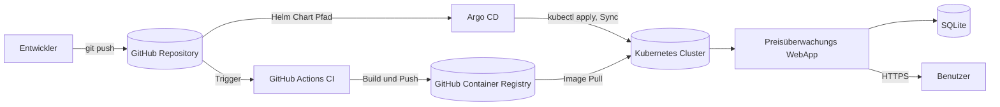
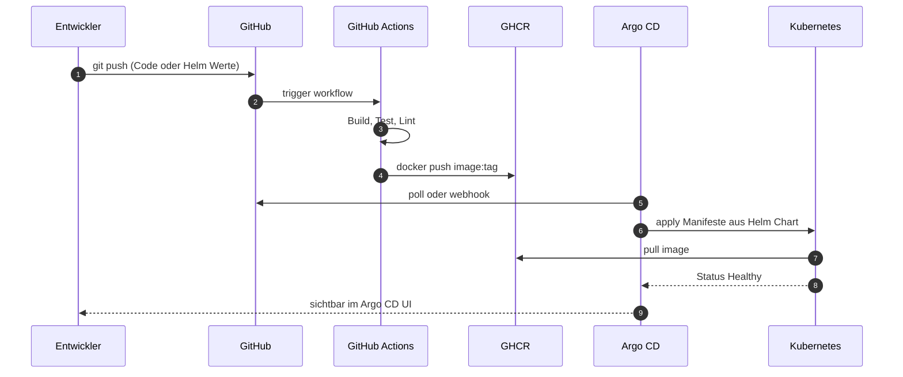

<div align="center">

# GitOps Plattform mit Preisüberwachungs WebApp

**Cloud Native Deployment auf Kubernetes mit Helm, Argo CD und GitHub Actions**

<p>


</p>

</div>

---

## Dokumentation

Die laufende Projektdokumentation ist auf GitHub Pages verfügbar:

**GitHub Pages:** [https://cancani.com/gitops-platform-semesterarbeit5/](https://cancani.com/gitops-platform-semesterarbeit5/)

| Dokument | Inhalt |
| --- | --- |
| [Dokumentation](./docs/dokumentation.md) | Hauptdokument, alle Kapitel von Management Summary bis Reflexion |
| [Runbook 01: Plattform Initial Setup](runbooks/01_plattform_initial_setup.md) | Cluster und Argo CD initial aufbauen |
| [Runbook 02: Neue Version deployen](runbooks/02_neue_version_deployen.md) | Standard GitOps Release Workflow |
| [Runbook 03: Rollback Release](runbooks/03_rollback_release.md) | Rollback eines fehlerhaften Releases |

---

## Kurzbeschreibung

Containerisierte Anwendungen werden in vielen Umgebungen noch manuell oder nur teilweise automatisiert bereitgestellt. Deployments sind dadurch schwer nachvollziehbar, Rollbacks nicht sauber definiert und der Soll Zustand der Anwendung ist nicht zentral versioniert.

Diese Semesterarbeit baut eine kleine, aber realistische Cloud Native Plattform auf Kubernetes auf. Der Soll Zustand wird im Git Repository gepflegt. Argo CD synchronisiert ihn automatisch in den Cluster. Eine Preisüberwachungs WebApp dient als realistischer Workload und ist bewusst einfach gehalten. Der Fokus der Arbeit liegt auf Plattform, GitOps, Helm und CI Pipeline.

---

## Sprint Status

| Sprint | Wochen | Sprint Ziel | Status |
| --- | --- | --- | --- |
| Sprint 1 | 1 bis 3 | Setup, Cluster, WebApp Skelett, Container |  |
| Sprint 2 | 4 bis 6 | GitOps Durchstich (CI, Helm, Argo CD) |  |
| Sprint 3 | 7 bis 9 | Stabilisierung, Runbooks, Doku, Demo |  |

---

## Architektur auf einen Blick



---

## Tech Stack

| Bereich | Technologie |
| --- | --- |
| Cluster | kind (Kubernetes in Docker) |
| Orchestrierung | Kubernetes |
| Paketierung | Helm |
| GitOps | Argo CD |
| CI Pipeline | GitHub Actions |
| Container Build | Docker |
| Registry | GitHub Container Registry (ghcr.io) |
| Backend | Python 3.12, FastAPI |
| Frontend | minimales HTML mit Chart.js |
| Datenbank | SQLite mit PVC |
| Job Scheduling | Kubernetes CronJob für regelmässigen Preisabruf |
| Quelle Preisdaten | öffentliche Preis API mit Testdaten Fallback |
| Doku | MkDocs Material auf GitHub Pages |

---

## GitOps Workflow

Änderungen am Deployment erfolgen ausschliesslich über Commits im Git Repository. Es wird nicht direkt im Cluster konfiguriert.



---

## Repository Struktur

```
.
├── README.md                       # Repository Einstieg
├── mkdocs.yml                      # MkDocs Material Konfiguration
├── docs/                           # gesamte Doku, wird zur Pages Seite
│   ├── index.md                    # diese Startseite
│   ├── dokumentation.md            # Hauptdokument der Semesterarbeit
│   ├── runbooks/                   # drei Runbooks
│   ├── architektur/                # Diagramme und ADRs
│   └── screenshots/                # Nachweise und Belege
├── app/
│   ├── backend/                    # FastAPI Service: API, Preisabruf, DB Zugriff
│   └── frontend/                   # einfache Weboberfläche
├── docker/
│   └── Dockerfile                  # Image Definition WebApp
├── helm/
│   └── price-watch/                # Helm Chart der WebApp
├── argocd/
│   └── price-watch-app.yaml        # Argo CD Application Definition
├── .github/
│   ├── workflows/
│   │   ├── ci.yaml                 # Build und Push in Registry
│   │   └── docs.yaml               # MkDocs Build und Pages Deploy
│   ├── ISSUE_TEMPLATE/             # User Story, Task, Bug Templates
│   └── PULL_REQUEST_TEMPLATE.md
├── tests/                          # Unit Tests, Smoke Tests
└── scripts/
    ├── setup-cluster.sh            # kind Cluster aufsetzen
    └── bootstrap-argocd.sh         # Argo CD installieren
```

---

## Quick Start, lokales Setup

Voraussetzungen: Docker, kubectl, Helm, kind, Git, Visual Studio Code.

```bash
# 1. Repository klonen
git clone https://github.com/Cancani/gitops-platform-semesterarbeit5.git
cd gitops-platform-semesterarbeit5

# 2. lokalen Cluster bauen
./scripts/setup-cluster.sh
kubectl get nodes                     # erwartet: 2 Nodes Ready

# 3. Argo CD installieren und initiale Application erstellen
./scripts/bootstrap-argocd.sh
kubectl -n argocd port-forward svc/argocd-server 8080:443

# 4. Status prüfen
kubectl get applications -n argocd
kubectl get pods -n price-watch
```

Eine vollständige Schritt für Schritt Anleitung mit Screenshots befindet sich im [Runbook 01: Plattform Initial Setup](runbooks/01_plattform_initial_setup.md).

---

## Referenzprojekt aus früherer Semesterarbeit

Die 4. Semesterarbeit ist als Referenzprojekt verlinkt und dient als Nachweis für vorhandene Erfahrung mit strukturierter Projektdokumentation, CI/CD, Docker und Microservice Architektur.

- **Dokumentation Sem 4:** [https://cancani.com/geraeteausleihe-sem4/dokumentation/](https://cancani.com/geraeteausleihe-sem4/dokumentation/)
- **Projektseite Sem 4:** [https://cancani.com/geraeteausleihe-sem4](https://cancani.com/geraeteausleihe-sem4)

Die neue Semesterarbeit ist keine Wiederholung, sondern eine fachliche Erweiterung in Richtung Kubernetes, GitOps, Helm, Argo CD und Cloud Native Plattform Engineering. Details und Lerntransfer siehe [Dokumentation Kapitel 12](dokumentation.md#12-lerntransfer-aus-fruherer-semesterarbeit).

---

## Autor und Rahmen

| Feld | Wert |
| --- | --- |
| Autor | Efekan Demirci |
| Klasse | ITCNE24 |
| Schule | Technische Berufsschule Zürich TBZ, Höhere Fachschule |
| Semester | 5 |
| Fachexperte IaCA, CNC, CNA | Marcel Bernet |
| Fachexperte PRJ | Thanam Pangri |
| Module | Projektmanagement, IaCA, CNC und CNA, optional DevOps |
| Geplanter Aufwand | ca. 50 Stunden über 9 Wochen |
| Repository | [github.com/Cancani/gitops-platform-semesterarbeit5](https://github.com/Cancani/gitops-platform-semesterarbeit5) |
