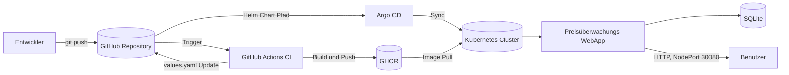
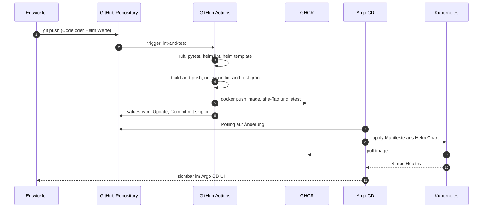

<div align="center">

# GitOps Plattform mit Preisüberwachungs WebApp

**Cloud Native Deployment auf Kubernetes mit Helm, Argo CD und GitHub Actions**

<p>


</p>

</div>

---

## Dokumentation

Die vollständige Projektdokumentation ist auf GitHub Pages verfügbar:

**GitHub Pages:** [https://cancani.com/gitops-platform-semesterarbeit5/](https://cancani.com/gitops-platform-semesterarbeit5/)

| Dokument | Inhalt |
| --- | --- |
| [Dokumentation](./docs/dokumentation.md) | Hauptdokument, alle Kapitel von Management Summary bis Reflexion |
| [Einreichungsformular](./docs/ITCNE24_Semesterarbeit-5_GitOps_Platform.pdf) | Ursprüngliche Projekteingabe der Semesterarbeit (PDF) |
| [Runbook 01: Plattform Initial Setup](docs/runbooks/RB01_plattform_initial_setup.md) | Cluster und Argo CD initial aufbauen |
| [Runbook 02: Neue Version deployen](docs/runbooks/RB02_neue_version_deployen.md) | Standard GitOps Release Workflow |
| [Runbook 03: Rollback Release](docs/runbooks/RB03_rollback_release.md) | Rollback eines fehlerhaften Releases |

---

## Kurzbeschreibung

Containerisierte Anwendungen werden in vielen Umgebungen noch manuell oder nur teilweise automatisiert bereitgestellt. Deployments sind dadurch schwer nachvollziehbar, Rollbacks nicht sauber definiert und der Soll Zustand der Anwendung ist nicht zentral versioniert.

Diese Semesterarbeit baut eine kleine, aber realistische Cloud Native Plattform auf Kubernetes auf. Der Soll Zustand wird im Git Repository gepflegt. Argo CD synchronisiert ihn automatisch in den Cluster. Eine Preisüberwachungs WebApp dient als realistischer Workload und ist bewusst einfach gehalten. Der Fokus der Arbeit liegt auf Plattform, GitOps, Helm und CI Pipeline.

---

## Sprint Status

| Sprint | Wochen | Sprint Ziel | Status |
| --- | --- | --- | --- |
| Sprint 1 | 1 bis 3 | Setup, Cluster, WebApp Skelett, Container |  |
| Sprint 2 | 4 bis 6 | GitOps Durchstich (CI, Helm, Argo CD) |  |
| Sprint 3 | 7 bis 9 | Stabilisierung, Runbooks, Doku, Demo |  |

---

## Architektur auf einen Blick



---

## Tech Stack

| Bereich | Technologie |
| --- | --- |
| Cluster | kind (Kubernetes in Docker) |
| Orchestrierung | Kubernetes |
| Paketierung | Helm |
| GitOps | Argo CD |
| CI Pipeline | GitHub Actions |
| Container Build | Docker |
| Registry | GitHub Container Registry (ghcr.io) |
| Backend | Python 3.12, FastAPI |
| Frontend | minimales HTML mit Chart.js |
| Datenbank | SQLite mit PVC |
| Job Scheduling | Kubernetes CronJob für regelmässigen Preisabruf |
| Preisdaten | Steam Market API mit Mock-Fallback |
| Doku | MkDocs Material auf GitHub Pages |

---

## GitOps Workflow

Änderungen am Deployment erfolgen ausschliesslich über Commits im Git Repository. Es wird nicht direkt im Cluster konfiguriert.



---

## Repository Struktur

```
.
├── README.md
├── mkdocs.yml
├── docs/
│   ├── index.md
│   ├── dokumentation.md
│   └── runbooks/
│       ├── RB01_plattform_initial_setup.md
│       ├── RB02_neue_version_deployen.md
│       └── RB03_rollback_release.md
├── app/
│   ├── argocd/
│   │   └── price-watch.app.yaml
│   └── backend/
│       ├── main.py
│       ├── models.py
│       ├── database.py
│       ├── pricesource.py
│       ├── Dockerfile
│       ├── requirements.txt
│       ├── pyproject.toml
│       ├── static/
│       │   └── index.html
│       └── tests/
│           └── test_api.py
├── helm/
│   └── price-watch/
│       ├── Chart.yaml
│       ├── values.yaml
│       └── templates/
│           ├── _helpers.tpl
│           ├── deployment.yaml
│           ├── service.yaml
│           ├── configmap.yaml
│           ├── pvc.yaml
│           └── cronjob.yaml
├── kind/
│   └── cluster.yaml
├── scripts/
│   ├── setup-cluster.sh
│   ├── setup-argocd.sh
│   └── teardown-cluster.sh
└── .github/
    └── workflows/
        ├── ci.yaml
        └── docs.yaml
```

---

## Quick Start, lokales Setup

Voraussetzungen: Docker Desktop, kubectl, Helm, kind, Git.

```bash
# 1. Repository klonen
git clone https://github.com/Cancani/gitops-platform-semesterarbeit5.git
cd gitops-platform-semesterarbeit5

# 2. Cluster erstellen
bash scripts/setup-cluster.sh

# 3. Argo CD installieren
bash scripts/setup-argocd.sh

# 4. price-watch App registrieren
kubectl apply -f app/argocd/price-watch.app.yaml

# 5. Argo CD UI erreichbar machen
kubectl port-forward svc/argocd-server -n argocd 8080:443

# 6. App im Browser öffnen, direkt über NodePort erreichbar
# http://localhost:30080
```

Eine vollständige Anleitung mit Screenshots befindet sich in [RB-01: Plattform Initial Setup](docs/runbooks/RB01_plattform_initial_setup.md).

---

## Referenzprojekt aus früherer Semesterarbeit

- **Dokumentation Sem 4:** [https://cancani.com/geraeteausleihe-sem4/dokumentation/](https://cancani.com/geraeteausleihe-sem4/dokumentation/)
- **Projektseite Sem 4:** [https://cancani.com/geraeteausleihe-sem4](https://cancani.com/geraeteausleihe-sem4)

---

## Autor und Rahmen

| Feld | Wert |
| --- | --- |
| Autor | Efekan Demirci |
| Klasse | ITCNE24 |
| Schule | Technische Berufsschule Zürich TBZ, Höhere Fachschule |
| Semester | 5 |
| Fachexperte IaCA, CNC, CNA | Marcel Bernet |
| Fachexperte PRJ | Thanam Pangri |
| Module | Projektmanagement, IaCA, CNC und CNA, optional DevOps |
| Kolloquium | 08.07.2026 |
| Repository | [github.com/Cancani/gitops-platform-semesterarbeit5](https://github.com/Cancani/gitops-platform-semesterarbeit5) |
