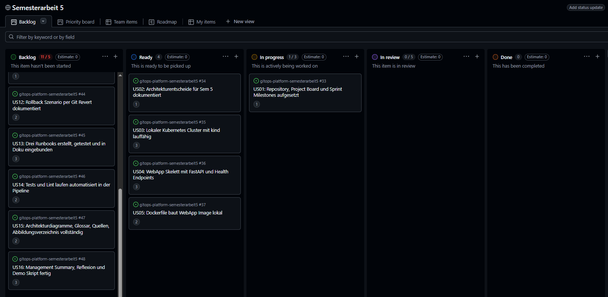
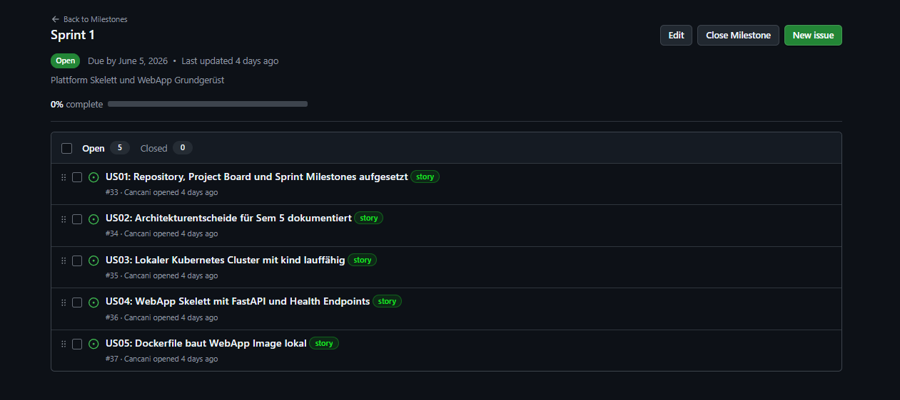
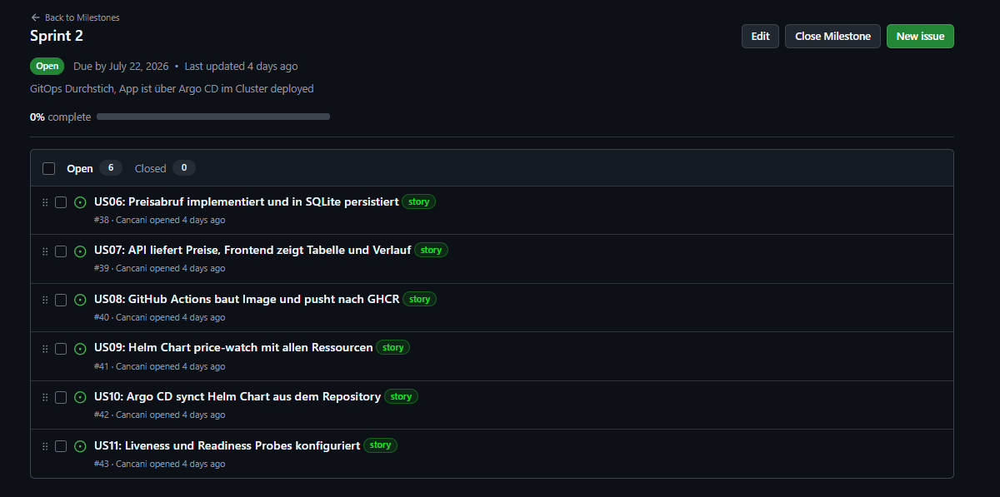
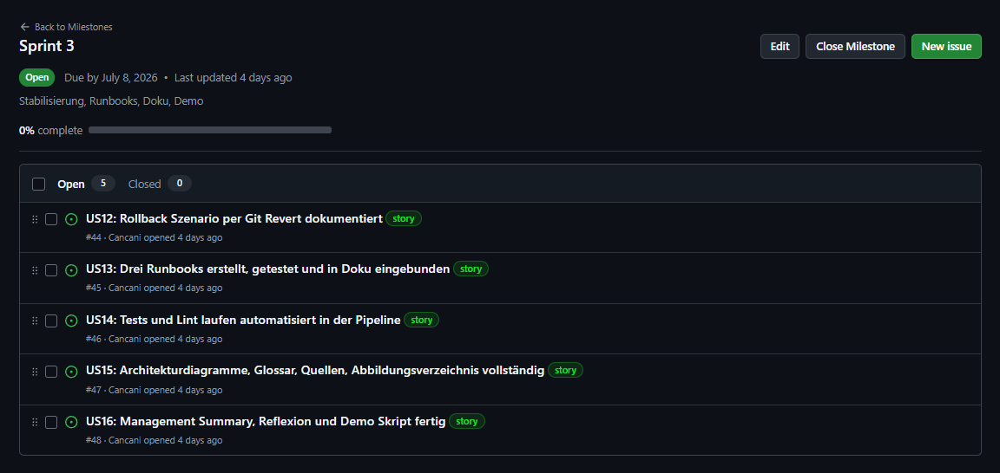
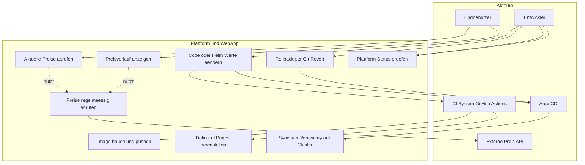
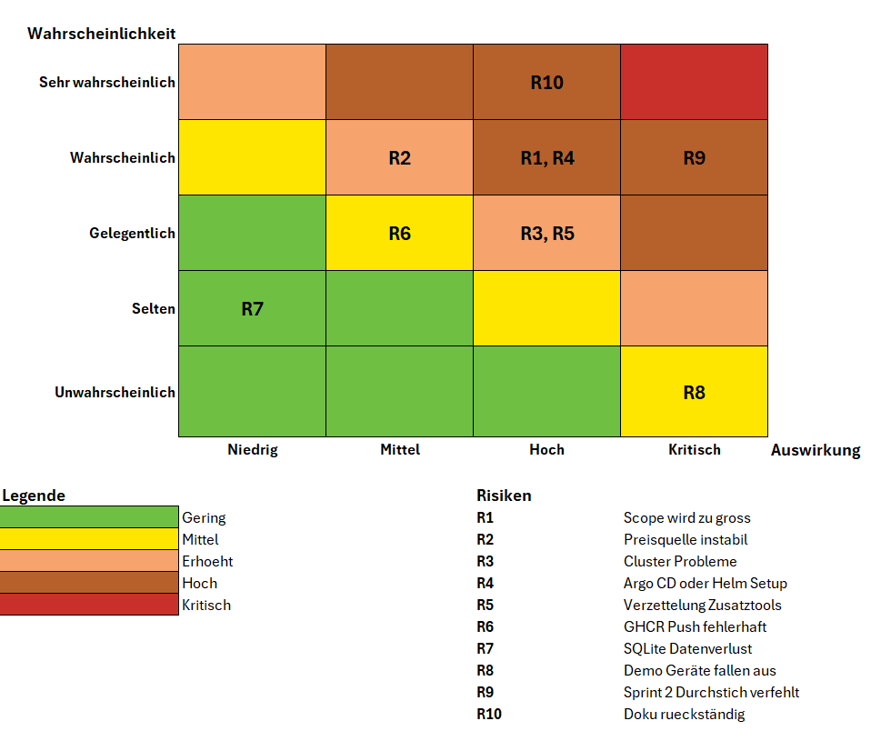

# Semesterarbeit 5: Aufbau einer GitOps basierten Kubernetes Plattform mit Preisüberwachungs WebApp

| Feld | Wert |
|------|------|
| Autor | Efekan Demirci |
| Klasse | ITCNE24 |
| Schule | Technische Berufsschule Zürich TBZ, Höhere Fachschule |
| Lehrgang | Dipl. Informatiker HF, Cloud Native Engineer |
| Semesterarbeit | Nummer 5 |
| Fachexperte IaCA, CNC, CNA | Marcel Bernet |
| Fachexperte Projektmanagement | Thanam Pangri |
| Module | Projektmanagement, IaCA, CNC und CNA, optional DevOps |
| Geplanter Aufwand | ca. 50 Stunden über 9 Wochen |
| Repository | https://github.com/Cancani/gitops-platform-semesterarbeit5 |
| Pages | https://cancani.com/gitops-platform-sem5/ |
| Version | 0.2, Stand nach Kickoff Anpassung |

# Semesterarbeit 5: Aufbau einer GitOps basierten Kubernetes Plattform mit Preisüberwachungs WebApp

| Feld | Wert |
|------|------|
| Autor | Efekan Demirci |
| Klasse | ITCNE24 |
| Schule | Technische Berufsschule Zürich TBZ, Höhere Fachschule |
| Lehrgang | Dipl. Informatiker HF, Cloud Native Engineer |
| Semesterarbeit | Nummer 5 |
| Fachexperte IaCA, CNC, CNA | Marcel Bernet |
| Fachexperte Projektmanagement | Thanam Pangri |
| Module | Projektmanagement, IaCA, CNC und CNA, optional DevOps |
| Geplanter Aufwand | ca. 50 Stunden über 9 Wochen |
| Repository | https://github.com/Cancani/gitops-platform-semesterarbeit5 |
| Pages | https://cancani.com/gitops-platform-sem5/ |
| Version | 0.2, Stand nach Kickoff Anpassung |

## Inhaltsverzeichnis

- [Semesterarbeit 5: Aufbau einer GitOps basierten Kubernetes Plattform mit Preisüberwachungs WebApp](#semesterarbeit-5-aufbau-einer-gitops-basierten-kubernetes-plattform-mit-preisüberwachungs-webapp)
- [Semesterarbeit 5: Aufbau einer GitOps basierten Kubernetes Plattform mit Preisüberwachungs WebApp](#semesterarbeit-5-aufbau-einer-gitops-basierten-kubernetes-plattform-mit-preisüberwachungs-webapp-1)
  - [Inhaltsverzeichnis](#inhaltsverzeichnis)
  - [1. Management Summary](#1-management-summary)
  - [2. Einleitung](#2-einleitung)
    - [2.1 Ausgangslage](#21-ausgangslage)
    - [2.2 Zielgruppe](#22-zielgruppe)
    - [2.3 Zielsetzung und Messkriterien](#23-zielsetzung-und-messkriterien)
    - [2.3.1 SMART Ziele](#231-smart-ziele)
    - [2.4 Abgrenzung](#24-abgrenzung)
    - [2.5 Themenfeldabdeckung](#25-themenfeldabdeckung)
  - [3. Projektmanagement](#3-projektmanagement)
    - [3.1 Projektmethodik](#31-projektmethodik)
    - [3.2 Sprintstruktur im Detail](#32-sprintstruktur-im-detail)
    - [3.3 Projektphasen und Meilensteine](#33-projektphasen-und-meilensteine)
    - [3.4 Anpassung der Projektdauer nach Kickoff Präsentation](#34-anpassung-der-projektdauer-nach-kickoff-präsentation)
    - [3.5 Issues und User Stories](#35-issues-und-user-stories)
      - [Standards pro Issue](#standards-pro-issue)
      - [Project Board Felder](#project-board-felder)
      - [Board Workflow](#board-workflow)
      - [Aufwandsschätzung und Story Points](#aufwandsschätzung-und-story-points)
      - [Verwendete Story-Point-Skala](#verwendete-story-point-skala)
      - [Priorisierung](#priorisierung)
    - [3.6 Sprint Planungen, Reviews und Retrospektiven](#36-sprint-planungen-reviews-und-retrospektiven)
      - [3.6.1 Sprint 1 Planung](#361-sprint-1-planung)
      - [3.6.2 Sprint 1 Review](#362-sprint-1-review)
      - [3.6.3 Sprint 1 Retrospektive](#363-sprint-1-retrospektive)
      - [3.6.4 Sprint 2 Planung](#364-sprint-2-planung)
      - [3.6.5 Sprint 2 Review](#365-sprint-2-review)
      - [3.6.6 Sprint 2 Retrospektive](#366-sprint-2-retrospektive)
      - [3.6.7 Sprint 3 Planung](#367-sprint-3-planung)
      - [3.6.8 Sprint 3 Review](#368-sprint-3-review)
      - [3.6.9 Sprint 3 Retrospektive](#369-sprint-3-retrospektive)
    - [3.7 Branching Strategie](#37-branching-strategie)
    - [3.8 Repository Strategie: Monorepo](#38-repository-strategie-monorepo)
    - [3.9 Definition of Done](#39-definition-of-done)
    - [3.10 SWOT Analyse](#310-swot-analyse)
      - [Stärken](#stärken)
      - [Schwächen](#schwächen)
      - [Chancen](#chancen)
      - [Risiken](#risiken)
      - [Fazit der SWOT Analyse](#fazit-der-swot-analyse)
  - [Use Case Diagramm](#use-case-diagramm)
    - [Akteure](#akteure)
    - [Use Case Diagramm](#use-case-diagramm-1)
    - [Use Cases im Detail](#use-cases-im-detail)
      - [UC1: Code oder Helm Werte ändern](#uc1-code-oder-helm-werte-ändern)
      - [UC2: Image bauen und pushen](#uc2-image-bauen-und-pushen)
      - [UC3: Doku auf Pages bereitstellen](#uc3-doku-auf-pages-bereitstellen)
      - [UC4: Sync aus Repository auf Cluster](#uc4-sync-aus-repository-auf-cluster)
      - [UC5: Rollback per Git Revert](#uc5-rollback-per-git-revert)
      - [UC6: Aktuelle Preise abrufen](#uc6-aktuelle-preise-abrufen)
      - [UC7: Preisverlauf anzeigen](#uc7-preisverlauf-anzeigen)
      - [UC8: Preise regelmässig abrufen](#uc8-preise-regelmässig-abrufen)
      - [UC9: Plattform Status prüfen](#uc9-plattform-status-prüfen)
    - [Geschäftsregeln und technische Constraints](#geschäftsregeln-und-technische-constraints)
  - [Risikomatrix](#risikomatrix)
    - [Achsenbeschreibung](#achsenbeschreibung)
    - [Farbbedeutung](#farbbedeutung)
    - [Risiken im Detail](#risiken-im-detail)
    - [Einordnung in die Risikomatrix](#einordnung-in-die-risikomatrix)
    - [Risikobehandlung über die Sprints](#risikobehandlung-über-die-sprints)
    - [Fazit zur Risikomatrix](#fazit-zur-risikomatrix)
    - [Status am Projektende](#status-am-projektende)

---

## 1. Management Summary

In dieser Semesterarbeit wird eine kleine, aber realistische Cloud Native Plattform auf Basis von Kubernetes aufgebaut. Auf der Plattform läuft eine einfache Preisüberwachungs WebApp als Referenzanwendung. Sie ruft regelmässig Preisdaten von digitalen Marktplatzobjekten ab, speichert aktuelle und historische Werte und stellt diese über eine einfache Weboberfläche dar.

Der fachliche Fokus liegt nicht auf der WebApp, sondern auf der Plattform und dem Bereitstellungsprozess. Konkret werden Containerisierung, deklarative Konfiguration mit Helm, eine CI Pipeline mit Container Registry sowie GitOps mit Argo CD umgesetzt. Der gewünschte Soll Zustand der Anwendung wird im Git Repository abgelegt. Argo CD synchronisiert ihn automatisch in den Cluster. Änderungen erfolgen deklarativ, sind nachvollziehbar und reproduzierbar.

Die Arbeit zeigt anhand eines praxisnahen Use Cases, wie zentrale Cloud Native Konzepte in einer überschaubaren, prüfbaren Umgebung kombiniert werden können. Sie deckt die Pflichtmodule Projektmanagement, IaCA und CNC/CNA ab und tangiert das optionale Modul DevOps durch CI Pipeline, Container Registry und automatisierte Auslieferung. Die Anwendung selbst bleibt bewusst einfach. Der Mehrwert liegt im strukturierten Plattformaufbau und in der nachvollziehbaren Betriebsdokumentation.

**Ergebnis:** Ein versionierter, deklarativer und automatisierbarer Deployment Workflow auf einer kleinen Kubernetes Plattform, dokumentiert mit Architekturdiagrammen, Runbooks und einer reproduzierbaren Umgebung.

---

## 2. Einleitung

### 2.1 Ausgangslage

Containerisierte Anwendungen werden in vielen Umgebungen noch manuell oder nur teilweise automatisiert bereitgestellt. Daraus ergeben sich typische Probleme:

- Deployments sind schwer nachvollziehbar.
- Rollbacks sind nicht eindeutig definiert.
- Konfigurationen sind nicht zentral dokumentiert.
- Der Soll Zustand einer Anwendung ist nicht versioniert.
- Wer was wann geändert hat, lässt sich nachträglich oft nur mit Aufwand rekonstruieren.

GitOps adressiert diese Probleme, indem der Soll Zustand der Plattform und der Anwendung in einem Git Repository definiert wird. Ein Operator wie Argo CD synchronisiert diesen Zustand automatisch in den Cluster und meldet Abweichungen.

### 2.2 Zielgruppe

Diese Dokumentation richtet sich an:

- den Fachexperten und die Lehrgangsleitung der TBZ,
- spätere Studierende, die einen vergleichbaren Plattformaufbau als Referenz nutzen wollen,
- den Autor selbst als Nachschlagewerk im Betrieb der Plattform.

### 2.3 Zielsetzung und Messkriterien

| Nr. | Ziel | Messkriterium |
|----|------|---------------|
| 1 | Kubernetes Umgebung aufbauen | Cluster ist lauffähig und mit `kubectl` erreichbar. |
| 2 | Preisüberwachungs WebApp erstellen | WebApp zeigt aktuelle und gespeicherte Preisdaten an. |
| 3 | Anwendung mit Helm paketieren | Anwendung kann über ein Helm Chart reproduzierbar installiert werden. |
| 4 | GitOps mit Argo CD umsetzen | Änderungen im Git Repository werden durch Argo CD auf Kubernetes synchronisiert. |
| 5 | Build und Image Veröffentlichung automatisieren | CI Pipeline erstellt ein Container Image und veröffentlicht es in einer Container Registry. |
| 6 | Dokumentation und Runbooks erstellen | Dokumentation enthält Architektur, Aufbau, Deployment Ablauf und mindestens drei Runbooks. |

### 2.3.1 SMART Ziele

Die Ziele aus Kapitel 2.3 werden nach dem SMART Prinzip weiter konkretisiert. Damit ist pro Ziel überprüfbar, ob es spezifisch, messbar, attraktiv, realistisch und terminiert ist.

| Ziel | Spezifisch | Messbar | Attraktiv | Realistisch | Terminiert |
| --- | --- | --- | --- | --- | --- |
| **Kubernetes Umgebung aufbauen** | Lokaler kind Cluster mit zwei Nodes per Skript bereitgestellt | `kubectl get nodes` zeigt zwei Nodes im Status Ready | Basis für GitOps, Helm und Argo CD | kind ist leichtgewichtig, lokal lauffähig | Sprint 1 |
| **Preisüberwachungs WebApp erstellen** | FastAPI Backend mit Endpoints für aktuelle und historische Preise, einfaches Frontend | API liefert valide JSON Responses, Browser zeigt Tabelle und Chart | Realistischer Workload für die Plattform | Bewährter Tech Stack, kleiner Scope | Sprint 1 bis Sprint 2 |
| **Anwendung mit Helm paketieren** | Helm Chart mit Deployment, Service, ConfigMap, Secret, PVC, CronJob | `helm lint` fehlerfrei, Chart installiert reproduzierbar | Standard im Cloud Native Umfeld | Helm ist gut dokumentiert, Argo CD unterstützt es nativ | Sprint 2 |
| **GitOps mit Argo CD umsetzen** | Argo CD Application beobachtet Helm Chart im Repo, automatisches Sync aktiv | Commit auf `main` führt innerhalb 3 Minuten zu Sync, Status `Synced, Healthy` | Deklarativ, nachvollziehbar, reproduzierbar | Lokaler Cluster, einfaches App Setup, kein App of Apps | Sprint 2 |
| **CI Build und Push automatisieren** | GitHub Actions Workflow baut Image bei jedem Push auf `main` und pusht nach GHCR | Erfolgreiche Workflow Runs, Tags `:sha` und `:latest` in GHCR sichtbar | Automatisierung als DevOps Kernprinzip | GitHub Actions im selben Ökosystem, kein extra Setup | Sprint 2 |
| **Dokumentation und Runbooks erstellen** | Dokumentation auf MkDocs Pages mit Architektur, ADRs, drei Runbooks, Reflexion | Pages URL erreichbar, alle Kapitel vollständig, drei Runbooks getestet | HF Bewertbarkeit, Nachvollziehbarkeit für Dritte | MkDocs Setup aus Sem 4 bekannt, parallele Doku Pflege | laufend, final Sprint 3 |

Die Erfolgskriterien werden in den Sprint Reviews (Kapitel 3.6) konkret pro Story abgeglichen. Die SMART Tabelle dient als Referenz für die Gesamtbewertung am Projektende (siehe Fazit, Kapitel 15).


### 2.4 Abgrenzung

Bewusst nicht im Scope:

- produktive Hochverfügbarkeit, Multi Cluster, Service Mesh,
- vollwertiger Observability Stack (Prometheus, Grafana, Loki) als Pflicht; falls Zeit übrig, optional,
- Identity Provider Integration (OIDC, SSO) für Argo CD,
- vollständige Sicherheitshärtung wie Network Policies, Pod Security Standards, RBAC für mehrere Teams,
- vollständige Frontend Architektur, das UI bleibt absichtlich minimal.

### 2.5 Themenfeldabdeckung

| Modul | Abdeckung in dieser Arbeit |
|-------|----------------------------|
| Projektmanagement (PRJ) | Projektplanung, Sprints, User Stories, Risikomanagement, Reflexion |
| IaCA (Infrastructure as Code Advanced) | Cluster Bootstrap per Skript, Helm Chart als deklarative Anwendungsbeschreibung, Argo CD Manifeste, alles versioniert |
| CNC, Cloud Native Core | Kubernetes Grundlagen, Pods, Services, Deployments, ConfigMaps, Secrets, CronJob |
| CNA, Cloud Native Advanced | Helm, GitOps mit Argo CD, Health Checks, deklarative Application Lifecycle |
| DevOps (optional) | CI Pipeline mit GitHub Actions, Container Registry, automatisierte Auslieferung |

---

## 3. Projektmanagement

### 3.1 Projektmethodik

Das Projekt folgt einem agilen, scrumähnlichen Vorgehen mit iterativer Entwicklung und regelmässigen Review Zyklen. Die Planung und Nachverfolgung erfolgt vollständig in GitHub.

**Gewählte Methodik: Sprint basierte Entwicklung**

Die Entscheidung für ein iteratives Vorgehen basiert auf folgenden Punkten:

- Neue technische Themen wie Kubernetes, Helm, Argo CD und GitOps benötigen experimentelles Vorgehen mit kurzen Feedback Schleifen.
- Technische Abhängigkeiten werden oft erst während der Umsetzung sichtbar, zum Beispiel das Zusammenspiel zwischen CI Pipeline, Image Tags und Argo CD Sync.
- Dozentenfeedback aus den Zwischenpräsentationen kann direkt in die nächsten Tasks und in die Dokumentation einfliessen.
- Risiken werden früh sichtbar, statt erst am Schluss.

**Kernprinzipien der angewandten Methodik**

- Iterative Entwicklung mit funktionsfähigen Zwischenständen am Ende jedes Sprints.
- Kontinuierliches Feedback und Anpassung der Prioritäten.
- Laufende Nachweisführung, damit der Projektstand jederzeit nachvollziehbar ist.
- Klare Definition of Done pro Ticket inklusive Evidence Anforderungen.
- Die Dokumentation läuft parallel zur Umsetzung, nicht erst am Ende.

### 3.2 Sprintstruktur im Detail

**Sprint Planning (Sprintbeginn):**

- Definition von User Stories mit klaren Akzeptanzkriterien
- Aufwandsschätzung in Story Points
- Festlegung des Sprintziels als ein Satz Outcome und der Deliverables
- Sprint Scope im GitHub Project Board zuweisen, Sprint Feld und Milestone setzen

**Sprint Execution (Durchführung):**

- Kontinuierliche Arbeit an den definierten User Stories
- GitHub Issues für Aufgabentracking und Statusupdates
- Regelmässige Commits und Pushes auf den `develop` Branch, kleine Änderungen statt grosse Sprünge
- Pull Requests von `develop` nach `main` per Squash Merge für nachvollziehbare Integration
- Ticket Status aktuell halten, WIP Limit in Progress maximal 2

**Sprint Review (Sprintende):**

- Abgleich gegen Sprintziel
- Zwischenpräsentationen mit Dozenten am Ende von Sprint 1 und Sprint 2 zur Qualitätssicherung
- Bewertung der Zielerreichung und Identifikation von Verbesserungspotenzialen
- Evidence Pflicht, Screenshots und Links werden direkt pro Sprint Review dokumentiert

**Sprint Retrospektive:**

- Reflexion des Arbeitsprozesses mit dem Starfish Modell
- Identifikation von Start Doing, Stop Doing, Keep Doing, More Of, Less Of
- Konkrete Massnahmen für den nächsten Sprint ableiten

**Vorteile der gewählten Methodik:**

- Flexibilität, schnelle Anpassung an neue Erkenntnisse, zum Beispiel beim ersten Argo CD Setup oder bei Helm Template Problemen.
- Qualitätssicherung, regelmässige Reviews verhindern späte Richtungsänderungen.
- Motivation, sichtbare Fortschritte nach jedem Sprint, insbesondere durch die zwei Zwischenpräsentationen.
- Lernoptimierung, Retrospektiven führen zu kontinuierlicher Prozessverbesserung.

### 3.3 Projektphasen und Meilensteine

Das Projekt ist in drei Sprints zu je drei Wochen gegliedert. Die beiden Zwischenpräsentationen fallen jeweils auf das Ende von Sprint 1 und Sprint 2.

**Sprint Progression im Überblick**

**Sprint 1, Setup und Fundament:**
Aufbau der Projektbasis mit Repository, Project Board, Branch Protection, Issue Templates, lokalem Kubernetes Cluster, WebApp Skelett und Container.

**Sprint 2, GitOps Durchstich:**
Aufbau der CI Pipeline mit GitHub Actions und GHCR, Helm Chart, Argo CD Installation und erster automatisierter Sync vom Repository in den Cluster. Implementierung von Preisabruf, API und Frontend.

**Sprint 3, Stabilisierung, Runbooks, Doku:**
Rollback Szenario, drei Runbooks, automatisierte Tests in der Pipeline, Finalisierung der Architekturdiagramme, Glossar, Quellen, Management Summary, Reflexion und Demo Skript.

Laufende Nachweise pro Sprint durchgehend in `docs/screenshots/sprint-X/`.

**Zeitplan**

| Sprint | Zeitraum | Fokus | Status |
| --- | --- | --- | --- |
| **Sprint 1** | Woche 1 bis 3 | Setup, Cluster, WebApp Skelett, Container | _In Bearbeitung_ |
| **Sprint 2** | Woche 4 bis 6 | CI Pipeline, Helm Chart, Argo CD, GitOps Sync | _Geplant_ |
| **Sprint 3** | Woche 7 bis 9 | Rollback, Runbooks, Tests, Doku Finalisierung | _Geplant_ |

### 3.4 Anpassung der Projektdauer nach Kickoff Präsentation

Die ursprüngliche Planung im Einreichungsformular ging von einer Projektdauer von 12 Wochen aus, aufgeteilt in vier Sprints zu je drei Wochen. In der Kickoff Präsentation wurde durch die Lehrgangsleitung präzisiert, dass die Semesterarbeit tatsächlich nur **9 Wochen** dauert. Empfohlen wurde eine Sprintdauer von drei Wochen, sodass insgesamt drei Sprints durchgeführt werden.

Die beiden Zwischenpräsentationen fallen damit jeweils auf das Ende von Sprint 1 und Sprint 2. Sie bieten eine strukturierte Gelegenheit, den Fortschritt zu reflektieren und gegebenenfalls den Plan anzupassen.

Konsequenzen für diese Arbeit:

- Die Sprintplanung wurde von vier auf drei Sprints reduziert.
- Inhaltlich wurden die ursprünglichen 21 User Stories auf 16 verdichtet, wobei der GitOps Durchstich von Sprint 3 auf **Sprint 2** vorgezogen wurde.
- Die Doku Pflege erfolgt parallel ab Sprint 1, damit Sprint 3 nicht durch Doku Nachholarbeit unter Druck gerät.
- Optional geplante Erweiterungen (Argo CD Image Updater, mehrere Values Profile, PostgreSQL als Subchart, vollwertiges Monitoring) wurden gestrichen oder als reine Bonus Items eingestuft.

Diese Anpassung wurde nicht als Risiko, sondern als Präzisierung des Scopes verstanden. Der reduzierte Zeitrahmen schärft den Fokus auf die Plattform und auf einen sauberen GitOps Lifecycle.

### 3.5 Issues und User Stories

Das Projekt umfasst **16 User Stories**, US01 bis US16. Alle Stories werden als GitHub Issues geführt und im [GitHub Project Board](https://github.com/users/Cancani/projects/) verwaltet.

#### Standards pro Issue

- User Story Text nach dem Schema „Als <Rolle> möchte ich <Ziel>, damit <Nutzen>“
- Akzeptanzkriterien als Checkboxen
- Definition of Done als Checkboxen
- Labels für Type (`story`, `task`, `bug`)
- Milestone Zuordnung zu Sprint
- Story Points im Project Board

#### Project Board Felder

Die Steuerung erfolgt über folgende Felder im GitHub Project:

| Feld | Zweck |
| --- | --- |
| Status | Backlog, Ready, In Progress, Review, Done |
| Story Points | Aufwandsschätzung (Number) |
| Priority | Low, Medium, High |
| Sprint | Sprint 1, Sprint 2, Sprint 3 |

#### Board Workflow

| Spalte | Bedeutung |
| --- | --- |
| Backlog | Neue Anforderungen, noch nicht priorisiert |
| Ready | Priorisiert und bereit zur Umsetzung |
| In Progress | Aktive Umsetzung, WIP Limit beachten |
| Review | DoD Kontrolle, Evidence prüfen |
| Done | Abgeschlossen und dokumentiert |

#### Aufwandsschätzung und Story Points

Die Aufwände der einzelnen User Stories wurden mit Story Points geschätzt. Story Points stellen bewusst **keine Zeitangaben** dar, sondern dienen als relative Bewertung von Aufwand, Komplexität und Risiko.

Die Schätzung basiert auf folgenden Kriterien:

- Technische Komplexität der Aufgabe
- Anzahl beteiligter Komponenten (Cluster, Helm, Argo CD, CI Pipeline)
- Grad der Unsicherheit oder Neuartigkeit der Technologie
- Erwarteter Analyse-, Test- und Debuggingaufwand
- Abhängigkeiten zu anderen Tasks

Es wurde bewusst auf eine Schätzung in Stunden verzichtet, da diese insbesondere bei technischen Aufgaben mit hohem Lern- und Analyseanteil eine Scheingenauigkeit erzeugen würde.

#### Verwendete Story-Point-Skala

| Story Points | Bedeutung |
| --- | --- |
| 1 | Sehr kleiner Task, klar abgegrenzt, kaum Risiko |
| 2 | Kleiner Task mit überschaubarem Aufwand |
| 3 | Mittlerer Task mit mehreren Schritten oder Abhängigkeiten |
| 5 | Komplexer Task oder neue Technologie mit erhöhtem Debuggingaufwand |
| 8 | Sehr komplexer Task mit hohem Risiko oder vielen Unbekannten |

Die Story Points werden direkt pro Issue im GitHub Project Board gepflegt. Zusätzlich ist in jedem Issue eine kurze Begründung der Schätzung dokumentiert. Änderungen an Schätzungen wurden transparent im jeweiligen Issue festgehalten.

#### Priorisierung

Die Priorisierung der Issues erfolgt zentral im GitHub Project Board und ist unabhängig von einzelnen Sprints. Ziel der Priorisierung ist es, den Fokus auf fachlich und technisch kritische Aufgaben zu legen und Abhängigkeiten frühzeitig zu berücksichtigen.

Die Priorisierung basiert auf folgenden Kriterien:

- Technische Abhängigkeiten zu anderen Tasks
- Risiko für den Projektfortschritt oder Betrieb
- Kritikalität für einen lauffähigen End to End Betrieb
- Rückmeldungen und Anforderungen der Dozenten in den Zwischenpräsentationen

Die Priorität wird pro Issue explizit festgelegt und bleibt über mehrere Sprints hinweg sichtbar. Dadurch ist jederzeit nachvollziehbar, warum bestimmte Aufgaben früher umgesetzt wurden als andere.

Im Project Board sind Issues mit der Priorität **High** ganz oben angeordnet, darunter folgen Issues mit der Priorität **Medium**, während Issues mit der Priorität **Low** bewusst am unteren Ende des Backlogs platziert sind. Diese Anordnung stellt sicher, dass fachlich und technisch zwingend notwendige Aufgaben jederzeit klar erkennbar sind und zuerst in die Sprint Planung einfliessen.

_Platzhalter Abbildung: Project Board mit Priorisierung_

---

### 3.6 Sprint Planungen, Reviews und Retrospektiven

Die nachfolgenden Abschnitte dokumentieren den vollständigen Projektverlauf und machen Fortschritte, Entscheidungen und Herausforderungen transparent nachvollziehbar.

---

#### 3.6.1 Sprint 1 Planung

**Sprint Zeitraum**

Woche 1 bis 3 der Semesterarbeit.

**Sprintziel**

Projektbasis schaffen und die Grundlage für den GitOps Durchstich in Sprint 2 legen. Repository, Project Board, lokaler Kubernetes Cluster, WebApp Skelett und ein erstes Container Image sind lokal lauffähig. Die Doku Pages ist live.

_Platzhalter Abbildung: Sprint 1 Milestone und Issues_

**Sprint 1 User Stories**

Die folgenden User Stories gehören zu Sprint 1:

[Link zu Issues auf GitHub](https://github.com/Cancani/gitops-platform-semesterarbeit5/milestone/1)

| US | Titel | Bereich | Story Points |
| --- | --- | --- | --- |
| US01 | Repository, Project Board und Sprint Milestones aufgesetzt | Projektmanagement | 1 |
| US02 | Architekturentscheide für Sem 5 dokumentiert | Architektur | 2 |
| US03 | Lokaler Kubernetes Cluster mit kind lauffähig | Plattform | 3 |
| US04 | WebApp Skelett mit FastAPI und Health Endpoints | WebApp | 3 |
| US05 | Dockerfile baut WebApp Image lokal | Container | 2 |

**Geplanter Aufwand Sprint 1:** **11 Story Points**

**WIP Regel**

In Progress maximal 2 parallel laufende Issues.

**Evidence Standard für Sprint 1**

Für Sprint 1 werden mindestens folgende Nachweise geplant:

- Screenshot Project Board Übersicht mit Sprint 1 Spalten
- Screenshot Milestones Übersicht (Sprint 1 bis 3 angelegt)
- Screenshot Branch Protection Rulesets
- Screenshot Issue Templates
- Screenshot `kubectl get nodes` mit zwei Ready Nodes
- Screenshot WebApp lokal im Browser (Hello World, Health Check)
- Screenshot `docker run` Output mit `curl /healthz` und 200 OK
- Link zur Doku Page auf GitHub Pages
- ADR Verzeichnis in `docs/architektur/adr/` befüllt

---

#### 3.6.2 Sprint 1 Review

> **Hinweis Reviewgespräch:** Sprint 1 wird am Ende mit einer Zwischenpräsentation gegenüber dem Dozenten abgeschlossen. Rückmeldungen werden hier dokumentiert.

**Review Ergebnis**

_Wird nach Abschluss von Sprint 1 ergänzt._

| Review Punkt | Ergebnis |
| --- | --- |
| Repository, Board und Milestones eingerichtet | _offen_ |
| Branch Protection per Ruleset aktiv | _offen_ |
| Issue Templates und PR Template vorhanden | _offen_ |
| Lokaler Cluster lauffähig | _offen_ |
| WebApp Skelett mit Health Endpoints | _offen_ |
| Image baut und Container startet lokal | _offen_ |
| Doku auf GitHub Pages live | _offen_ |

**Umgesetzter Aufwand:** _X von 11 Story Points_

_Platzhalter Abbildung: Abgeschlossene Tasks in Sprint 1_

**Board und Planung**



_Platzhalter Abbildung: Issue Labels_




**Dozentenfeedback aus Zwischenpräsentation 1**

_Wird nach der Präsentation ergänzt._

---

#### 3.6.3 Sprint 1 Retrospektive

Die Retrospektive wird mit dem Starfish Modell durchgeführt.

_Platzhalter Abbildung: Starfish Retrospektive Sprint 1_

**Start Doing**

_Was sollte ich neu beginnen?_

- ...

**Stop Doing**

_Was sollte ich nicht mehr tun?_

- ...

**Keep Doing**

_Was sollte ich beibehalten?_

- ...

**More Of**

_Wovon sollte ich mehr machen?_

- ...

**Less Of**

_Wovon sollte ich weniger machen?_

- ...

**Zusammenfassung**

_Wird nach Abschluss von Sprint 1 ergänzt._

**Empfehlungen für Sprint 2**

_Wird abgeleitet aus der Retro und der Zwischenpräsentation._

---

#### 3.6.4 Sprint 2 Planung

**Sprint Zeitraum**

Woche 4 bis 6 der Semesterarbeit.

**Sprint Ziel**

GitOps Durchstich. Push auf `main` führt automatisch zu Build, Push, Sync und Deployment im Cluster. Argo CD überwacht das Helm Chart und synchronisiert Änderungen automatisch.

**Sprint 2 Scope**

- CI Pipeline für Image Build und Push nach GHCR
- Helm Chart für die WebApp mit allen Kernressourcen
- Argo CD Installation und Application Definition
- Preisabruf und Datenpersistierung in SQLite
- API und einfaches Frontend für Preise und Verlauf
- Liveness und Readiness Probes



**Sprint 2 User Stories**

[Link zu Issues auf GitHub](https://github.com/Cancani/gitops-platform-semesterarbeit5/milestone/2)

| US | Titel | Bereich | Story Points |
| --- | --- | --- | --- |
| US06 | Preisabruf implementiert und in SQLite persistiert | WebApp | 3 |
| US07 | API liefert Preise, Frontend zeigt Tabelle und Verlauf | WebApp | 3 |
| US08 | GitHub Actions baut Image und pusht nach GHCR | CI | 3 |
| US09 | Helm Chart price-watch mit allen Ressourcen | Plattform | 3 |
| US10 | Argo CD synct Helm Chart aus dem Repository | GitOps | 3 |
| US11 | Liveness und Readiness Probes konfiguriert | Plattform | 1 |

**Geplanter Aufwand Sprint 2:** **16 Story Points**

Sprint 2 ist bewusst der schwerste Sprint, da hier der GitOps Durchstich entsteht. Das Risiko, dass ein Teil davon nicht in den drei Wochen schaffbar ist, ist explizit in der Risikomatrix als R11 dokumentiert.

**WIP Regel**

In Progress maximal 2 parallel laufende Issues. US06, US07, US08, US09 und US10 werden in dieser Reihenfolge bearbeitet, US11 läuft parallel zu US10 mit.

**Evidence Standard für Sprint 2**

Für Sprint 2 werden mindestens folgende Nachweise geplant:

- Screenshot erfolgreicher CI Lauf in GitHub Actions
- Screenshot Image in GHCR mit mehreren Tags
- Screenshot `helm lint` und `helm template` Output
- Screenshot Argo CD Application Status `Synced, Healthy`
- Screenshot Argo CD Sync nach `values.yaml` Bump
- Screenshot `kubectl get pods -n price-watch` mit neuem Image
- Screenshot `kubectl describe pod` mit Probes
- Screenshot WebApp im Cluster, Tabelle mit Preisen
- Screenshot CronJob Auflistung und letzter Lauf
- Beispiel API Response JSON

---

#### 3.6.5 Sprint 2 Review

> **Hinweis Reviewgespräch:** Sprint 2 wird am Ende mit der zweiten Zwischenpräsentation gegenüber dem Dozenten abgeschlossen.

**Review Ergebnis**

_Wird nach Abschluss von Sprint 2 ergänzt._

| Review Punkt | Ergebnis |
| --- | --- |
| CI Pipeline grün, Image in GHCR | _offen_ |
| Helm Chart `helm lint` fehlerfrei | _offen_ |
| Argo CD installiert und konfiguriert | _offen_ |
| Application `Synced, Healthy` | _offen_ |
| Commit auf `main` triggert automatischen Sync | _offen_ |
| WebApp im Cluster zeigt Preise | _offen_ |
| Probes funktionieren | _offen_ |

**Umgesetzter Aufwand:** _X von 16 Story Points_

_Platzhalter Abbildung: Abgeschlossene Tasks in Sprint 2_

**Board und Planung**

_Platzhalter Abbildung: Project Board Sprint 2_

**Dozentenfeedback aus Zwischenpräsentation 2**

_Wird nach der Präsentation ergänzt._

---

#### 3.6.6 Sprint 2 Retrospektive

_Platzhalter Abbildung: Starfish Retrospektive Sprint 2_

**Start Doing**

- ...

**Stop Doing**

- ...

**Keep Doing**

- ...

**More Of**

- ...

**Less Of**

- ...

**Zusammenfassung**

_Wird nach Abschluss von Sprint 2 ergänzt._

**Empfehlungen für Sprint 3**

_Wird abgeleitet aus der Retro und der Zwischenpräsentation._

---

#### 3.6.7 Sprint 3 Planung

**Sprint Zeitraum**

Woche 7 bis 9 der Semesterarbeit.

**Sprint Ziel**

Plattform und Dokumentation sind prüfbar abgeschlossen. Rollback Szenario ist nachgewiesen, Runbooks sind getestet, Tests laufen in der Pipeline, alle Doku Bestandteile sind vollständig. Schlussdemo ist vorbereitet.

**Sprint 3 Scope**

- Rollback Szenario praktisch durchführen und dokumentieren
- Drei Runbooks finalisieren und testen
- Pipeline um Tests und Lint Schritte erweitern
- Architekturdiagramme, Quellen, Abbildungsverzeichnis, Glossar finalisieren
- Management Summary, Reflexion und Demo Skript schreiben
- Generalprobe der Schlussdemo



**Sprint 3 User Stories**

[Link zu Issues auf GitHub](https://github.com/Cancani/gitops-platform-semesterarbeit5/milestone/3)

| US | Titel | Bereich | Story Points |
| --- | --- | --- | --- |
| US12 | Rollback Szenario per Git Revert dokumentiert | GitOps | 2 |
| US13 | Drei Runbooks erstellt, getestet und in Doku eingebunden | Dokumentation | 3 |
| US14 | Tests und Lint laufen automatisiert in der Pipeline | CI | 2 |
| US15 | Architekturdiagramme, Glossar, Quellen, Abbildungsverzeichnis vollständig | Dokumentation | 2 |
| US16 | Management Summary, Reflexion und Demo Skript fertig | Dokumentation | 3 |

**Geplanter Aufwand Sprint 3:** **12 Story Points**

**WIP Regel**

In Progress maximal 2 parallel laufende Issues. Doku Stories (US15, US16) laufen parallel zu den technischen Stories.

**Evidence Standard für Sprint 3**

Für Sprint 3 werden mindestens folgende Nachweise geplant:

- Screenshot bad Commit, der CrashLoopBackoff verursacht
- Screenshot `git log` mit Revert Commit
- Screenshot Argo CD History und Rollback Ansicht
- Screenshot Pods vor und nach Rollback
- Drei Runbooks unter `docs/runbooks/` final und auf Pages sichtbar
- Screenshot CI Pipeline mit allen Test- und Lint Steps grün
- Screenshot fehlgeschlagener Pipeline Lauf mit nachfolgender Korrektur
- Vollständiges Quellenverzeichnis und Abbildungsverzeichnis
- Generalprobe Notizen oder Demo Video Recording

---

#### 3.6.8 Sprint 3 Review

**Review Ergebnis**

_Wird nach Abschluss von Sprint 3 ergänzt._

| Review Punkt | Ergebnis |
| --- | --- |
| Rollback durchgeführt und dokumentiert | _offen_ |
| Drei Runbooks vollständig | _offen_ |
| Tests und Lint in Pipeline | _offen_ |
| Doku vollständig und auf Pages aktuell | _offen_ |
| Schlussdemo Skript fertig und einmal generalprobenweise durchgespielt | _offen_ |

**Umgesetzter Aufwand:** _X von 12 Story Points_

_Platzhalter Abbildung: Abgeschlossene Tasks in Sprint 3_

**Board und Planung**

_Platzhalter Abbildung: Project Board Sprint 3_

**Offene Punkte und nächste Schritte**

_Wird am Sprint Ende ausgefüllt: was bleibt offen, was wird bei der Abgabe nachgereicht, was ist Ausblick für eine mögliche Sem 6._

---

#### 3.6.9 Sprint 3 Retrospektive

_Platzhalter Abbildung: Starfish Retrospektive Sprint 3_

**Start Doing**

- ...

**Stop Doing**

- ...

**Keep Doing**

- ...

**More Of**

- ...

**Less Of**

- ...

**Zusammenfassung**

_Wird nach Abschluss von Sprint 3 ergänzt._

**Fazit**

_Gesamtfazit zum Projektmanagement über alle drei Sprints. Was hat die Methodik gebracht, was würde ich nächstes Mal anders machen._

---

### 3.7 Branching Strategie

Bewusst einfach gehalten, passend für ein Einpersonen Projekt mit Nachweisanspruch.

- `main` ist der stabile Hauptbranch und gleichzeitig der GitOps Soll Zustand. Direktpushes sind durch Branch Protection unterbunden.
- `develop` ist der permanente Arbeitsbranch. Hier erfolgen die täglichen Commits.
- `gh-pages` wird ausschliesslich vom MkDocs Workflow geschrieben, niemals manuell.
- Pull Requests gehen `develop` nach `main`, jeweils am Sprint Ende, per Squash Merge.
- Optional Feature Branches `feat/<kurzname>` für grössere parallele Themen.
- Tags pro Sprint Abschluss: `sprint-1`, `sprint-2`, `sprint-3` und `demo`.

Branch Protection ist über GitHub Rulesets umgesetzt:

| Branch | Schutz |
| --- | --- |
| `main` | kein Direktpush, PR Pflicht, linear history, kein Force Push, keine Löschung |
| `develop` | keine Löschung, kein Force Push |
| `gh-pages` | keine Löschung (Force Push erlaubt, da MkDocs gh-deploy ihn benötigt) |

### 3.8 Repository Strategie: Monorepo

Es wurde zwischen Monorepo und mehreren Repositories abgewogen.

| Kriterium | Monorepo | Multi Repo |
| --- | --- | --- |
| Komplexität | gering | höher |
| Nachvollziehbarkeit Commit zu Deployment | direkt | indirekt, mehrere Repos beobachten |
| GitOps Konfiguration | einfacher Pfad in Argo CD | benötigt zusätzliches Konfigurations Repo |
| Realistisch für 50 Stunden Projekt | ja | nein |
| HF Bewertbarkeit, alles an einem Ort | ja | nein |

**Entscheid:** Monorepo. Code, Helm Chart, Argo CD Application und Dokumentation liegen in einem Repository. Argo CD beobachtet `helm/price-watch`. Die Anwendung wird im selben Repository entwickelt, wodurch der Lifecycle transparent ist.

### 3.9 Definition of Done

Eine User Story gilt als erledigt, wenn:

1. der Code auf `main` ist (über `develop` und Pull Request),
2. ein Issue Eintrag dokumentiert, was erledigt wurde,
3. relevante Screenshots oder Logs in `docs/screenshots/sprint-X/` abgelegt sind,
4. die Funktion lokal reproduzierbar ist (Anleitung in der Doku oder im Runbook),
5. wo sinnvoll, Tests oder Lint Schritte in der Pipeline grün sind,
6. wo zutreffend, Argo CD die Application im Status `Synced, Healthy` zeigt.

### 3.10 SWOT Analyse

Eine SWOT Analyse hilft, das Projekt aus vier Perspektiven einzuschätzen und Massnahmen für die Sprint Planung abzuleiten.

#### Stärken

- Erfahrung aus der 4. Semesterarbeit mit GitHub Actions, Docker und strukturierter Dokumentation
- Bewährtes MkDocs Setup für GitHub Pages aus Sem 4 wird wiederverwendet
- Klar abgegrenzter Scope, WebApp bleibt absichtlich klein
- Plattform basiert auf etablierten Cloud Native Standards (Kubernetes, Helm, Argo CD)
- Tooling läuft komplett lokal, keine Cloud Kosten

#### Schwächen

- Einpersonen Projekt ohne Code Review von Aussen
- Kubernetes und Argo CD sind neu, Lernkurve ist eingerechnet aber unbekannt
- Nur 9 statt 12 Wochen, weniger Puffer bei Verzögerungen
- Sprint 2 ist sehr dicht gepackt mit dem GitOps Durchstich

#### Chancen

- Aufbau einer Plattform Engineering Grundkompetenz, die im Berufsumfeld direkt nutzbar ist
- Zwei Zwischenpräsentationen erlauben frühes Feedback und Kurskorrektur
- Klares fachliches Profil als Cloud Native Engineer durch praxisnahes End to End Beispiel
- Mögliche Erweiterung in einer Folgearbeit (Multi Cluster, Service Mesh, Security)

#### Risiken

- GitOps Durchstich in Sprint 2 wird nicht in 3 Wochen geschafft (siehe R11 in Risikomatrix)
- Doku rückständig zur Umsetzung (siehe R10 und R12)
- Verzettelung in optionale Zusatztools wie Monitoring (siehe R5)
- Externe Preis API instabil oder limitiert (siehe R2, gemildert durch Testdaten Fallback)
- Argo CD oder Helm Konfiguration verursachen mehr Setup Aufwand als geplant (siehe R4, R9)

#### Fazit der SWOT Analyse

Die Stärken aus dem Vorprojekt (Doku Disziplin, CI/CD Erfahrung, MkDocs Setup) kompensieren teilweise die Schwächen des Einpersonen Settings. Die grösste Schwäche ist der dichte Sprint 2 in nur 9 Wochen. Massnahme: GitOps Durchstich (US08, US09, US10) wird parallel statt sequenziell angegangen, und die ersten zwei Wochen von Sprint 2 sind dafür reserviert. Optionale Zusatztools werden konsequent aus dem Scope ausgegrenzt.

---

## Use Case Diagramm

Das Use Case Diagramm zeigt die Interaktionen zwischen den Akteuren und der Plattform. Da der fachliche Fokus auf der Plattform liegt, sind die Use Cases bewusst aus Plattform Sicht modelliert und nicht aus einer fachlichen Geschäftslogik.

### Akteure

| Akteur | Beschreibung |
| --- | --- |
| **Entwickler** | Die rolle, in der Code, Helm Werte und Doku verändert werden. Triggert via Git Commit den GitOps Lifecycle. |
| **Endbenutzer** | Konsumiert die Preisüberwachungs WebApp über den Browser, fragt aktuelle Preise und Verlauf ab. |
| **CI System (GitHub Actions)** | Automatisierter Akteur, baut Container Images, pusht in Registry und prüft die Doku Site. |
| **Argo CD** | Automatisierter Akteur, synchronisiert den Soll Zustand aus dem Repository in den Kubernetes Cluster. |
| **Externe Preis API** | Externer Datenlieferant für Preise. Optional, mit Testdaten Fallback. |

### Use Case Diagramm



_Abbildung: Use Case Diagramm aus Plattform Sicht_

### Use Cases im Detail

#### UC1: Code oder Helm Werte ändern

**Akteur:** Entwickler
**Auslöser:** Code Anpassung, Image Tag Bump oder Doku Änderung
**Ablauf:** Entwickler ändert Datei lokal, committet auf `develop`, öffnet Pull Request nach `main`, mergt per Squash Merge.
**Ergebnis:** Änderung ist auf `main` und triggert je nach Pfad die CI Pipeline oder den Pages Build.

#### UC2: Image bauen und pushen

**Akteur:** CI System (GitHub Actions)
**Auslöser:** Push auf `main` mit Änderungen unter `app/`, `docker/` oder Workflow
**Ablauf:** Workflow checkt Code aus, baut Container Image, pusht nach GHCR mit Tags `:sha` und `:latest`.
**Ergebnis:** Neues Image ist in GHCR verfügbar und kann von Argo CD oder lokal geladen werden.

#### UC3: Doku auf Pages bereitstellen

**Akteur:** CI System (GitHub Actions)
**Auslöser:** Push auf `main` mit Änderungen unter `docs/` oder in `mkdocs.yml`
**Ablauf:** Workflow installiert MkDocs Material, baut die Site und deployed auf `gh-pages`. GitHub Pages serviert die Site unter der konfigurierten URL.
**Ergebnis:** Aktuelle Doku ist live unter der Pages URL.

#### UC4: Sync aus Repository auf Cluster

**Akteur:** Argo CD
**Auslöser:** Änderung im überwachten Pfad `helm/price-watch`
**Ablauf:** Argo CD pollt das Repository, erkennt Drift, appliziert die neuen Manifeste auf den Cluster.
**Ergebnis:** Cluster Zustand entspricht dem Soll Zustand im Repository. Application Status zeigt `Synced, Healthy`.

#### UC5: Rollback per Git Revert

**Akteur:** Entwickler
**Auslöser:** Fehlerhafter Release nach Sync
**Ablauf:** Entwickler ermittelt schlechten Commit, führt `git revert` aus, pusht auf `main`. Argo CD synct den vorherigen Stand.
**Ergebnis:** Cluster läuft wieder mit dem letzten guten Image Tag.

#### UC6: Aktuelle Preise abrufen

**Akteur:** Endbenutzer
**Auslöser:** Aufruf der WebApp URL im Browser
**Ablauf:** Frontend lädt Daten von `GET /api/prices`, zeigt Tabelle mit aktuellem Preis pro Produkt.
**Ergebnis:** Endbenutzer sieht aktuelle Marktpreise.

#### UC7: Preisverlauf anzeigen

**Akteur:** Endbenutzer
**Auslöser:** Klick auf ein Produkt oder Aufruf der Verlaufsseite
**Ablauf:** Frontend lädt Daten von `GET /api/prices/{id}/history`, rendert einfaches Chart mit Chart.js.
**Ergebnis:** Endbenutzer sieht Preisentwicklung über die Zeit.

#### UC8: Preise regelmässig abrufen

**Akteur:** Kubernetes CronJob (intern), externe Preis API
**Auslöser:** Cron Schedule (z.B. alle 15 Minuten)
**Ablauf:** CronJob startet Pod, ruft externe Preis API oder Testdaten Fallback ab, speichert Datensätze in SQLite.
**Ergebnis:** Datenbank enthält aktuelle Preisdaten. Bei nicht erreichbarer API wird der Testdaten Fallback genutzt.

#### UC9: Plattform Status prüfen

**Akteur:** Entwickler
**Auslöser:** Manuelle Prüfung oder Reaktion auf Alarm
**Ablauf:** Entwickler nutzt `kubectl get pods`, Argo CD UI, GitHub Actions Logs. Bei Bedarf Zugriff auf `/healthz` und `/ready`.
**Ergebnis:** Klares Bild über Cluster, Application und WebApp Zustand.

### Geschäftsregeln und technische Constraints

- Änderungen am Deployment erfolgen ausschliesslich über Git Commits, niemals direkt im Cluster (GitOps Prinzip).
- Die WebApp läuft auch ohne externe Preis API durch den Testdaten Fallback.
- Argo CD synct automatisch (`syncPolicy.automated`) mit `prune: true` und `selfHeal: true`.
- Image Tags werden manuell in `values.yaml` gebumpt, kein Argo CD Image Updater (Scope Entscheidung).
- Pull Requests gehen ausschliesslich von `develop` nach `main`, niemals umgekehrt im normalen Flow.

---

## Risikomatrix

Die Risikomatrix stellt die identifizierten Projektrisiken zweidimensional dar. Sie hilft, Risiken nach Eintrittswahrscheinlichkeit und Auswirkung zu priorisieren und passende Gegenmassnahmen abzuleiten.

### Achsenbeschreibung

**Y Achse, Eintrittswahrscheinlichkeit (5 Stufen):**

| Stufe | Bedeutung |
| --- | --- |
| Unwahrscheinlich | Tritt mit sehr geringer Wahrscheinlichkeit ein, eher theoretisch |
| Selten | Tritt vereinzelt ein, aber nicht regelmässig |
| Gelegentlich | Kann durchaus eintreten, ist nicht ungewöhnlich |
| Wahrscheinlich | Tritt mit hoher Wahrscheinlichkeit ein |
| Sehr wahrscheinlich | Eintritt ist nahezu sicher |

**X Achse, Auswirkung (4 Stufen):**

| Stufe | Bedeutung |
| --- | --- |
| Niedrig | Kaum spürbare Auswirkung, leicht zu beheben |
| Mittel | Spürbare Auswirkung, Mehraufwand zur Behebung |
| Hoch | Deutliche Auswirkung auf den Projektfortschritt |
| Kritisch | Projektgefährdend, Sprint Ziele oder Abgabe nicht erreichbar |

### Farbbedeutung

| Farbe | Bedeutung | Behandlung |
| --- | --- | --- |
| Grün | Geringes Risiko | Beobachten, keine aktive Massnahme nötig |
| Gelb | Mittleres Risiko | Massnahme definieren, Auswirkungen begrenzen |
| Orange | Erhöhtes Risiko | Aktive Massnahme umsetzen, Monitoring erforderlich |
| Rot | Kritisches Risiko | Sofortige Massnahme, hat Priorität in der Sprint Planung |


### Risiken im Detail

| ID | Risiko | Wahrscheinlichkeit | Auswirkung | Level | Massnahme | Sprint |
| --- | --- | --- | --- | --- | --- | --- |
| **R1** | Scope wird zu gross, WebApp wächst ungeplant über die Plattform hinaus | Wahrscheinlich | Hoch | Orange | WebApp bewusst klein halten, jedes Sprint Ziel auf Pflichtumfang prüfen, Plattform priorisieren | laufend |
| **R2** | Externe Preisquelle ist instabil, limitiert oder bricht weg | Wahrscheinlich | Mittel | Orange | Früh testen, Testdaten Fallback im CronJob, in Doku als bewusste Abgrenzung dokumentieren | Sprint 2 |
| **R3** | Lokaler Kubernetes Cluster (kind) verursacht Setup oder Stabilitätsprobleme | Gelegentlich | Hoch | Orange | Setup Skript versioniert und idempotent, k3s als Backup, früh testen in Sprint 1 | Sprint 1 |
| **R4** | Argo CD oder Helm Setup verursachen mehr Aufwand als geplant | Wahrscheinlich | Hoch | Rot | Bewusst einfache Application ohne App of Apps und OIDC, `helm lint` und Dry Run in CI, Setup in Runbook 01 | Sprint 2 |
| **R5** | Zeitdruck durch Verzettelung in Zusatztools wie Monitoring, Alerting, Dashboards | Gelegentlich | Hoch | Orange | Strikt Out of Scope erklären, nur umsetzen falls Kernziele erfüllt und Restzeit verbleibt | Sprint 3 |
| **R6** | Image Push nach GHCR schlägt wegen Token oder Permissions fehl | Gelegentlich | Mittel | Gelb | `permissions: packages: write` im Workflow, GHCR Sichtbarkeit korrekt setzen, frühzeitig testen | Sprint 2 |
| **R7** | Datenverlust SQLite bei Pod Neustart ohne PVC | Selten | Niedrig | Grün | PVC im Helm Chart Pflicht, Verifikation per Test (Pod löschen, Daten noch da) | Sprint 2 |
| **R8** | Demo Geräte oder Netz im Klassenzimmer fallen aus | Unwahrscheinlich | Kritisch | Gelb | Demo lokal auf Laptop, kein Cloud Cluster nötig, vorbereitetes Demo Video als Fallback | Sprint 3 |
| **R9** | Sprint 2 schafft den GitOps Durchstich nicht in 3 Wochen | Wahrscheinlich | Kritisch | Rot | US08, US09, US10 parallel ab Woche 4 starten, US06 und US07 parallel weiterführen, Zwischenpräsentation 1 als Reality Check nutzen | Sprint 2 |
| **R10** | Dokumentation rückständig zur Umsetzung | Sehr wahrscheinlich | Hoch | Rot | Doku Pflicht in Definition of Done, MkDocs Pages ab Sprint 1 live, Reviewzeit pro Sprint einplanen | laufend |

### Einordnung in die Risikomatrix

Die folgende Tabelle zeigt, an welcher Position der grafischen Risikomatrix jedes Risiko eingezeichnet wird. Spalten sind die Auswirkung von links (Niedrig) nach rechts (Kritisch), Zeilen sind die Wahrscheinlichkeit von unten (Unwahrscheinlich) nach oben (Sehr wahrscheinlich).

```
                         Niedrig     Mittel       Hoch         Kritisch
Sehr wahrscheinlich      [grün]      [orange]     [rot] R10    [rot]
Wahrscheinlich           [grün]      [orange] R2  [rot] R1,R4  [rot] R9
Gelegentlich             [grün]      [gelb] R6    [orange] R3, [orange]
                                                  R5
Selten                   [grün] R7   [grün]       [gelb]       [orange]
Unwahrscheinlich         [grün]      [grün]       [grün]       [gelb] R8
```

**Position pro Risiko zum Eintragen in der Grafik:**

| Risiko | Position (Wahrscheinlichkeit, Auswirkung) | Feldfarbe |
| --- | --- | --- |
| R1 Scope zu gross | Wahrscheinlich, Hoch | Rot |
| R2 Preisquelle instabil | Wahrscheinlich, Mittel | Orange |
| R3 Cluster Probleme | Gelegentlich, Hoch | Orange |
| R4 Argo CD/Helm Setup | Wahrscheinlich, Hoch | Rot |
| R5 Zusatztools Verzettelung | Gelegentlich, Hoch | Orange |
| R6 GHCR Push fehlerhaft | Gelegentlich, Mittel | Gelb |
| R7 SQLite Datenverlust | Selten, Niedrig | Grün |
| R8 Demo Geräte fallen aus | Unwahrscheinlich, Kritisch | Gelb |
| R9 Sprint 2 Durchstich verfehlt | Wahrscheinlich, Kritisch | Rot |
| R10 Doku rückständig | Sehr wahrscheinlich, Hoch | Rot |




### Risikobehandlung über die Sprints

- **Sprint 1:** R3 und R6 frühzeitig prüfen, damit Plattform und CI Setup tragfähig sind. R10 ab Sprint 1 durch laufende Doku auf MkDocs Pages reduzieren.
- **Sprint 2:** R2 mit Testdaten Fallback abdecken. R4 durch frühen, schrittweisen Aufbau von Helm Chart und Argo CD Application angehen. R9 als Hauptfokus überwachen, der GitOps Durchstich hat Priorität.
- **Sprint 3:** R5 strikt aus Scope halten, keine Zusatztools wenn Kernziele wackeln. R8 mit Demo Generalprobe und vorbereitetem Video absichern. R10 final reduzieren durch vollständige Doku vor Abgabe.

### Fazit zur Risikomatrix

Die drei höchsten Risiken (R4, R9, R10) sind alle in der roten Zone und betreffen den Kern der Arbeit: technische Neuheit der Plattform, der dichte GitOps Durchstich in Sprint 2 und die laufende Doku Pflege. Für alle drei sind konkrete Massnahmen definiert, die direkt in die Sprintplanung einfliessen.

Die orangen Risiken (R1, R2, R3, R5) sind technisch oder organisatorisch beherrschbar und werden über die Sprints aktiv beobachtet. Die Massnahmen sind so gewählt, dass sie ohne zusätzlichen Sprint Aufwand integrierbar sind, zum Beispiel der Testdaten Fallback für R2 oder die strikte Scope Disziplin für R1 und R5.

Die gelben und grünen Risiken (R6, R7, R8) sind dokumentiert, aber kein aktiver Treiber der Sprintplanung. Sie werden bei Eintritt mit den vorbereiteten Massnahmen behandelt.

### Status am Projektende

Nach Projektabschluss wird hier die Ist Bewertung pro Risiko ergänzt: ob das Risiko eingetreten ist und ob die Massnahme gewirkt hat.

| ID | Ist Bewertung | Massnahme erfolgreich? | Bemerkung |
| --- | --- | --- | --- |
| R1 | _offen_ | _offen_ | _wird am Sprint 3 Ende ergänzt_ |
| R2 | _offen_ | _offen_ | _wird am Sprint 3 Ende ergänzt_ |
| R3 | _offen_ | _offen_ | _wird am Sprint 3 Ende ergänzt_ |
| R4 | _offen_ | _offen_ | _wird am Sprint 3 Ende ergänzt_ |
| R5 | _offen_ | _offen_ | _wird am Sprint 3 Ende ergänzt_ |
| R6 | _offen_ | _offen_ | _wird am Sprint 3 Ende ergänzt_ |
| R7 | _offen_ | _offen_ | _wird am Sprint 3 Ende ergänzt_ |
| R8 | _offen_ | _offen_ | _wird am Sprint 3 Ende ergänzt_ |
| R9 | _offen_ | _offen_ | _wird am Sprint 3 Ende ergänzt_ |
| R10 | _offen_ | _offen_ | _wird am Sprint 3 Ende ergänzt_ |

