# Semesterarbeit 5: Aufbau einer GitOps basierten Kubernetes Plattform mit Preisüberwachungs WebApp

| Feld | Wert |
|------|------|
| Autor | Efekan Demirci |
| Klasse | ITCNE24 |
| Schule | Technische Berufsschule Zürich TBZ, Höhere Fachschule |
| Lehrgang | Dipl. Informatiker HF, Cloud Native Engineer |
| Semesterarbeit | Nummer 5 |
| Fachexperte IaCA, CNC, CNA | Marcel Bernet |
| Fachexperte Projektmanagement | Thanam Pangri |
| Module | Projektmanagement, IaCA, CNC und CNA, optional DevOps |
| Geplanter Aufwand | ca. 50 Stunden über 9 Wochen |
| Repository | https://github.com/Cancani/gitops-platform-semesterarbeit5 |
| Pages | https://cancani.com/gitops-platform-semesterarbeit5/ |

---

## Management Summary

In dieser Semesterarbeit wird eine kleine, aber realistische Cloud Native Plattform auf Basis von Kubernetes aufgebaut. Auf der Plattform läuft eine einfache Preisüberwachungs WebApp als Referenzanwendung. Sie ruft regelmässig Preisdaten von digitalen Marktplatzobjekten ab, speichert aktuelle und historische Werte und stellt diese über eine einfache Weboberfläche dar.

Der fachliche Fokus liegt nicht auf der WebApp, sondern auf der Plattform und dem Bereitstellungsprozess. Konkret werden Containerisierung, deklarative Konfiguration mit Helm, eine CI Pipeline mit Container Registry sowie GitOps mit Argo CD umgesetzt. Der gewünschte Soll Zustand der Anwendung wird im Git Repository abgelegt. Argo CD synchronisiert ihn automatisch in den Cluster. Änderungen erfolgen deklarativ, sind nachvollziehbar und reproduzierbar.

Die Arbeit zeigt anhand eines praxisnahen Use Cases, wie zentrale Cloud Native Konzepte in einer überschaubaren, prüfbaren Umgebung kombiniert werden können. Sie deckt die Pflichtmodule Projektmanagement, IaCA und CNC/CNA ab und tangiert das optionale Modul DevOps durch CI Pipeline, Container Registry und automatisierte Auslieferung. Die Anwendung selbst bleibt bewusst einfach. Der Mehrwert liegt im strukturierten Plattformaufbau und in der nachvollziehbaren Betriebsdokumentation.

**Ergebnis:** Ein versionierter, deklarativer und automatisierbarer Deployment Workflow auf einer kleinen Kubernetes Plattform, dokumentiert mit Architekturdiagrammen, Runbooks und einer reproduzierbaren Umgebung.

---

## Einleitung

### Ausgangslage

Containerisierte Anwendungen werden in vielen Umgebungen noch manuell oder nur teilweise automatisiert bereitgestellt. Daraus ergeben sich typische Probleme:

- Deployments sind schwer nachvollziehbar.
- Rollbacks sind nicht eindeutig definiert.
- Konfigurationen sind nicht zentral dokumentiert.
- Der Soll Zustand einer Anwendung ist nicht versioniert.
- Wer was wann geändert hat, lässt sich nachträglich oft nur mit Aufwand rekonstruieren.

GitOps adressiert diese Probleme, indem der Soll Zustand der Plattform und der Anwendung in einem Git Repository definiert wird. Ein Operator wie Argo CD synchronisiert diesen Zustand automatisch in den Cluster und meldet Abweichungen.

### Zielgruppe

Diese Dokumentation richtet sich an:

- den Fachexperten und die Lehrgangsleitung der TBZ,
- spätere Studierende, die einen vergleichbaren Plattformaufbau als Referenz nutzen wollen,
- den Autor selbst als Nachschlagewerk im Betrieb der Plattform.

### Zielsetzung und Messkriterien

| Nr. | Ziel | Messkriterium |
|----|------|---------------|
| 1 | Kubernetes Umgebung aufbauen | Cluster ist lauffähig und mit `kubectl` erreichbar. |
| 2 | Preisüberwachungs WebApp erstellen | WebApp zeigt aktuelle und gespeicherte Preisdaten an. |
| 3 | Anwendung mit Helm paketieren | Anwendung kann über ein Helm Chart reproduzierbar installiert werden. |
| 4 | GitOps mit Argo CD umsetzen | Änderungen im Git Repository werden durch Argo CD auf Kubernetes synchronisiert. |
| 5 | Build und Image Veröffentlichung automatisieren | CI Pipeline erstellt ein Container Image und veröffentlicht es in einer Container Registry. |
| 6 | Dokumentation und Runbooks erstellen | Dokumentation enthält Architektur, Aufbau, Deployment Ablauf und mindestens drei Runbooks. |

### SMART Ziele

Die Ziele aus dem Kapitel Zielsetzung und Messkriterien werden nach dem SMART Prinzip weiter konkretisiert. Damit ist pro Ziel überprüfbar, ob es spezifisch, messbar, attraktiv, realistisch und terminiert ist.

| Ziel | Spezifisch | Messbar | Attraktiv | Realistisch | Terminiert |
| --- | --- | --- | --- | --- | --- |
| **Kubernetes Umgebung aufbauen** | Lokaler kind Cluster mit zwei Nodes per Skript bereitgestellt | `kubectl get nodes` zeigt zwei Nodes im Status Ready | Basis für GitOps, Helm und Argo CD | kind ist leichtgewichtig, lokal lauffähig | Sprint 1 |
| **Preisüberwachungs WebApp erstellen** | FastAPI Backend mit Endpoints für aktuelle und historische Preise, einfaches Frontend | API liefert valide JSON Responses, Browser zeigt Tabelle und Chart | Realistischer Workload für die Plattform | Bewährter Tech Stack, kleiner Scope | Sprint 1 bis Sprint 2 |
| **Anwendung mit Helm paketieren** | Helm Chart mit Deployment, Service, ConfigMap, PVC, CronJob | `helm lint` fehlerfrei, Chart installiert reproduzierbar | Standard im Cloud Native Umfeld | Helm ist gut dokumentiert, Argo CD unterstützt es nativ | Sprint 2 |
| **GitOps mit Argo CD umsetzen** | Argo CD Application beobachtet Helm Chart im Repo, automatisches Sync aktiv | Commit auf `main` führt innerhalb 3 Minuten zu Sync, Status `Synced, Healthy` | Deklarativ, nachvollziehbar, reproduzierbar | Lokaler Cluster, einfaches App Setup, kein App of Apps | Sprint 2 |
| **CI Build und Push automatisieren** | GitHub Actions Workflow baut Image bei jedem Push auf `main` und pusht nach GHCR | Erfolgreiche Workflow Runs, Tags `:sha` und `:latest` in GHCR sichtbar | Automatisierung als DevOps Kernprinzip | GitHub Actions im selben Ökosystem, kein extra Setup | Sprint 2 |
| **Dokumentation und Runbooks erstellen** | Dokumentation auf MkDocs Pages mit Architektur, ADRs, drei Runbooks, Reflexion | Pages URL erreichbar, alle Kapitel vollständig, drei Runbooks getestet | HF Bewertbarkeit, Nachvollziehbarkeit für Dritte | MkDocs Setup aus Sem 4 bekannt, parallele Doku Pflege | laufend, final Sprint 3 |

Die Erfolgskriterien werden in den Sprint Reviews (Kapitel Sprint Planungen, Reviews und Retrospektiven) konkret pro Story abgeglichen. Die SMART Tabelle dient als Referenz für die Gesamtbewertung am Projektende (siehe Kapitel Fazit).


### Abgrenzung

Bewusst nicht im Scope:

- produktive Hochverfügbarkeit, Multi Cluster, Service Mesh,
- vollwertiger Observability Stack (Prometheus, Grafana, Loki) als Pflicht; falls Zeit übrig, optional,
- Identity Provider Integration (OIDC, SSO) für Argo CD,
- Authentisierung der API: `POST /api/prices/refresh` ist bewusst unauthentisiert und über den NodePort erreichbar. Für das Lab Setup ist das akzeptabel, in Produktion wären Authentisierung und Rate Limiting notwendig
- vollständige Sicherheitshärtung wie Network Policies, Pod Security Standards, RBAC für mehrere Teams,
- vollständige Frontend Architektur, das UI bleibt absichtlich minimal.

### Themenfeldabdeckung

| Modul | Abdeckung in dieser Arbeit |
|-------|----------------------------|
| Projektmanagement (PRJ) | Projektplanung, Sprints, User Stories, Risikomanagement, Reflexion |
| IaCA (Infrastructure as Code Advanced) | Cluster Bootstrap per Skript, Helm Chart als deklarative Anwendungsbeschreibung, Argo CD Manifeste, alles versioniert |
| CNC, Cloud Native Core | Kubernetes Grundlagen, Pods, Services, Deployments, ConfigMaps, CronJob |
| CNA, Cloud Native Advanced | Helm, GitOps mit Argo CD, Health Checks, deklarative Application Lifecycle |
| DevOps (optional) | CI Pipeline mit GitHub Actions, Container Registry, automatisierte Auslieferung |

---

## Projektmanagement

### Projektmethodik

Das Projekt folgt einem agilen, scrumähnlichen Vorgehen mit iterativer Entwicklung und regelmässigen Review Zyklen. Die Planung und Nachverfolgung erfolgt vollständig in GitHub.

**Gewählte Methodik: Sprint basierte Entwicklung**

Die Entscheidung für ein iteratives Vorgehen basiert auf folgenden Punkten:

- Neue technische Themen wie Kubernetes, Helm, Argo CD und GitOps benötigen experimentelles Vorgehen mit kurzen Feedback Schleifen.
- Technische Abhängigkeiten werden oft erst während der Umsetzung sichtbar, zum Beispiel das Zusammenspiel zwischen CI Pipeline, Image Tags und Argo CD Sync.
- Dozentenfeedback aus den Zwischenpräsentationen kann direkt in die nächsten Tasks und in die Dokumentation einfliessen.
- Risiken werden früh sichtbar, statt erst am Schluss.

**Kernprinzipien der angewandten Methodik**

- Iterative Entwicklung mit funktionsfähigen Zwischenständen am Ende jedes Sprints.
- Kontinuierliches Feedback und Anpassung der Prioritäten.
- Laufende Nachweisführung, damit der Projektstand jederzeit nachvollziehbar ist.
- Klare Definition of Done pro Ticket inklusive Evidence Anforderungen.
- Die Dokumentation läuft parallel zur Umsetzung, nicht erst am Ende.

### Sprintstruktur im Detail

**Sprint Planning (Sprintbeginn):**

- Definition von User Stories mit klaren Akzeptanzkriterien
- Aufwandsschätzung in Story Points
- Festlegung des Sprintziels als ein Satz Outcome und der Deliverables
- Sprint Scope im GitHub Project Board zuweisen, Sprint Feld und Milestone setzen

**Sprint Execution (Durchführung):**

- Kontinuierliche Arbeit an den definierten User Stories
- GitHub Issues für Aufgabentracking und Statusupdates
- Regelmässige Commits auf Feature Branches, kleine Änderungen statt grosse Sprünge
- Pull Requests per Squash Merge nach `main` für nachvollziehbare Integration
- Ticket Status aktuell halten, WIP Limit in Progress maximal 2

**Sprint Review (Sprintende):**

- Abgleich gegen Sprintziel
- Zwischenpräsentationen mit Dozenten am Ende von Sprint 1 und Sprint 2 zur Qualitätssicherung
- Bewertung der Zielerreichung und Identifikation von Verbesserungspotenzialen
- Evidence Pflicht, Screenshots und Links werden direkt in der technischen Dokumentation platziert

**Sprint Retrospektive:**

- Reflexion des Arbeitsprozesses mit dem Starfish Modell
- Identifikation von Start Doing, Stop Doing, Keep Doing, More Of, Less Of
- Konkrete Massnahmen für den nächsten Sprint ableiten

**Vorteile der gewählten Methodik:**

- Flexibilität, schnelle Anpassung an neue Erkenntnisse, zum Beispiel beim ersten Argo CD Setup oder bei Helm Template Problemen.
- Qualitätssicherung, regelmässige Reviews verhindern späte Richtungsänderungen.
- Motivation, sichtbare Fortschritte nach jedem Sprint, insbesondere durch die zwei Zwischenpräsentationen.
- Lernoptimierung, Retrospektiven führen zu kontinuierlicher Prozessverbesserung.

### Projektphasen und Meilensteine

Das Projekt ist in drei Sprints zu je drei Wochen gegliedert. Die beiden Zwischenpräsentationen fallen jeweils auf das Ende von Sprint 1 und Sprint 2.

**Sprint Progression im Überblick**

**Sprint 1, Setup und Fundament:**
Aufbau der Projektbasis mit Repository, Project Board, Branch Protection, Issue Templates, lokalem Kubernetes Cluster, WebApp Skelett und Container.

**Sprint 2, GitOps Durchstich:**
Aufbau der CI Pipeline mit GitHub Actions und GHCR, Helm Chart, Argo CD Installation und erster automatisierter Sync vom Repository in den Cluster. Implementierung von Preisabruf, API und Frontend.

**Sprint 3, Stabilisierung, Runbooks, Doku:**
Rollback Szenario, drei Runbooks, automatisierte Tests in der Pipeline, Finalisierung der Architekturdiagramme, Glossar, Quellen, Management Summary, Reflexion und Demo Skript.

Laufende Nachweise pro Sprint durchgehend in [`docs/img/`](https://github.com/Cancani/gitops-platform-semesterarbeit5/tree/main/docs/img).

**Zeitplan**

| Sprint | Zeitraum | Fokus | Status |
| --- | --- | --- | --- |
| **Sprint 1** | Woche 1 bis 3 | Setup, Cluster, WebApp Skelett, Container | _Abgeschlossen_ |
| **Sprint 2** | Woche 4 bis 6 | CI Pipeline, Helm Chart, Argo CD, GitOps Sync | _Abgeschlossen_ |
| **Sprint 3** | Woche 7 bis 9 | Rollback, Runbooks, Tests, Doku Finalisierung | _Abgeschlossen_ |

### Anpassung der Projektdauer nach Kickoff Präsentation

Die ursprüngliche Planung im Einreichungsformular ging von einer Projektdauer von 12 Wochen aus, aufgeteilt in vier Sprints zu je drei Wochen. In der Kickoff Präsentation wurde durch die Lehrgangsleitung präzisiert, dass die Semesterarbeit tatsächlich nur **9 Wochen** dauert. Empfohlen wurde eine Sprintdauer von drei Wochen, sodass insgesamt drei Sprints durchgeführt werden.

Die beiden Zwischenpräsentationen fallen damit jeweils auf das Ende von Sprint 1 und Sprint 2. Sie bieten eine strukturierte Gelegenheit, den Fortschritt zu reflektieren und gegebenenfalls den Plan anzupassen.

Konsequenzen für diese Arbeit:

- Die Sprintplanung wurde von vier auf drei Sprints reduziert.
- Inhaltlich wurden die ursprünglichen 21 User Stories auf 16 verdichtet, wobei der GitOps Durchstich von Sprint 3 auf **Sprint 2** vorgezogen wurde.
- Die Doku Pflege erfolgt parallel ab Sprint 1, damit Sprint 3 nicht durch Doku Nachholarbeit unter Druck gerät.
- Optional geplante Erweiterungen (Argo CD Image Updater, mehrere Values Profile, PostgreSQL als Subchart, vollwertiges Monitoring) wurden gestrichen oder als reine Bonus Items eingestuft.

Diese Anpassung wurde nicht als Risiko, sondern als Präzisierung des Scopes verstanden. Der reduzierte Zeitrahmen schärft den Fokus auf die Plattform und auf einen sauberen GitOps Lifecycle.

### Issues und User Stories

Das Projekt umfasst **16 User Stories**, US01 bis US16. Alle Stories werden als GitHub Issues geführt und im [GitHub Project Board](https://github.com/users/Cancani/projects/) verwaltet.

#### Standards pro Issue

- User Story Text nach dem Schema `Als <Rolle> möchte ich <Ziel>, damit <Nutzen>`
- Akzeptanzkriterien als Checkboxen
- Definition of Done als Checkboxen
- Labels für Type (`story`, `task`, `bug`)
- Milestone Zuordnung zu Sprint
- Story Points in den Sprint Planning Tabellen dieser Dokumentation

#### Project Board Felder

Die Steuerung erfolgt über folgende Felder im GitHub Project:

| Feld | Zweck |
| --- | --- |
| Status | Backlog, Ready, In Progress, Review, Done |
| Priority | Low, Medium, High |
| Sprint | Sprint 1, Sprint 2, Sprint 3 |

#### Board Workflow

| Spalte | Bedeutung |
| --- | --- |
| Backlog | Neue Anforderungen, noch nicht priorisiert |
| Ready | Priorisiert und bereit zur Umsetzung |
| In Progress | Aktive Umsetzung, WIP Limit beachten |
| Review | DoD Kontrolle, Evidence prüfen |
| Done | Abgeschlossen und dokumentiert |

#### Aufwandsschätzung und Story Points

Die Aufwände der einzelnen User Stories wurden mit Story Points geschätzt. Story Points stellen bewusst **keine Zeitangaben** dar, sondern dienen als relative Bewertung von Aufwand, Komplexität und Risiko.

Die Schätzung basiert auf folgenden Kriterien:

- Technische Komplexität der Aufgabe
- Anzahl beteiligter Komponenten (Cluster, Helm, Argo CD, CI Pipeline)
- Grad der Unsicherheit oder Neuartigkeit der Technologie
- Erwarteter Analyse-, Test- und Debuggingaufwand
- Abhängigkeiten zu anderen Tasks

Es wurde bewusst auf eine Schätzung in Stunden verzichtet, da diese insbesondere bei technischen Aufgaben mit hohem Lern- und Analyseanteil eine Scheingenauigkeit erzeugen würde.

#### Verwendete Story-Point-Skala

| Story Points | Bedeutung |
| --- | --- |
| 1 | Sehr kleiner Task, klar abgegrenzt, kaum Risiko |
| 2 | Kleiner Task mit überschaubarem Aufwand |
| 3 | Mittlerer Task mit mehreren Schritten oder Abhängigkeiten |
| 5 | Komplexer Task oder neue Technologie mit erhöhtem Debuggingaufwand |
| 8 | Sehr komplexer Task mit hohem Risiko oder vielen Unbekannten |

Die Story Points werden pro User Story in den Sprint Planning Tabellen dieser Dokumentation gepflegt und in den Sprint Reviews gegen den tatsächlichen Abschluss abgeglichen. Die Zuordnung der Issues zu den Sprints erfolgt im GitHub Project Board über Milestones.

#### Priorisierung

Die Priorisierung der Issues erfolgt zentral im GitHub Project Board und ist unabhängig von einzelnen Sprints. Ziel der Priorisierung ist es, den Fokus auf fachlich und technisch kritische Aufgaben zu legen und Abhängigkeiten frühzeitig zu berücksichtigen.

Die Priorisierung basiert auf folgenden Kriterien:

- Technische Abhängigkeiten zu anderen Tasks
- Risiko für den Projektfortschritt oder Betrieb
- Kritikalität für einen lauffähigen End to End Betrieb
- Rückmeldungen und Anforderungen der Dozenten in den Zwischenpräsentationen

Die Priorität wird pro Issue explizit festgelegt und bleibt über mehrere Sprints hinweg sichtbar. Dadurch ist jederzeit nachvollziehbar, warum bestimmte Aufgaben früher umgesetzt wurden als andere.

Im Project Board sind Issues mit der Priorität **High** ganz oben angeordnet, darunter folgen Issues mit der Priorität **Medium**, während Issues mit der Priorität **Low** bewusst am unteren Ende des Backlogs platziert sind. Diese Anordnung stellt sicher, dass fachlich und technisch zwingend notwendige Aufgaben jederzeit klar erkennbar sind und zuerst in die Sprint Planung einfliessen.

---

### Sprint Planungen, Reviews und Retrospektiven

Die nachfolgenden Abschnitte dokumentieren den vollständigen Projektverlauf und machen Fortschritte, Entscheidungen und Herausforderungen transparent nachvollziehbar.

---

#### Sprint 1 Planung

**Sprint Zeitraum**

Woche 1 bis 3 der Semesterarbeit.

**Sprintziel**

Projektbasis schaffen und die Grundlage für den GitOps Durchstich in Sprint 2 legen. Repository, Project Board, lokaler Kubernetes Cluster, WebApp Skelett und ein erstes Container Image sind lokal lauffähig. Die Doku Pages ist live.


**Sprint 1 User Stories**

Die folgenden User Stories gehören zu Sprint 1:

[Link zu Issues auf GitHub](https://github.com/Cancani/gitops-platform-semesterarbeit5/milestone/1)

| US | Titel | Bereich | Story Points |
| --- | --- | --- | --- |
| US01 | Repository, Project Board und Sprint Milestones aufgesetzt | Projektmanagement | 1 |
| US02 | Architekturentscheide für Sem 5 dokumentiert | Architektur | 2 |
| US03 | Lokaler Kubernetes Cluster mit kind lauffähig | Plattform | 3 |
| US04 | WebApp Skelett mit FastAPI und Health Endpoints | WebApp | 3 |
| US05 | Dockerfile baut WebApp Image lokal | Container | 2 |

**Evidence Standard für Sprint 1**

Für Sprint 1 werden mindestens folgende Nachweise geplant:

- Screenshot Project Board Übersicht mit Sprint 1 Spalten
- Screenshot Milestones Übersicht (Sprint 1 bis 3 angelegt)
- Screenshot Branch Protection Rulesets
- Screenshot Issue Templates
- Screenshot `kubectl get nodes` mit zwei Ready Nodes
- Screenshot WebApp lokal
- Screenshot `docker run` Output mit `curl /healthz` und 200 OK
- Link zur Doku Page auf GitHub Pages
- ADR Verzeichnis in Dokumentation


---

#### Sprint 1 Review

**Datum**: 26.05.2026 (Sprint Abschluss vor Zwischenpräsentation am 05.06.2026)

**Sprintziel** : Plattform Grundgerüst aufgebaut, lokaler Cluster lauffähig, FastAPI Skelett als Container baubar.

##### Erledigte User Stories

| ID | Titel | Story Points | Status | Issue |
| --- | --- | --- | --- | --- |
| US01 | Repository, Project Board und Sprint Milestones aufgesetzt | 1 | erledigt | geschlossen |
| US02 | Architekturentscheide für Sem 5 dokumentiert (5 ADRs) | 2 | erledigt | geschlossen |
| US03 | Lokaler Kubernetes Cluster mit kind lauffähig | 3 | erledigt | geschlossen |
| US04 | WebApp Skelett mit FastAPI und Health Endpoints | 3 | erledigt | geschlossen |
| US05 | Dockerfile baut WebApp Image lokal | 2 | erledigt | geschlossen |

**Velocity**: 11 von 11 geplanten Story Points abgeschlossen (100 Prozent Sprint Goal Achievement).

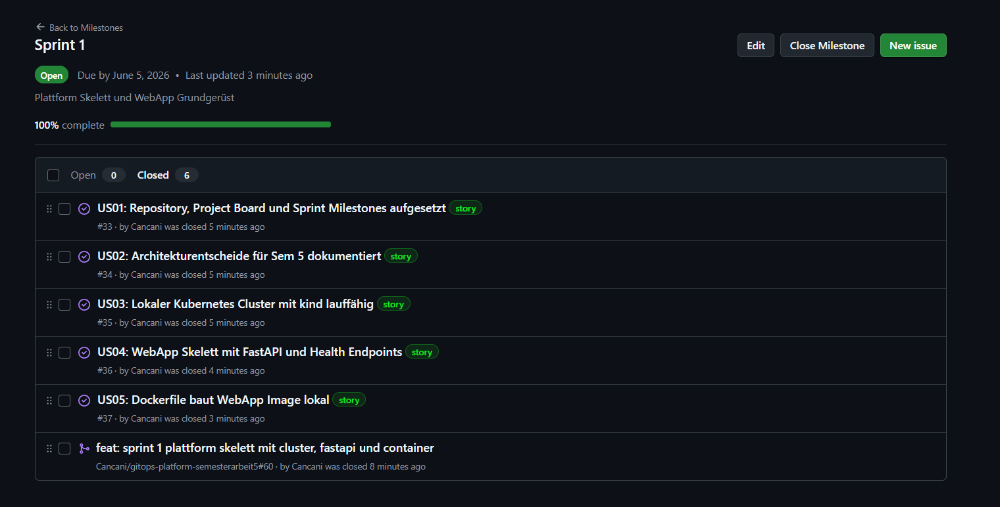
<small><em>Abbildung 1: Milestone Sprint 1 Ende</em></small>

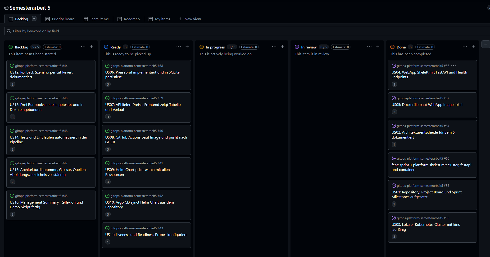
<small><em>Abbildung 2: Projectboard Sprint 1 Ende</em></small>

##### Demo-fähige Artefakte

- Funktionierender kind Cluster mit zwei Nodes (`gitops-platform-control-plane`, `gitops-platform-worker`), beide im Status `Ready`, Kubernetes v1.35.0
- FastAPI Backend lokal lauffähig (`uvicorn main:app --reload --port 8000`), alle vier Endpoints (`/healthz`, `/ready`, `/api/prices`, `/api/prices/history`) liefern erwartete JSON Responses
- Container Image `price-watch-backend:dev` baut in 15 Sekunden, läuft mit aktivem HEALTHCHECK (Status `(healthy)` nach rund 30 Sekunden), Image Grösse 248 MB
- 5 ADRs dokumentiert (FastAPI, kind, SQLite, Monorepo, Squash Merge)
- Doku Kapitel Architekturentscheide (ADRs) und Plattformaufbau auf MkDocs Pages live
- 1 Pull Request gemerged, 11 atomare Commits, lineare History auf `main`

##### Definition of Done Check

| Kriterium | Erfüllt |
| --- | --- |
| Code lokal getestet (Smoke Tests dokumentiert) | ja |
| Doku im selben PR aktualisiert | ja |
| Conventional Commits Format eingehalten | ja |
| User Stories im Project Board geschlossen | ja |
| Squash Merge auf `main` | ja |
| Pages Deployment grün | ja |

##### Zielerreichung gegen SMART Tabelle

| SMART Ziel | Sprint 1 Beitrag | Status |
| --- | --- | --- |
| Kubernetes Umgebung aufbauen | Lokaler kind Cluster mit zwei Nodes per Skript reproduzierbar | erreicht |
| Preisüberwachungs WebApp erstellen | Backend Skelett mit Endpoints aufgesetzt, fachliche Logik folgt in Sprint 2 | teilweise erreicht |
| Anwendung mit Helm paketieren | Nicht im Sprint 1 Scope, Image Build als Vorarbeit erledigt | offen, geplant Sprint 2 |
| GitOps mit Argo CD umsetzen | Nicht im Sprint 1 Scope | offen, geplant Sprint 2 |
| CI Build und Push automatisieren | Lokaler Build verifiziert, CI folgt in Sprint 2 | teilweise vorbereitet |
| Dokumentation und Runbooks erstellen | Architekturentscheide und Plattformaufbau erstellt, Runbooks ab Sprint 3 | im Plan |

##### Stakeholder Abnahme

Die Zwischenpräsentation 1 fand am 05.06.2026 um 19:00 Uhr statt. Präsentiert wurde gegenüber Marcel Bernet (IaCA, CNC, CNA) und Thanam Pangri (Projektmanagement).

**Meeting Minutes Zwischenpräsentation 1**

| Feedback | Art |
| --- | --- |
| Gute Einführung ins Projekt | Positiv |
| Gute Erklärung von IST und SOLL Zustand | Positiv |
| Ausblick übersichtlich dargestellt | Positiv |
| Gute Demo | Positiv |
| Gute Dokumentation und Entscheidungsgrundlagen (ADRs) | Positiv |
| Reflexion vorhanden | Positiv |
| Self Review Checkliste entspricht der Definition of Done | Hinweis |
| Zielerreichung übersichtlich dargestellt, Fortsetzung in Sprint 2 | Positiv |
| Ausblick sehr übersichtlich | Positiv |
| Pull Request mit Verweis auf User Story | Sehr positiv |
| Warum alles in Sprint 2, Anzahl Sprints unklar | Verbesserung |

Die Rückmeldung zum Sprint-Umfang in Sprint 2 wurde aufgenommen. Die Sprint 2 Planung bleibt unverändert, da die Aufteilung inhaltlich korrekt war. Zur Klarheit wurde die Sprint-Struktur mit drei Sprints und den jeweiligen Milestones explizit kommuniziert.

---

#### Sprint 1 Retrospektive

**Datum**: 26.05.2026

Die Retrospektive folgt dem Starfish Modell. Beobachtungen aus Sprint 1 werden in fünf Kategorien einsortiert und in konkrete Aktionen für Sprint 2 überführt.

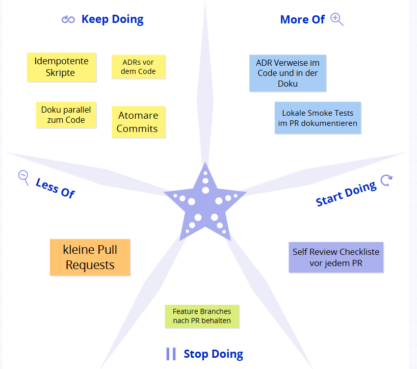
<small><em>Abbildung 3: Sprint 1 Starfish Retrospektive</em></small>

##### Keep (lief gut)

- **Doku parallel zum Code**: Jede Story hatte ein Doku Update im selben PR. R10 (Doku rückständig) ist dadurch in Sprint 1 nicht eingetreten. Die Massnahme aus der Sprint 1 Planung wirkt nachweisbar.
- **Atomare Commits in Conventional Commits Format**: 11 Commits mit klar lesbaren Prefixen (`feat`, `docs`, `kind`, `scripts`, `app`). Self Review war dadurch schnell durchführbar.
- **ADRs vor dem Code**: Die fünf ADRs lagen vor der ersten Zeile Anwendungscode. Begründungen für FastAPI, kind, SQLite, Monorepo und Squash Merge sind schriftlich verteidigbar.
- **Idempotente Skripte mit Verifikation**: Setup und Teardown wurden mehrfach ausgeführt, ohne Fehler. Diese Tests liefern direkt Material für die Runbooks in Sprint 3.

##### Stop (sollte nicht mehr passieren)

- **Branching**: Dev / Feature Branches werden nach einem PR und merge gelöscht und neu erstellt.

##### Start (sollte ab jetzt gemacht werden)

- **Self Review Checkliste vor jedem PR**: Filename Konvention, Funktion vor Style.

##### More of (mehr davon)

- **Lokale Smoke Tests im PR Body dokumentieren**: Bei jeder Story die getesteten Befehle und erwarteten Ausgaben  im PR. Erleichtert Self Review und liefert direkt Material für die Runbooks in Sprint 3.
- **ADR Verweise im Code und in der Doku**: Mehr Querverlinkungen zwischen Dokumentation und ADR, damit der "warum"-Faden überall sichtbar ist.

##### Less of (weniger davon)

- **kleine Pull Requests**: grosse Pull Requests durchführen mit mehreren Commits damit alle Commits einfacher nachverfolgbar sind pro Sprint.

##### Risikobewertung am Sprint 1 Ende (siehe Risikomatrix)

| Risiko | Status nach Sprint 1 | Nächste Massnahme |
| --- | --- | --- |
| R3 Cluster Probleme | nicht eingetreten, kind funktionierte stabil | weiter beobachten |
| R6 GHCR Push fehlerhaft | nicht aktiviert (CI folgt in Sprint 2) | in Sprint 2 früh testen |
| R10 Doku rückständig | nicht eingetreten, parallele Pflege wirkt | Massnahme beibehalten |
| R1 Scope zu gross | nicht eingetreten, alle Stories im SP Budget abgeschlossen | weiter Disziplin halten |
| R4 Argo CD und Helm Setup | wird in Sprint 2 aktiv | als Hauptfokus angehen |
| R9 Sprint 2 Durchstich verfehlt | wird in Sprint 2 aktiv | beobachten |

---

#### Sprint 2 Planung

**Sprint Zeitraum**

Woche 4 bis 6 der Semesterarbeit.

**Sprint Ziel**

GitOps Durchstich. Push auf `main` führt automatisch zu Build, Push, Sync und Deployment im Cluster. Argo CD überwacht das Helm Chart und synchronisiert Änderungen automatisch.

**Sprint 2 Scope**

- CI Pipeline für Image Build und Push nach GHCR
- Helm Chart für die WebApp mit allen Kernressourcen
- Argo CD Installation und Application Definition
- Preisabruf und Datenpersistierung in SQLite
- API und einfaches Frontend für Preise und Verlauf
- Liveness und Readiness Probes


<small><em>Abbildung 4: Sprint 2 Milestone und Issues</em></small>

**Sprint 2 User Stories**

[Link zu Issues auf GitHub](https://github.com/Cancani/gitops-platform-semesterarbeit5/milestone/2)

| US | Titel | Bereich | Story Points |
| --- | --- | --- | --- |
| US06 | Preisabruf implementiert und in SQLite persistiert | WebApp | 3 |
| US07 | API liefert Preise, Frontend zeigt Tabelle und Verlauf | WebApp | 3 |
| US08 | GitHub Actions baut Image und pusht nach GHCR | CI | 3 |
| US09 | Helm Chart price-watch mit allen Ressourcen | Plattform | 3 |
| US10 | Argo CD synct Helm Chart aus dem Repository | GitOps | 3 |
| US11 | Liveness und Readiness Probes konfiguriert | Plattform | 1 |

**Geplanter Aufwand Sprint 2:** **16 Story Points**

Sprint 2 ist bewusst der schwerste Sprint, da hier der GitOps Durchstich entsteht. Das Risiko, dass ein Teil davon nicht in den drei Wochen schaffbar ist, ist explizit in der Risikomatrix als R9 dokumentiert.

**WIP Regel**

In Progress maximal 2 parallel laufende Issues. US06, US07, US08, US09 und US10 werden in dieser Reihenfolge bearbeitet, US11 läuft parallel zu US10 mit.

**Evidence Standard für Sprint 2**

Für Sprint 2 werden mindestens folgende Nachweise geplant:

- Screenshot erfolgreicher CI Lauf in GitHub Actions
- Screenshot Image in GHCR mit mehreren Tags
- Screenshot `helm lint` und `helm template` Output
- Screenshot Argo CD Application Status `Synced, Healthy`
- Screenshot Argo CD Sync nach `values.yaml` Bump
- Screenshot `kubectl get pods -n price-watch` mit neuem Image
- Screenshot `kubectl describe pod` mit Probes
- Screenshot WebApp im Cluster, Tabelle mit Preisen
- Screenshot CronJob Auflistung und letzter Lauf
- Beispiel API Response JSON

---

#### Sprint 2 Review

**Datum**: 22.06.2026 (Zwischenpräsentation 2)

**Sprintziel**: GitOps Durchstich. Push auf `main` führt automatisch zu Build, Push, Sync und Deployment im Cluster.

##### Erledigte User Stories

| ID | Titel | Story Points | Status | Issue |
| --- | --- | --- | --- | --- |
| US06 | Preisabruf implementiert und in SQLite persistiert | 3 | erledigt | geschlossen |
| US07 | API liefert Preise, Frontend zeigt Tabelle und Verlauf | 3 | erledigt | geschlossen |
| US08 | GitHub Actions baut Image und pusht nach GHCR | 3 | erledigt | geschlossen |
| US09 | Helm Chart price-watch mit allen Ressourcen (Kernressourcen)* | 3 | erledigt | geschlossen |
| US10 | Argo CD synct Helm Chart aus dem Repository | 3 | erledigt | geschlossen |
| US11 | Liveness und Readiness Probes konfiguriert | 1 | erledigt | geschlossen |

*US09 wurde in Sprint 2 mit den Kernressourcen (Deployment, Service, Security Context, Probes) abgeschlossen. ConfigMap, PVC und CronJob wurden als geplanter Abschluss von US09 zu Beginn von Sprint 3 ergänzt (siehe Sprint 3 Planung).

**Velocity**: 16 von 16 geplanten Story Points abgeschlossen (100 Prozent Sprint Goal Achievement).

##### Demo-fähige Artefakte

- Vollständiger GitOps Loop: Commit auf `main` triggert CI Build, Image Push nach GHCR, automatisches Update von `values.yaml` und Argo CD Sync ohne manuelles kubectl
- CI Pipeline läuft grün in GitHub Actions, Image unter `ghcr.io/cancani/price-watch-backend` mit SHA Tags und `latest`
- Argo CD Application `price-watch` im Status `Synced, Healthy`, beobachtet `helm/price-watch` auf Branch `main`
- Price Watch Frontend unter `http://localhost:30080`: CS2 Skin Grid mit echten Steam CDN Bildern, Live-Suche, prozentuale Preisänderung in grün/rot, Verlaufsdiagramm per Chart.js
- Vier beobachtete Skins: AK-47 Redline, AWP Asiimov, Desert Eagle Blaze, USP-S Kill Confirmed
- Kubernetes Pod läuft als Non-Root User (UID 1001) mit `readOnlyRootFilesystem`, Liveness und Readiness Probes aktiv
- `helm lint` und `helm template` fehlerfrei

##### Definition of Done Check

| Kriterium | Erfüllt |
| --- | --- |
| Code lokal und im Cluster getestet | ja |
| Doku im selben PR oder direkt danach aktualisiert | ja |
| Conventional Commits Format eingehalten | ja |
| User Stories im Project Board geschlossen | ja |
| Squash Merge auf `main` | ja |
| CI Pipeline grün nach Merge | ja |
| Argo CD Application Synced und Healthy | ja |

##### Zielerreichung gegen SMART Tabelle

| SMART Ziel | Sprint 2 Beitrag | Status |
| --- | --- | --- |
| Kubernetes Umgebung aufbauen | Cluster aus Sprint 1, in Sprint 2 als Produktionsumgebung für Argo CD genutzt | erreicht |
| Preisüberwachungs WebApp erstellen | API liefert Preise aus SQLite, Frontend zeigt Tabelle und Verlauf im Browser | erreicht |
| Anwendung mit Helm paketieren | Helm Chart mit Deployment, Service, Security Context, Probes deployed und via Argo CD synct | erreicht |
| GitOps mit Argo CD umsetzen | Argo CD synct automatisch nach jedem Commit auf main, selfHeal und prune aktiv | erreicht |
| CI Build und Push automatisieren | GitHub Actions baut Image, pushed nach GHCR, updated values.yaml automatisch | erreicht |
| Dokumentation und Runbooks erstellen | Plattformkapitel vollständig, Runbooks folgen in Sprint 3 | im Plan |

##### Herausforderungen und Lösungen

Zwei technische Probleme wurden im Sprint erkannt und gelöst:

**GHCR Lowercase Bug**: Der CI Workflow verwendete `${{ github.repository_owner }}`, was den GitHub Usernamen in Originalschreibweise (`Cancani`) liefert. Die OCI Spezifikation verlangt lowercase Repository Namen. Kubernetes lehnte den Pod mit `InvalidImageName` ab. Lösung: hartkodiertes `cancani` (lowercase) an beiden Stellen im CI Workflow.

**Dockerfile kopierte nur main.py**: Das Dockerfile aus Sprint 1 kopierte ausschliesslich `main.py` ins Container Image. Nach US06 und US07 importiert `main.py` zusätzlich `database.py`, `models.py` und `pricesource.py` und liefert das Frontend aus `static/` aus. Der Container crashte mit `ModuleNotFoundError`. Lösung: `COPY --chown=app:app . .` statt `COPY --chown=app:app main.py ./`.

Beide Bugs wurden per Git Commit auf main gefixt, Argo CD hat nach dem Sync automatisch den gesunden Stand hergestellt. Das illustriert den Vorteil des GitOps Ansatzes: ein Fehler im Cluster wird durch einen Commit behoben, nicht durch manuelles Eingreifen.

##### Stakeholder Abnahme

Die Zwischenpräsentation 2 fand am 22.06.2026 statt. Präsentiert wurde gegenüber Marcel Bernet (IaCA, CNC, CNA) und Thanam Pangri (Projektmanagement). Präsentationsdauer: 18 Minuten.

**Feedback Thanam Pangri (Projektmanagement)**

| Feedback | Art |
| --- | --- |
| Guter Einstieg und Agenda, Projekt klar eingeführt | Positiv |
| Sprintziel und Umsetzung vom letzten zum neuen Sprint nachvollziehbar und verständlich | Positiv |
| Guter Gesamteindruck der Arbeit und Vorgehensweise | Positiv |
| Demo-Fehler ab Minute 9, Use Case nicht vollständig vorbereitet | Verbesserung |
| Problem wurde schnell erkannt und unter Druck gelöst | Positiv |
| Sprint Retrospektive zu wenig klar erklärt | Verbesserung |
| Gesamturteil positiv, Sprint-Abschluss gut dargestellt | Positiv |

**Feedback Marcel Bernet (IaCA, CNC, CNA)**

| Feedback | Art |
| --- | --- |
| Gut gerettet nach Demo-Problem | Positiv |
| Umstellung von manuell zu IaC und deklarativem Ansatz klar rübergekommen | Positiv |
| Gesamturteil: tiptop | Positiv |

**Massnahmen aus dem Feedback**

Der Demo-Fehler trat auf weil ein Use Case nicht vollständig durchgespielt wurde. Für die Schlusspräsentation wird jeder Demo-Schritt mindestens einmal komplett und in Reihenfolge getestet. Die Sprint Retrospektive wird mit dem Starfish-Diagramm visuell unterstützt und klarer erklärt.

---

#### Sprint 2 Retrospektive

**Datum**: 22.06.2026

Die Retrospektive folgt dem Starfish Modell und ist als Diagramm festgehalten.

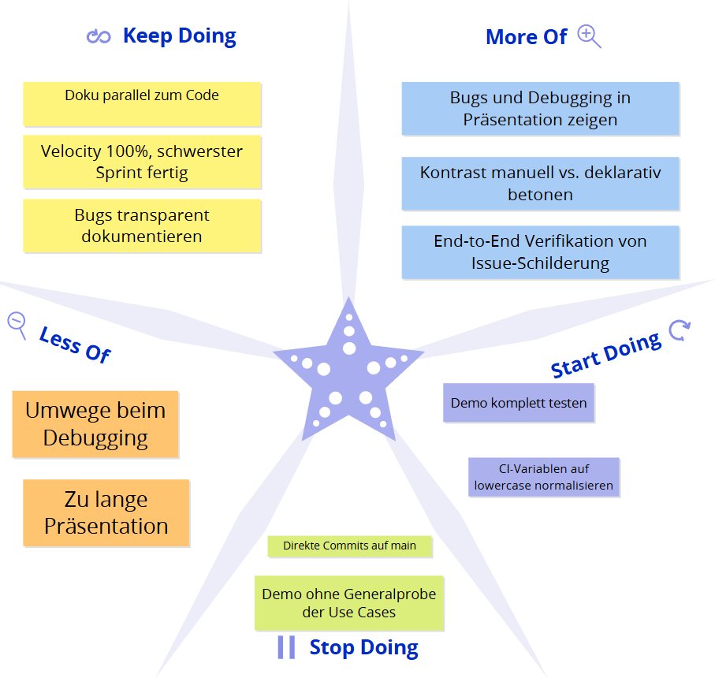
<small><em>Abbildung 5: Starfish Retrospektive Sprint 2</em></small>

##### Keep (lief gut, bitte beibehalten)

- Doku parallel zum Code
- Velocity 100%, schwerster Sprint fertig
- Bugs transparent dokumentieren

##### Stop (sollte nicht mehr passieren)

- Direkte Commits auf main
- Demo ohne Generalprobe der Use Cases

##### Start (sollte ab jetzt gemacht werden)

- Demo komplett testen
- CI-Variablen auf lowercase normalisieren

##### More of (mehr davon)

- Bugs und Debugging in Präsentation zeigen
- Kontrast manuell vs. deklarativ betonen
- End-to-End Verifikation vor Issue-Schliessung

##### Less of (weniger davon)

- Umwege beim Debugging
- Zu lange Präsentation

##### Aktionen für Sprint 3

| Aktion | Frist |
| --- | --- |
| Generalprobe der Schlussdemo vollständig und in Reihenfolge | vor Kolloquium 08.07.2026 |
| Direkte Main Commits vermeiden, auch Hotfixes als PR | laufend |
| CI Workflow Variablen mit Lowercase-Normalisierung absichern | Sprint 3 Start |

##### Risikobewertung am Sprint 2 Ende

| Risiko | Status nach Sprint 2 | Nächste Massnahme |
| --- | --- | --- |
| R2 Preisquelle instabil | Mock Quelle aktiv, keine externe Abhängigkeit | bleibt als Mock, echte Preise als optionale Erweiterung |
| R4 Argo CD und Helm Setup | nicht eingetreten, Loop läuft stabil | weiter beobachten |
| R6 GHCR Push fehlerhaft | eingetreten (Lowercase Bug), behoben | CI Workflow nachgebessert |
| R9 Sprint 2 Durchstich verfehlt | nicht eingetreten, 100 Prozent Velocity | nicht mehr aktiv |
| R10 Doku rückständig | nicht eingetreten, parallele Pflege wirkt | Massnahme beibehalten |
| R1 Scope zu gross | nicht eingetreten | Sprint 3 Scope im Blick behalten |


---

#### Sprint 3 Planung

**Sprint Zeitraum**

Woche 7 bis 9 der Semesterarbeit, 14.06.2026 bis 08.07.2026. Die Zwischenpräsentation 2 (22.06.2026) fand, analog zum Versatz bei Sprint 1, nach dem inhaltlichen Abschluss von Sprint 2 bereits während der Laufzeit von Sprint 3 statt.

**Sprint Ziel**

Plattform und Dokumentation sind prüfbar abgeschlossen. Helm Chart ist mit PVC und CronJob vollständig, Rollback Szenario ist live nachgewiesen, drei Runbooks sind getestet und auf Pages sichtbar, Tests und Lint laufen automatisiert in der Pipeline, alle Doku-Bestandteile sind komplett. Die Schlussdemo ist vorbereitet und getestet.

**Sprint 3 Scope**

- Helm Chart um PVC, ConfigMap und CronJob erweitern (US09 Abschluss)
- Rollback Szenario praktisch durchführen und in Runbook 03 dokumentieren
- Drei Runbooks erstellen, testen und in MkDocs Navigation einbinden
- CI Pipeline um pytest, ruff, helm lint und helm template erweitern
- Vier Mermaid Architekturdiagramme, Quellenverzeichnis, Abbildungsverzeichnis und Glossar finalisieren
- Management Summary finalisieren, Reflexion und Demo Skript schreiben
- Generalprobe der Schlussdemo


<small><em>Abbildung 6: Sprint 3 Milestones und Issues</em></small>

**Sprint 3 User Stories**

[Link zu Issues auf GitHub](https://github.com/Cancani/gitops-platform-semesterarbeit5/milestone/3)

| US | Titel | Bereich | Story Points |
| --- | --- | --- | --- |
| US12 | Rollback Szenario per Git Revert dokumentiert | GitOps | 2 |
| US13 | Drei Runbooks erstellt, getestet und in Doku eingebunden | Dokumentation | 3 |
| US14 | Tests und Lint laufen automatisiert in der Pipeline | CI | 2 |
| US15 | Architekturdiagramme, Glossar, Quellen, Abbildungsverzeichnis vollständig | Dokumentation | 2 |
| US16 | Management Summary, Reflexion und Demo Skript fertig | Dokumentation | 3 |

**Geplanter Aufwand Sprint 3:** **12 Story Points**

Sprint 3 schliesst die Plattform ab und fokussiert auf Nachweisbarkeit und Dokumentation. US09 (Helm Chart PVC und CronJob) wird als technische Grundlage zu Beginn von Sprint 3 fertiggestellt, bevor die Runbooks und der Rollback-Nachweis erarbeitet werden.

**Abhängigkeiten zwischen den Stories**

US13 und US12 sind direkt verknüpft: Runbook 03 (Rollback) enthält den Nachweis aus US12. Beide werden daher parallel erarbeitet. US15 und US16 laufen in der letzten Woche parallel, da US16 auf einem vollständigen technischen Stand aufbaut.

**WIP Regel**

In Progress maximal 2 parallel laufende Issues. US12 und US13 laufen in Woche 8 gleichzeitig. US15 und US16 laufen in Woche 9 gleichzeitig.

**Empfohlene Reihenfolge**

| Woche | Stories | Fokus |
| --- | --- | --- |
| Woche 7 (14.06 bis 22.06) | US09 Abschluss, US14 | PVC und CronJob, Tests und Lint in CI |
| Woche 8 (23.06 bis 29.06) | US12, US13 | Rollback Szenario, drei Runbooks |
| Woche 9 (30.06 bis 08.07) | US15, US16 | Doku Abschluss, Reflexion, Generalprobe |

**Runbooks Übersicht (US13)**

| Runbook | Titel | Anwendungsfall |
| --- | --- | --- |
| RB-01 | Plattform Initial Setup | Cluster und Argo CD von Null aufsetzen, price-watch deployen |
| RB-02 | Neue Version deployen via Git Commit | Code ändern, PR mergen, CI und Argo CD beobachten |
| RB-03 | Rollback eines fehlerhaften Releases | Fehlerhafter Commit auf main, git revert, Cluster erholt sich automatisch |

Jedes Runbook enthält: Voraussetzungen, Schritt-für-Schritt-Anleitung, Erfolgskriterium und Nachweis. Alle drei Runbooks werden mindestens einmal live durchgespielt und in `docs/runbooks/` abgelegt.

**Tests und Lint in der CI Pipeline (US14)**

Die bestehende CI Pipeline (`ci.yaml`) wird um folgende Schritte erweitert, die vor dem Image-Build laufen:

| Schritt | Tool | Zweck |
| --- | --- | --- |
| Lint | ruff | Python Code Qualität und Format |
| Tests | pytest mit httpx | Vier Endpoint-Tests gegen die FastAPI App |
| Helm Lint | helm lint | Statische Prüfung des Helm Charts |
| Helm Template | helm template | Manifeste aus dem Chart rendern und auf Fehler prüfen, ohne Cluster-Verbindung |

Ein fehlgeschlagener Schritt verhindert den Image-Build. Damit ist die Pipeline ein vollständiges Build → Test → Lint → Push Konstrukt. Mindestens ein roter und ein grüner Lauf werden als Screenshot dokumentiert.

**Evidence Standard für Sprint 3**

Für Sprint 3 werden mindestens folgende Nachweise geplant:

- Screenshot `kubectl get pods` und `kubectl get cronjob` mit laufendem CronJob
- Screenshot CronJob Ausführung und Preis-Update im Frontend ohne manuellen Trigger
- Screenshot bad Commit der CrashLoopBackOff oder ImagePullBackOff verursacht
- Screenshot `git log` mit dem Revert Commit und dem dazugehörigen SHA
- Screenshot Argo CD History mit Sync vor und nach dem Rollback
- Screenshot `kubectl get pods` vor und nach dem Rollback
- Drei Runbooks unter `docs/runbooks/` auf Pages sichtbar mit URL
- Screenshot CI Pipeline mit allen Steps grün (Lint, Tests, Helm Lint, Helm Template, Build, Push)
- Screenshot eines fehlgeschlagenen Lint oder Test Laufs mit nachfolgender Korrektur
- Vier Mermaid Architekturdiagramme in der Doku auf Pages sichtbar
- Vollständiges Quellenverzeichnis und Abbildungsverzeichnis
- Demo Skript oder Generalprobe Notizen


**Sprint 3 Review**

Ein separates Sprint 3 Review Gespräch findet nicht statt. Die Abnahme von Sprint 3 erfolgt direkt im Rahmen des Kolloquiums am 08.07.2026, in dem Plattform, Live-Demo und Dokumentation gemeinsam mit beiden Experten geprüft werden. Die Nachweise aus dem Evidence Standard ersetzen dabei die Demo-Artefakte eines regulären Sprint Reviews.

---

#### Sprint 3 Retrospektive

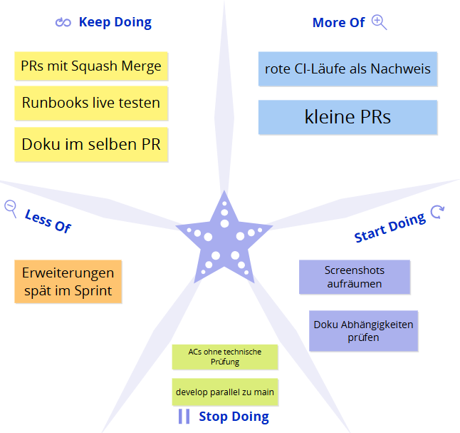
<small><em>Abbildung 7: Starfish Retrospektive Sprint 3</em></small>

**Start Doing**

- Akzeptanzkriterien vor der Umsetzung gegen die technische Realität prüfen. Das Kriterium kubectl apply --dry-run=client aus US14 war ohne laufenden Cluster in der CI nicht umsetzbar und musste durch helm template ersetzt werden. Eine kurze technische Validierung beim Sprint Planning hätte das früher aufgedeckt.
- Dokumentation kontinuierlich reviewen statt in einer grossen Schlusskorrektur. Das finale Doku Review fand mehrere Inkonsistenzen auf einmal, verteilt über den Sprint wäre der Aufwand kleiner gewesen.

**Stop Doing**

- Den develop Branch über längere Zeit parallel zu main führen. Durch Squash Merges divergieren die SHA Stände, was zu unnötigem Branch Handling führte. Feature Branches direkt von main sind bei einem Soloprojekt ausreichend.
- Nicht referenzierte Screenshots im Repository ansammeln. Das Aufräumen am Sprint Ende kostete Zeit, die bei sofortigem Löschen nicht angefallen wäre.

**Keep Doing**

- Alle Änderungen konsequent über PRs mit Squash Merge. Genau diese saubere Historie hat das Rollback Szenario in US12 mit einem einzigen git revert möglich gemacht.
- Runbooks vor der Dokumentation live durchspielen. Alle drei Runbooks wurden praktisch verifiziert, dadurch sind sie belastbar und nicht nur theoretisch.
- Klare Abhängigkeiten zwischen Stories im Planning definieren. Die Verknüpfung von US12 und US13 über Runbook 03 hat Doppelarbeit vermieden.

**More Of**

- Rote Pipeline Läufe bewusst provozieren und dokumentieren. Der absichtlich fehlerhafte Image Tag in US12 war einer der stärksten Nachweise des Sprints und zeigt das Verhalten der Plattform unter Fehlerbedingungen.
- Kleine, abgeschlossene PRs pro Story. Das hat Reviews und Nachvollziehbarkeit deutlich vereinfacht.

**Less Of**

- Funktionale Erweiterungen kurz vor Sprint Ende. Die Integration der Steam Market API als echte Preisquelle war fachlich wertvoll, hätte aber bei Problemen die Doku Stories US15 und US16 gefährdet. Solche Erweiterungen gehören an den Sprint Anfang oder in einen eigenen Scope Entscheid.

**Zusammenfassung**

Sprint 3 wurde mit 12 von 12 Story Points abgeschlossen, die Velocity liegt bei 100 Prozent. Alle fünf Stories sowie der Abschluss von US09 wurden umgesetzt: das Helm Chart ist mit PVC, ConfigMap und CronJob vollständig, die Pipeline prüft Code und Chart automatisiert, das Rollback Szenario ist praktisch nachgewiesen, drei Runbooks sind getestet und die Dokumentation ist mit Diagrammen, Glossar, Quellen, Management Summary und Reflexion vollständig. Die WIP Regel von maximal zwei parallelen Issues wurde eingehalten. Der grösste Lerneffekt des Sprints war der Rollback Nachweis: die Plattform korrigiert Fehlzustände ausschliesslich über Git, ohne direkten Cluster Eingriff.

**Erkenntnisse für zukünftige Projekte**

Akzeptanzkriterien technisch validieren bevor sie ins Issue geschrieben werden, Dokumentation als laufende Aufgabe statt als Schlussaktivität behandeln und Branch Strategien so einfach wie möglich halten. Der GitOps Ansatz mit Pull Prinzip hat sich gegenüber dem Push CD aus Semester 4 als klar nachvollziehbarer und robuster erwiesen.

---

### Branching Strategie

Bewusst einfach gehalten, passend für ein Einpersonen Projekt mit Nachweisanspruch.

- `main` ist der stabile Hauptbranch und gleichzeitig der GitOps Soll Zustand. Direktpushes sind durch Branch Protection unterbunden.
- Feature Branches werden direkt von `main` abgezweigt (Namensschema `sprint3.x` in Sprint 3) und per Pull Request mit Squash Merge zurückgeführt (siehe ADR-005).
- `gh-pages` wird ausschliesslich vom MkDocs Workflow geschrieben, niemals manuell.
- In Sprint 1 und 2 lief die tägliche Arbeit über einen permanenten `develop` Branch. Da Squash Merges die SHA Stände von `develop` und `main` divergieren lassen, wurde `develop` in Sprint 3 aufgegeben (siehe Sprint 3 Retrospektive, Stop Doing). Seither wird ausschliesslich mit kurzlebigen Feature Branches ab `main` gearbeitet.
- Tags pro Sprint Abschluss: `sprint-1`, `sprint-2`, `sprint-3` und `demo`.

Branch Protection ist über GitHub Rulesets umgesetzt:

| Branch | Schutz |
| --- | --- |
| `main` | kein Direktpush, PR Pflicht, linear history, kein Force Push, keine Löschung |
| `develop` | keine Löschung, kein Force Push (Branch seit Sprint 3 nicht mehr genutzt) |
| `gh-pages` | keine Löschung (Force Push erlaubt, da MkDocs gh-deploy ihn benötigt) |

### Repository Strategie: Monorepo

Es wurde zwischen Monorepo und mehreren Repositories abgewogen.

| Kriterium | Monorepo | Multi Repo |
| --- | --- | --- |
| Komplexität | gering | höher |
| Nachvollziehbarkeit Commit zu Deployment | direkt | indirekt, mehrere Repos beobachten |
| GitOps Konfiguration | einfacher Pfad in Argo CD | benötigt zusätzliches Konfigurations Repo |
| Realistisch für 50 Stunden Projekt | ja | nein |
| HF Bewertbarkeit, alles an einem Ort | ja | nein |

**Entscheid:** Monorepo. Code, Helm Chart, Argo CD Application und Dokumentation liegen in einem Repository. Argo CD beobachtet `helm/price-watch`. Die Anwendung wird im selben Repository entwickelt, wodurch der Lifecycle transparent ist.

### Definition of Done

Eine User Story gilt als erledigt, wenn:

1. der Code auf `main` ist (über Feature Branch und Pull Request),
2. ein Issue Eintrag dokumentiert, was erledigt wurde,
3. relevante Screenshots oder Logs in `docs/img/` abgelegt sind,
4. die Funktion lokal reproduzierbar ist (Anleitung in der Doku oder im Runbook),
5. wo sinnvoll, Tests oder Lint Schritte in der Pipeline grün sind,
6. wo zutreffend, Argo CD die Application im Status `Synced, Healthy` zeigt.

### SWOT Analyse

Eine SWOT Analyse hilft, das Projekt aus vier Perspektiven einzuschätzen und Massnahmen für die Sprint Planung abzuleiten.

#### Stärken

- Erfahrung aus der 4. Semesterarbeit mit GitHub Actions, Docker und strukturierter Dokumentation
- Bewährtes MkDocs Setup für GitHub Pages aus Sem 4 wird wiederverwendet
- Klar abgegrenzter Scope, WebApp bleibt absichtlich klein
- Plattform basiert auf etablierten Cloud Native Standards (Kubernetes, Helm, Argo CD)
- Tooling läuft komplett lokal, keine Cloud Kosten

#### Schwächen

- Einpersonen Projekt ohne Code Review von Aussen
- Kubernetes und Argo CD sind neu, Lernkurve ist eingerechnet aber unbekannt
- Nur 9 statt 12 Wochen, weniger Puffer bei Verzögerungen
- Sprint 2 ist sehr dicht gepackt mit dem GitOps Durchstich

#### Chancen

- Aufbau einer Plattform Engineering Grundkompetenz, die im Berufsumfeld direkt nutzbar ist
- Zwei Zwischenpräsentationen erlauben frühes Feedback und Kurskorrektur
- Klares fachliches Profil als Cloud Native Engineer durch praxisnahes End to End Beispiel
- Mögliche Erweiterung in einer Folgearbeit (Multi Cluster, Service Mesh, Security)

#### Risiken

- GitOps Durchstich in Sprint 2 wird nicht in 3 Wochen geschafft (siehe R9 in Risikomatrix)
- Doku rückständig zur Umsetzung (siehe R10)
- Verzettelung in optionale Zusatztools wie Monitoring (siehe R5)
- Externe Preis API instabil oder limitiert (siehe R2, gemildert durch Testdaten Fallback)
- Argo CD oder Helm Konfiguration verursachen mehr Setup Aufwand als geplant (siehe R4, R9)

#### Fazit der SWOT Analyse

Die Stärken aus dem Vorprojekt (Doku Disziplin, CI/CD Erfahrung, MkDocs Setup) kompensieren teilweise die Schwächen des Einpersonen Settings. Die grösste Schwäche ist der dichte Sprint 2 in nur 9 Wochen. Massnahme: GitOps Durchstich (US08, US09, US10) wird parallel statt sequenziell angegangen, und die ersten zwei Wochen von Sprint 2 sind dafür reserviert. Optionale Zusatztools werden konsequent aus dem Scope ausgegrenzt.

---

### Use Case Diagramm

Das Use Case Diagramm zeigt die Interaktionen zwischen den Akteuren und der Plattform. Da der fachliche Fokus auf der Plattform liegt, sind die Use Cases bewusst aus Plattform Sicht modelliert und nicht aus einer fachlichen Geschäftslogik.

#### Akteure

| Akteur | Beschreibung |
| --- | --- |
| **Entwickler** | Die rolle, in der Code, Helm Werte und Doku verändert werden. Triggert via Git Commit den GitOps Lifecycle. |
| **Endbenutzer** | Konsumiert die Preisüberwachungs WebApp über den Browser, fragt aktuelle Preise und Verlauf ab. |
| **CI System (GitHub Actions)** | Automatisierter Akteur, baut Container Images, pusht in Registry und prüft die Doku Site. |
| **Argo CD** | Automatisierter Akteur, synchronisiert den Soll Zustand aus dem Repository in den Kubernetes Cluster. |
| **Externe Preis API** | Externer Datenlieferant für Preise. Optional, mit Testdaten Fallback. |

#### Use Case Diagramm

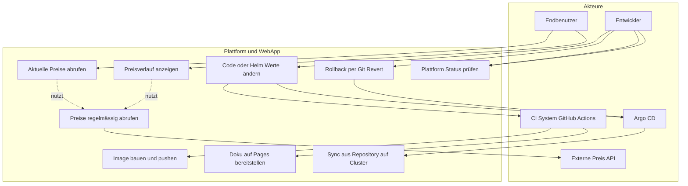
```mermaid
flowchart TB
    subgraph Akteure[Akteure]
        Dev[Entwickler]
        User[Endbenutzer]
        CI[CI System GitHub Actions]
        Argo[Argo CD]
        Ext[Externe Preis API]
    end

    subgraph System[Plattform und WebApp]
        UC1[Code oder Helm Werte ändern]
        UC2[Image bauen und pushen]
        UC3[Doku auf Pages bereitstellen]
        UC4[Sync aus Repository auf Cluster]
        UC5[Rollback per Git Revert]
        UC6[Aktuelle Preise abrufen]
        UC7[Preisverlauf anzeigen]
        UC8[Preise regelmässig abrufen]
        UC9[Plattform Status prüfen]
    end

    Dev --> UC1
    Dev --> UC5
    Dev --> UC9

    UC1 --> CI
    CI --> UC2
    CI --> UC3

    UC1 --> Argo
    Argo --> UC4
    UC5 --> Argo

    User --> UC6
    User --> UC7

    UC8 --> Ext
    UC6 -.->|nutzt| UC8
    UC7 -.->|nutzt| UC8

    Dev --> UC9
```

_Abbildung 8: Use Case Diagramm aus Plattform Sicht_

#### Use Cases im Detail

##### UC1: Code oder Helm Werte ändern

**Akteur:** Entwickler
**Auslöser:** Code Anpassung, Image Tag Bump oder Doku Änderung
**Ablauf:** Entwickler ändert Datei lokal, committet auf einen Feature Branch, öffnet Pull Request nach `main`, mergt per Squash Merge.
**Ergebnis:** Änderung ist auf `main` und triggert je nach Pfad die CI Pipeline oder den Pages Build.

##### UC2: Image bauen und pushen

**Akteur:** CI System (GitHub Actions)
**Auslöser:** Push auf `main` mit Änderungen unter `app/backend/**` oder `helm/**` (siehe Kapitel CI Pipeline, Trigger und Path Filter)
**Ablauf:** Workflow checkt Code aus, baut Container Image, pusht nach GHCR mit Tags `:sha` und `:latest`.
**Ergebnis:** Neues Image ist in GHCR verfügbar und wird vom kubelet gemäss Deployment Spezifikation gezogen oder lokal geladen.

##### UC3: Doku auf Pages bereitstellen

**Akteur:** CI System (GitHub Actions)
**Auslöser:** Push auf `main` mit Änderungen unter `docs/` oder in `mkdocs.yml`
**Ablauf:** Workflow installiert MkDocs Material, baut die Site und deployed auf `gh-pages`. GitHub Pages serviert die Site unter der konfigurierten URL.
**Ergebnis:** Aktuelle Doku ist live unter der Pages URL.

##### UC4: Sync aus Repository auf Cluster

**Akteur:** Argo CD
**Auslöser:** Änderung im überwachten Pfad `helm/price-watch`
**Ablauf:** Argo CD pollt das Repository, erkennt Drift, appliziert die neuen Manifeste auf den Cluster.
**Ergebnis:** Cluster Zustand entspricht dem Soll Zustand im Repository. Application Status zeigt `Synced, Healthy`.

##### UC5: Rollback per Git Revert

**Akteur:** Entwickler
**Auslöser:** Fehlerhafter Release nach Sync
**Ablauf:** Entwickler ermittelt schlechten Commit, führt `git revert` aus, pusht auf `main`. Argo CD synct den vorherigen Stand.
**Ergebnis:** Cluster läuft wieder mit dem letzten guten Image Tag.

##### UC6: Aktuelle Preise abrufen

**Akteur:** Endbenutzer
**Auslöser:** Aufruf der WebApp URL im Browser
**Ablauf:** Frontend lädt Daten von `GET /api/prices`, zeigt Tabelle mit aktuellem Preis pro Produkt.
**Ergebnis:** Endbenutzer sieht aktuelle Marktpreise.

##### UC7: Preisverlauf anzeigen

**Akteur:** Endbenutzer
**Auslöser:** Klick auf ein Produkt oder Aufruf der Verlaufsseite
**Ablauf:** Frontend lädt Daten von `GET /api/prices/history`, optional gefiltert per `?item=`, rendert einfaches Chart mit Chart.js.
**Ergebnis:** Endbenutzer sieht Preisentwicklung über die Zeit.

##### UC8: Preise regelmässig abrufen

**Akteur:** Kubernetes CronJob (intern), externe Preis API
**Auslöser:** Cron Schedule (jede Minute, `*/1 * * * *`)
**Ablauf:** CronJob startet einen Job Pod, der `POST /api/prices/refresh` am Backend aufruft. Das Backend ruft die externe Preis API oder den Testdaten Fallback ab und speichert die Datensätze in SQLite.
**Ergebnis:** Datenbank enthält aktuelle Preisdaten. Bei nicht erreichbarer API wird der Testdaten Fallback genutzt.

##### UC9: Plattform Status prüfen

**Akteur:** Entwickler
**Auslöser:** Manuelle Prüfung oder Reaktion auf Alarm
**Ablauf:** Entwickler nutzt `kubectl get pods`, Argo CD UI, GitHub Actions Logs. Bei Bedarf Zugriff auf `/healthz` und `/ready`.
**Ergebnis:** Klares Bild über Cluster, Application und WebApp Zustand.

#### Geschäftsregeln und technische Constraints

- Änderungen am Deployment erfolgen ausschliesslich über Git Commits, niemals direkt im Cluster (GitOps Prinzip).
- Die WebApp läuft auch ohne externe Preis API durch den Testdaten Fallback.
- Argo CD synct automatisch (`syncPolicy.automated`) mit `prune: true` und `selfHeal: true`.
- Image Tags werden von der CI Pipeline per Bot Commit in `values.yaml` gebumpt, kein Argo CD Image Updater (Scope Entscheidung).
- Pull Requests gehen ausschliesslich über Feature Branches nach `main`, niemals umgekehrt im normalen Flow.

---

### Risikomatrix

Die Risikomatrix stellt die identifizierten Projektrisiken zweidimensional dar. Sie hilft, Risiken nach Eintrittswahrscheinlichkeit und Auswirkung zu priorisieren und passende Gegenmassnahmen abzuleiten.

#### Achsenbeschreibung

**Y Achse, Eintrittswahrscheinlichkeit (5 Stufen):**

| Stufe | Bedeutung |
| --- | --- |
| Unwahrscheinlich | Tritt mit sehr geringer Wahrscheinlichkeit ein, eher theoretisch |
| Selten | Tritt vereinzelt ein, aber nicht regelmässig |
| Gelegentlich | Kann durchaus eintreten, ist nicht ungewöhnlich |
| Wahrscheinlich | Tritt mit hoher Wahrscheinlichkeit ein |
| Sehr wahrscheinlich | Eintritt ist nahezu sicher |

**X Achse, Auswirkung (4 Stufen):**

| Stufe | Bedeutung |
| --- | --- |
| Niedrig | Kaum spürbare Auswirkung, leicht zu beheben |
| Mittel | Spürbare Auswirkung, Mehraufwand zur Behebung |
| Hoch | Deutliche Auswirkung auf den Projektfortschritt |
| Kritisch | Projektgefährdend, Sprint Ziele oder Abgabe nicht erreichbar |

#### Farbbedeutung

| Farbe | Bedeutung | Behandlung |
| --- | --- | --- |
| Grün | Geringes Risiko | Beobachten, keine aktive Massnahme nötig |
| Gelb | Mittleres Risiko | Massnahme definieren, Auswirkungen begrenzen |
| Orange | Erhöhtes Risiko | Aktive Massnahme umsetzen, Monitoring erforderlich |
| Rot | Kritisches Risiko | Sofortige Massnahme, hat Priorität in der Sprint Planung |


#### Risiken im Detail

| ID | Risiko | Wahrscheinlichkeit | Auswirkung | Level | Massnahme | Sprint |
| --- | --- | --- | --- | --- | --- | --- |
| **R1** | Scope wird zu gross, WebApp wächst ungeplant über die Plattform hinaus | Wahrscheinlich | Hoch | Orange | WebApp bewusst klein halten, jedes Sprint Ziel auf Pflichtumfang prüfen, Plattform priorisieren | laufend |
| **R2** | Externe Preisquelle ist instabil, limitiert oder bricht weg | Wahrscheinlich | Mittel | Orange | Früh testen, Testdaten Fallback im CronJob, in Doku als bewusste Abgrenzung dokumentieren | Sprint 2 |
| **R3** | Lokaler Kubernetes Cluster (kind) verursacht Setup oder Stabilitätsprobleme | Gelegentlich | Hoch | Orange | Setup Skript versioniert und idempotent, k3s als Backup, früh testen in Sprint 1 | Sprint 1 |
| **R4** | Argo CD oder Helm Setup verursachen mehr Aufwand als geplant | Wahrscheinlich | Hoch | Rot | Bewusst einfache Application ohne App of Apps und OIDC, `helm lint` und `helm template` in CI, Setup in Runbook 01 | Sprint 2 |
| **R5** | Zeitdruck durch Verzettelung in Zusatztools wie Monitoring, Alerting, Dashboards | Gelegentlich | Hoch | Orange | Strikt Out of Scope erklären, nur umsetzen falls Kernziele erfüllt und Restzeit verbleibt | Sprint 3 |
| **R6** | Image Push nach GHCR schlägt wegen Token oder Permissions fehl | Gelegentlich | Mittel | Gelb | `permissions: packages: write` im Workflow, GHCR Sichtbarkeit korrekt setzen, frühzeitig testen | Sprint 2 |
| **R7** | Datenverlust SQLite bei Pod Neustart ohne PVC | Selten | Niedrig | Grün | PVC im Helm Chart Pflicht, Verifikation per Test (Pod löschen, Daten noch da) | Sprint 2 |
| **R8** | Demo Geräte oder Netz im Klassenzimmer fallen aus | Unwahrscheinlich | Kritisch | Gelb | Demo lokal auf Laptop, kein Cloud Cluster nötig, vorbereitetes Demo Video als Fallback | Sprint 3 |
| **R9** | Sprint 2 schafft den GitOps Durchstich nicht in 3 Wochen | Wahrscheinlich | Kritisch | Rot | US08, US09, US10 parallel ab Woche 4 starten, US06 und US07 parallel weiterführen, Zwischenpräsentation 1 als Reality Check nutzen | Sprint 2 |
| **R10** | Dokumentation rückständig zur Umsetzung | Sehr wahrscheinlich | Hoch | Rot | Doku Pflicht in Definition of Done, MkDocs Pages ab Sprint 1 live, Reviewzeit pro Sprint einplanen | laufend |

#### Einordnung in die Risikomatrix

Die folgende Tabelle zeigt, an welcher Position der grafischen Risikomatrix jedes Risiko eingezeichnet wird. Spalten sind die Auswirkung von links (Niedrig) nach rechts (Kritisch), Zeilen sind die Wahrscheinlichkeit von unten (Unwahrscheinlich) nach oben (Sehr wahrscheinlich).

```
                         Niedrig     Mittel       Hoch         Kritisch
Sehr wahrscheinlich      [grün]      [orange]     [rot] R10    [rot]
Wahrscheinlich           [grün]      [orange] R2  [rot] R1,R4  [rot] R9
Gelegentlich             [grün]      [gelb] R6    [orange] R3, [orange]
                                                  R5
Selten                   [grün] R7   [grün]       [gelb]       [orange]
Unwahrscheinlich         [grün]      [grün]       [grün]       [gelb] R8
```

**Position pro Risiko zum Eintragen in der Grafik:**

| Risiko | Position (Wahrscheinlichkeit, Auswirkung) | Feldfarbe |
| --- | --- | --- |
| R1 Scope zu gross | Wahrscheinlich, Hoch | Rot |
| R2 Preisquelle instabil | Wahrscheinlich, Mittel | Orange |
| R3 Cluster Probleme | Gelegentlich, Hoch | Orange |
| R4 Argo CD/Helm Setup | Wahrscheinlich, Hoch | Rot |
| R5 Zusatztools Verzettelung | Gelegentlich, Hoch | Orange |
| R6 GHCR Push fehlerhaft | Gelegentlich, Mittel | Gelb |
| R7 SQLite Datenverlust | Selten, Niedrig | Grün |
| R8 Demo Geräte fallen aus | Unwahrscheinlich, Kritisch | Gelb |
| R9 Sprint 2 Durchstich verfehlt | Wahrscheinlich, Kritisch | Rot |
| R10 Doku rückständig | Sehr wahrscheinlich, Hoch | Rot |


<small><em>Abbildung 9: Risikomatrix mit allen zehn Risiken</em></small>

#### Risikobehandlung über die Sprints

- **Sprint 1:** R3 und R6 frühzeitig prüfen, damit Plattform und CI Setup tragfähig sind. R10 ab Sprint 1 durch laufende Doku auf MkDocs Pages reduzieren.
- **Sprint 2:** R2 mit Testdaten Fallback abdecken. R4 durch frühen, schrittweisen Aufbau von Helm Chart und Argo CD Application angehen. R9 als Hauptfokus überwachen, der GitOps Durchstich hat Priorität.
- **Sprint 3:** R5 strikt aus Scope halten, keine Zusatztools wenn Kernziele wackeln. R8 mit Demo Generalprobe und vorbereitetem Video absichern. R10 final reduzieren durch vollständige Doku vor Abgabe.

#### Fazit zur Risikomatrix

Die drei höchsten Risiken (R4, R9, R10) sind alle in der roten Zone und betreffen den Kern der Arbeit: technische Neuheit der Plattform, der dichte GitOps Durchstich in Sprint 2 und die laufende Doku Pflege. Für alle drei sind konkrete Massnahmen definiert, die direkt in die Sprintplanung einfliessen.

Die orangen Risiken (R1, R2, R3, R5) sind technisch oder organisatorisch beherrschbar und werden über die Sprints aktiv beobachtet. Die Massnahmen sind so gewählt, dass sie ohne zusätzlichen Sprint Aufwand integrierbar sind, zum Beispiel der Testdaten Fallback für R2 oder die strikte Scope Disziplin für R1 und R5.

Die gelben und grünen Risiken (R6, R7, R8) sind dokumentiert, aber kein aktiver Treiber der Sprintplanung. Sie werden bei Eintritt mit den vorbereiteten Massnahmen behandelt.

#### Status am Projektende

Nach Projektabschluss wird hier die Ist Bewertung pro Risiko ergänzt: ob das Risiko eingetreten ist und ob die Massnahme gewirkt hat.

| ID | Ist Bewertung | Massnahme erfolgreich? | Bemerkung |
| --- | --- | --- | --- |
| R1 | Nicht eingetreten | Ja | WebApp blieb über alle drei Sprints bewusst klein, Scope Disziplin hat gehalten |
| R2 | Teilweise eingetreten | Ja | Steam API wird produktiv genutzt, Mock-Fallback hat in Tests und CI ohne Netzwerkzugriff zuverlässig übernommen |
| R3 | Nicht eingetreten | Ja | kind Cluster lief über alle drei Sprints stabil, keine grösseren Setup-Probleme |
| R4 | Teilweise eingetreten | Ja | Helm Chart und Argo CD Application brauchten mehr Iteration als geplant, insbesondere PVC und CronJob in Sprint 3, aber ohne Verzug beim Kernziel |
| R5 | Nicht eingetreten | Ja | Kein Monitoring, kein Alerting, kein Dashboard umgesetzt, konsequent aus Scope gehalten |
| R6 | Eingetreten | Ja | GHCR Push scheiterte initial an der Gross-Kleinschreibung von `github.repository_owner`, behoben durch hartkodiertes `cancani` |
| R7 | Nicht eingetreten | Ja | PVC seit Sprint 3 im Einsatz, Datenverlust bei Pod-Neustart verifiziert ausgeschlossen |
| R8 | Nicht eingetreten | Ja | Demo läuft lokal auf dem eigenen Notebook, kein externer Abhängigkeitspunkt |
| R9 | Nicht eingetreten | Ja | Sprint 2 hat den GitOps Durchstich mit 16 von 16 Story Points vollständig geschafft |
| R10 | Teilweise eingetreten | Ja | Einzelne Kapitel liefen der Umsetzung hinterher, insbesondere die CI-Beschreibung nach der US14 Erweiterung, wurde vor Abgabe nachgezogen |

---

## Architektur im Überblick

Dieses Kapitel zeigt die Architektur auf vier Ebenen, von aussen nach innen: zuerst der Systemkontext mit allen Akteuren und externen Systemen, dann die interne Architektur der WebApp, danach die Plattform Architektur auf Kubernetes Ebene, und zum Schluss die zeitliche Abfolge des GitOps Loops als Sequenzdiagramm. Die Diagramme sind bewusst als Ergänzung zu den ADRs und zum Kapitel Plattformaufbau gedacht: Sie zeigen das Gesamtbild, die Detailbegründungen stehen in den jeweiligen Kapiteln.

### Systemkontext

Das Systemkontextdiagramm zeigt die Plattform als Ganzes, abgegrenzt von den externen Akteuren und Systemen, mit denen sie kommuniziert.

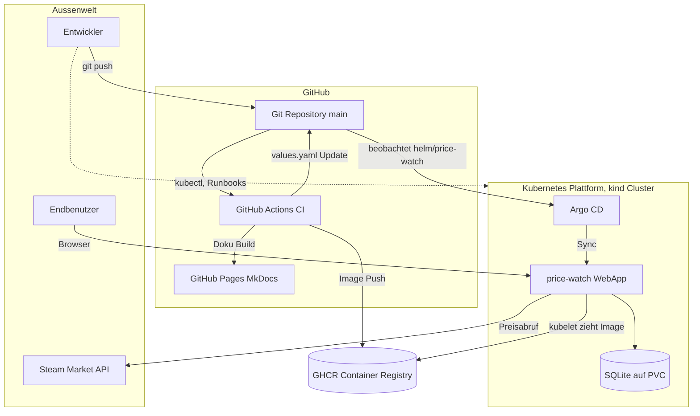
```mermaid
flowchart TB
    subgraph Aussenwelt
        Dev[Entwickler]
        User[Endbenutzer]
        Steam[Steam Market API]
    end

    subgraph GitHub[GitHub]
        Repo[Git Repository main]
        Actions[GitHub Actions CI]
        Pages[GitHub Pages MkDocs]
    end

    GHCR[(GHCR Container Registry)]

    subgraph Plattform[Kubernetes Plattform, kind Cluster]
        Argo[Argo CD]
        App[price-watch WebApp]
        DB[(SQLite auf PVC)]
    end

    Dev -->|git push| Repo
    Repo --> Actions
    Actions -->|Image Push| GHCR
    Actions -->|Doku Build| Pages
    Actions -->|values.yaml Update| Repo
    Repo -->|beobachtet helm/price-watch| Argo
    Argo -->|Sync| App
    App -->|kubelet zieht Image| GHCR
    App --> DB
    App -->|Preisabruf| Steam
    User -->|Browser| App
    Dev -.->|kubectl, Runbooks| Plattform
```

_Abbildung 10: Systemkontext der Plattform_

Vier Akteure beziehungsweise externe Systeme umgeben die Plattform: der Entwickler, der über Git Commits die Plattform verändert, der Endbenutzer, der die WebApp im Browser konsumiert, GitHub als Ort für Repository, CI und Doku Hosting, und die Steam Market API als externe, nicht kontrollierte Datenquelle. Alle Pfeile in die Plattform hinein laufen entweder über Git (deklarativ, versioniert) oder über den direkten Preisabruf der WebApp selbst. Es gibt keinen Pfad, der den Cluster direkt und undokumentiert verändert. Argo CD überwacht dabei ausschliesslich den Pfad `helm/price-watch`, rendert das Chart und synchronisiert die Kubernetes Ressourcen; das Container Image wird nicht von Argo CD, sondern vom kubelet gemäss Deployment Spezifikation aus GHCR geladen.

### WebApp Architektur

Die WebApp Architektur zeigt die interne Struktur des FastAPI Backends und wie Browser und CronJob mit ihm interagieren.

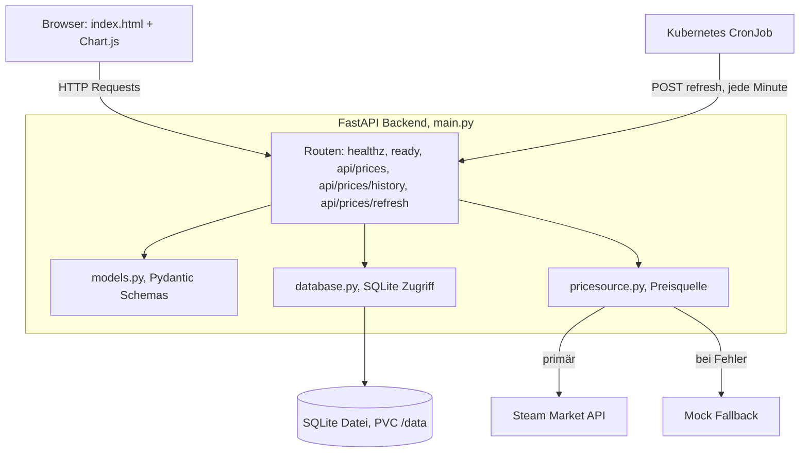
```mermaid
flowchart TB
    Browser[Browser: index.html + Chart.js]
    CronJob[Kubernetes CronJob]

    subgraph Backend[FastAPI Backend, main.py]
        Routes[Routen: healthz, ready, api/prices, api/prices/history, api/prices/refresh]
        Models[models.py, Pydantic Schemas]
        DBLayer[database.py, SQLite Zugriff]
        Source[pricesource.py, Preisquelle]
    end

    Mock[Mock Fallback]
    SteamAPI[Steam Market API]
    SQLite[(SQLite Datei, PVC /data)]

    Browser -->|HTTP Requests| Routes
    CronJob -->|POST refresh, jede Minute| Routes
    Routes --> Models
    Routes --> DBLayer
    Routes --> Source
    DBLayer --> SQLite
    Source -->|primär| SteamAPI
    Source -->|bei Fehler| Mock
```

_Abbildung 11: WebApp Architektur_

Die vier Python Module haben klar getrennte Zuständigkeiten: `main.py` definiert nur die Routen und verdrahtet die anderen Module, `models.py` validiert Ein- und Ausgabedaten über Pydantic, `database.py` kapselt jeden SQLite Zugriff, und `pricesource.py` entscheidet pro Aufruf, ob die echte Steam API oder der Mock Fallback antwortet. Kein Modul greift direkt auf ein anderes als über diese Schnittstellen zu, was die automatisierten Tests aus US14 ohne echten Cluster oder echte Steam Verbindung ermöglicht.

### Plattform Architektur

Die Plattform Architektur zeigt, was innerhalb des kind Clusters läuft und wie Argo CD den Soll-Zustand aus dem Repository durchsetzt.

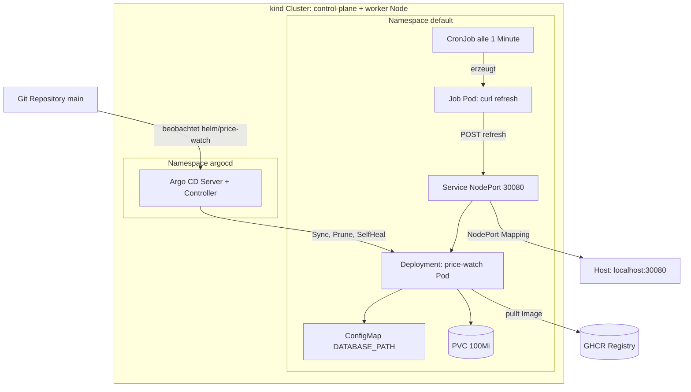
```mermaid
flowchart TB
    subgraph KindCluster[kind Cluster: control-plane + worker Node]
        subgraph ArgoNS[Namespace argocd]
            ArgoServer[Argo CD Server + Controller]
        end

        subgraph DefaultNS[Namespace default]
            Deploy[Deployment: price-watch Pod]
            Svc[Service NodePort 30080]
            CM[ConfigMap DATABASE_PATH]
            PVC[(PVC 100Mi)]
            CJ[CronJob alle 1 Minute]
            Job[Job Pod: curl refresh]
        end
    end

    GHCR[(GHCR Registry)]
    Repo[Git Repository main]
    Host[Host: localhost:30080]

    Repo -->|beobachtet helm/price-watch| ArgoServer
    ArgoServer -->|Sync, Prune, SelfHeal| Deploy
    Deploy -->|pullt Image| GHCR
    Svc --> Deploy
    Deploy --> CM
    Deploy --> PVC
    CJ -->|erzeugt| Job
    Job -->|POST refresh| Svc
    Svc -->|NodePort Mapping| Host
```

_Abbildung 12: Plattform Architektur auf Kubernetes Ebene_

Zwei Namespaces sind relevant: `argocd` für Argo CD selbst, bootstrapped über `kubectl apply` (siehe Begründung im Kapitel Plattformaufbau), und `default` für die eigentliche Anwendung. Argo CD ist der einzige Akteur, der Ressourcen im Namespace `default` verändert, jede manuelle `kubectl edit` oder `kubectl scale` wird beim nächsten Reconcile Loop durch `selfHeal: true` zurückgesetzt. Der CronJob läuft als eigener, kurzlebiger Job Pod, nicht im Deployment Pod selbst, sodass ein hängender Preisabruf nie den laufenden Service beeinträchtigt.

### GitOps Sequenz

Das Sequenzdiagramm zeigt den vollständigen Ablauf von einem Commit bis zum synchronisierten Cluster, inklusive dem Abbruchpfad bei einer fehlgeschlagenen Prüfung.

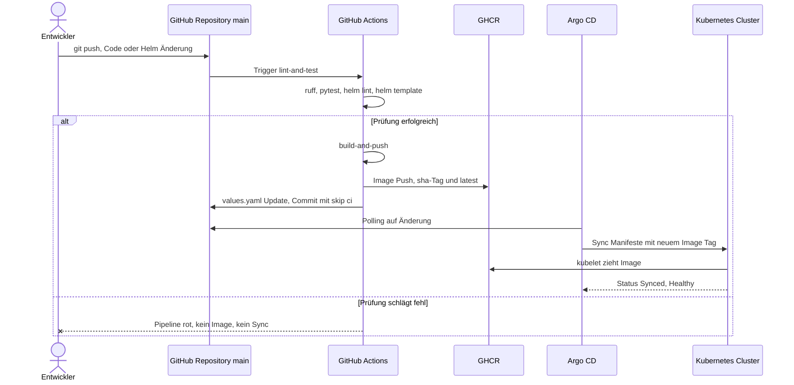
```mermaid
sequenceDiagram
    actor Dev as Entwickler
    participant Git as GitHub Repository main
    participant CI as GitHub Actions
    participant GHCR as GHCR
    participant Argo as Argo CD
    participant K8s as Kubernetes Cluster

    Dev->>Git: git push, Code oder Helm Änderung
    Git->>CI: Trigger lint-and-test
    CI->>CI: ruff, pytest, helm lint, helm template

    alt Prüfung erfolgreich
        CI->>CI: build-and-push
        CI->>GHCR: Image Push, sha-Tag und latest
        CI->>Git: values.yaml Update, Commit mit skip ci
        Argo->>Git: Polling auf Änderung
        Argo->>K8s: Sync Manifeste mit neuem Image Tag
        K8s->>GHCR: kubelet zieht Image
        K8s-->>Argo: Status Synced, Healthy
    else Prüfung schlägt fehl
        CI--xDev: Pipeline rot, kein Image, kein Sync
    end
```

_Abbildung 13: GitOps Sequenz vom Commit bis zum synchronisierten Cluster_

Der entscheidende Punkt in diesem Diagramm ist der `alt`-Block: Nur wenn `lint-and-test` grün ist, entsteht überhaupt ein neues Image, und nur dann wird `values.yaml` verändert. Damit kann kein ungeprüfter Code jemals bis zu Argo CD vordringen. Der Rollback aus Kapitel Rollback Szenario per Git Revert nutzt exakt denselben Pfad in die andere Richtung: ein `git revert` ist ebenfalls nur ein Commit auf `main` und durchläuft dieselbe Pipeline.

---

## Architekturentscheide (ADRs)

Wichtige technische Entscheidungen werden als Architectural Decision Records (ADRs) dokumentiert. Jeder ADR beschreibt Kontext, betrachtete Alternativen, den Entscheid und die Konsequenzen. Das Format folgt einer abgespeckten Variante des MADR Schemas (Markdown Architectural Decision Records).

Die ADRs sind versioniert und werden im Verlauf der Arbeit ergänzt, wenn neue Entscheidungen getroffen werden. Spätere Änderungen an einem bestehenden ADR werden nicht überschrieben, sondern erhalten den Status "Abgelöst" und verweisen auf den neuen ADR.

### ADR Übersicht

| ADR | Titel |
| --- | --- |
| [ADR-001](#adr-001-fastapi-statt-flask-fur-das-backend) | FastAPI statt Flask für das Backend |
| [ADR-002](#adr-002-lokaler-cluster-mit-kind-statt-minikube) | Lokaler Cluster mit kind statt minikube |
| [ADR-003](#adr-003-sqlite-statt-postgresql-als-datenbank) | SQLite statt PostgreSQL als Datenbank |
| [ADR-004](#adr-004-monorepo-statt-multi-repo) | Monorepo statt Multi Repo |
| [ADR-005](#adr-005-squash-merge-statt-merge-commit) | Squash Merge statt Merge Commit | 

### ADR-001: FastAPI statt Flask für das Backend

**Kontext und Problemstellung**

In der 4. Semesterarbeit (Geräteausleihe) wurde Python mit Flask als Backend Framework eingesetzt. Für diese Arbeit wird ein HTTP Service mit folgenden Anforderungen benötigt:

- REST Endpoints für aktuelle und historische Preise
- Health Endpoints `/healthz` und `/ready` für Kubernetes Liveness und Readiness Probes
- Klar definierte Datenmodelle zwischen API Schicht und SQLite
- Anbindung an einen Kubernetes CronJob für regelmässigen Preisabruf
- Lerntransfer und Evolution gegenüber Sem 4

Es ist zu entscheiden, ob das aus Sem 4 bekannte Flask weitergeführt oder ein anderes Framework gewählt wird.

**Entscheidungstreiber**

- Cloud Native Eignung, insbesondere klare Schnittstellen für Probes und API
- OpenAPI Spezifikation und Swagger UI ohne zusätzlichen Aufwand für Dokumentation und manuelles Testen
- Typisierte Datenmodelle (Pydantic) für Konsistenz zwischen Request, Response und Datenbankschicht
- Vertretbare Einarbeitungszeit im 9 Wochen Rahmen
- Sichtbarer Lerntransfer gegenüber Sem 4

**Betrachtete Optionen**

1. Flask weiterführen, bekannt aus Sem 4
2. FastAPI als modernes ASGI Framework mit OpenAPI Unterstützung
3. Django REST Framework als vollumfänglicher Stack

**Entscheid**

FastAPI wird als Backend Framework eingesetzt.

**Begründung**

FastAPI baut auf Python Type Hints auf und liefert die OpenAPI Spezifikation samt Swagger UI unter `/docs` ohne Zusatzkonfiguration. Pydantic Modelle erzwingen Konsistenz zwischen API Schicht und Persistenzschicht, was bei einer typisierten, kleinen Domain wie der Preisüberwachung sauber passt.

Gegenüber Flask reduziert FastAPI Boilerplate (kein eigener Marshalling Code, automatische Request Validierung) und macht den Code prüfbarer. Gegenüber Django REST Framework ist FastAPI deutlich leichtgewichtiger und matchet den Scope (keine Admin Oberfläche, kein User Management) wesentlich besser.

Der Wechsel von Flask zu FastAPI dokumentiert zudem den Lernfortschritt zwischen Sem 4 und Sem 5 und fliesst als Lerntransfer in die Reflexion ein.

**Konsequenzen**

*Positiv*

- Automatische OpenAPI Dokumentation reduziert Testaufwand in Sprint 2 und Sprint 3
- Pydantic Modelle stellen eine klare Schnittstelle zur Datenbank dar
- Klarere Cloud Native Wahrnehmung im HF Bewertungsraster, da FastAPI als modernes Cloud Native Framework gilt

*Negativ*

- Einarbeitungszeit von rund 1 bis 2 Stunden für Pydantic und Dependency Injection
- Async und sync müssen bewusst gewählt werden, in diesem Projekt bleiben Endpoints synchron, da SQLite keinen sinnvollen Async Treiber hat (siehe ADR-003)

*Neutral*

- Frontend Anbindung unverändert, beide Frameworks liefern JSON

**Links**

- FastAPI Dokumentation: https://fastapi.tiangolo.com/
- Pydantic v2 Dokumentation: https://docs.pydantic.dev/latest/
- Sem 4 Referenzprojekt (Flask): https://cancani.com/geraeteausleihe-sem4/dokumentation/

### ADR-002: Lokaler Cluster mit kind statt minikube

**Kontext und Problemstellung**

Die Semesterarbeit benötigt eine lokal lauffähige Kubernetes Umgebung für Entwicklung und Demo. Ein Cloud Cluster (EKS, AKS, GKE) ist explizit nicht im Scope, aus Kostengründen.

Die Umgebung muss:

- Mehrere Nodes simulieren können, um Pod Scheduling sichtbar zu machen
- Schnell starten und stoppen, da der Cluster oft frisch gebaut wird
- Per Skript idempotent aufsetzbar sein (R3 in der Risikomatrix)
- Kompatibel mit Helm, Argo CD und Docker Images aus GHCR sein

**Entscheidungstreiber**

- Multi Node Setup für realistischere Plattform Wahrnehmung
- Schnelle Boot Zeit, damit Iteration beim Setup nicht bremst
- Geringer Ressourcenverbrauch auf einem Notebook
- Aktive Pflege und Cloud Native Standard

**Betrachtete Optionen**

1. kind (Kubernetes IN Docker), Multi Node via Docker Container
2. minikube, VM oder Docker basiert, single Node Standard
3. k3s oder k3d, leichtgewichtige Rancher Distribution

**Entscheid**

kind wird als lokaler Cluster eingesetzt, konfiguriert mit zwei Nodes (1 Control Plane, 1 Worker).

**Begründung**

kind bringt Multi Node Setups out of the box, indem jeder Node als eigener Docker Container läuft. Damit lässt sich Scheduling realistisch zeigen, was bei einem single Node minikube nicht möglich wäre. kind ist offizielles Kubernetes Tooling (im `kubernetes-sigs` Repository) und wird in der Kubernetes CI selbst verwendet, was Stabilität und langfristige Pflege gewährleistet.

Gegenüber minikube entfällt der VM Overhead, da kind direkt mit dem lokalen Docker Daemon arbeitet. Die Boot Zeit liegt typischerweise unter einer Minute. Gegenüber k3s und k3d ist kind näher an "echtem" Kubernetes, also derselben Distribution, die im Hyperscaler Umfeld läuft, statt einer reduzierten Variante.

**Konsequenzen**

*Positiv*

- Multi Node Cluster mit zwei Nodes in unter einer Minute startklar
- Identisch zur Upstream Kubernetes Distribution, kein Vendor Lock
- Hervorragend für CI Integration geeignet (relevant für US14 in Sprint 3)
- Setup vollständig im Skript [`scripts/setup-cluster.sh`](https://github.com/Cancani/gitops-platform-semesterarbeit5/blob/main/scripts/setup-cluster.sh) reproduzierbar

*Negativ*

- Kein eingebautes Ingress oder LoadBalancer, Zugriff erfolgt via Port Forward oder NodePort
- Container Images müssen entweder von GHCR gezogen oder per `kind load docker-image` in den Cluster importiert werden
- Persistenz auf den Nodes geht verloren, sobald der Cluster zerstört wird (gilt für alle lokalen Cluster gleichermassen)

*Neutral*

- Argo CD und Helm laufen unverändert, der Cluster ist API kompatibel

**Links**

- kind Dokumentation: https://kind.sigs.k8s.io/
- minikube Vergleich: https://kubernetes.io/docs/tasks/tools/

### ADR-003: SQLite statt PostgreSQL als Datenbank

**Kontext und Problemstellung**

Die Preisüberwachungs WebApp speichert aktuelle und historische Preisdaten von digitalen Marktplatzobjekten. Das Datenvolumen ist klein (geschätzt einige tausend Datensätze pro Tag), die Schreibvorgänge erfolgen durch den Kubernetes CronJob sowie durch manuell ausgelöste Refresh Aufrufe über API oder UI, die Leseseite ist gering bis moderat.

Es ist zu entscheiden, welche Datenbank für die Persistenz eingesetzt wird. Die Entscheidung muss zur Plattform passen (Kubernetes Resourcen) und darf den Scope der Arbeit nicht unnötig vergrössern.

**Entscheidungstreiber**

- Tatsächliches Datenvolumen und Lastprofil
- Anzahl zusätzlicher Komponenten im Cluster (jeder Pod ist Wartungsaufwand)
- Backup und Wiederherstellbarkeit für die Demo
- Vereinbarkeit mit dem GitOps Ansatz (deklarativ, reproduzierbar)

**Betrachtete Optionen**

1. SQLite, embedded, eine Datei auf einem Persistent Volume
2. PostgreSQL als eigener Pod, vermutlich via Bitnami Helm Subchart
3. Externe Datenbank, z.B. gehostete Postgres Instanz

**Entscheid**

SQLite wird als Datenbank eingesetzt. Die Datenbankdatei liegt auf einem Persistent Volume Claim (PVC), das im Helm Chart definiert ist.

**Begründung**

Bei einem CronJob, der alle paar Minuten schreibt, und einer Leseseite, die hauptsächlich Read Only Queries beantwortet, ist SQLite mehr als ausreichend. Die Single Writer Beschränkung von SQLite ist in diesem Lab Setup akzeptabel, weil nur eine Backend Replica betrieben wird und das Deployment bewusst nicht horizontal skaliert (Strategie `Recreate`). Schreibzugriffe erfolgen durch den CronJob sowie durch manuell ausgelöste Refresh Aufrufe; `concurrencyPolicy: Forbid` reduziert parallele CronJob Ausführungen, verhindert aber keine gleichzeitig manuell ausgelösten Refreshs. Für ein produktives Multi Pod Setup wäre PostgreSQL oder eine vergleichbare Server Datenbank notwendig.

Ein zusätzlicher PostgreSQL Pod würde den Plattformfokus verwässern: zusätzliches Deployment, ConfigMap, Secret, PVC und ggf. ein Init Job für Schema Migrationen. Das ist Plattform Engineering, das die Story der Arbeit nicht stärkt, weil es nur eine zweite Datenbank dazustellt.

Das Backup einer SQLite Datenbank reduziert sich auf das Kopieren einer Datei, was für die Demo und für eventuelle Rollback Szenarien (US12 in Sprint 3) einfach zu zeigen ist.

**Konsequenzen**

*Positiv*

- Kein zusätzlicher Pod, kein Operator, keine Subchart Komplexität
- Backup und Restore über simple Dateikopie demonstrierbar
- Sehr schnelle Reads für kleine Datenmengen
- Persistenz vollständig über PVC abgedeckt, getestet durch Pod Delete

*Negativ*

- Single Writer, keine Replikation. Bei zukünftigem Multi Pod Setup nicht skalierbar
- Schemamigrationen erfolgen mit Bordmitteln (Alembic ist Overkill, vermutlich SQL Migrationen oder Code)
- Wenn das Projekt produktiv weitergeführt würde, wäre eine Migration auf PostgreSQL nötig (siehe Reflexion und Ausblick)

*Neutral*

- Die Datenmodellschicht in FastAPI ist DB agnostisch genug, falls später migriert wird

**Links**

- SQLite Dokumentation: https://www.sqlite.org/docs.html
- SQLite Limits: https://www.sqlite.org/limits.html

### ADR-004: Monorepo statt Multi Repo

**Kontext und Problemstellung**

Die Arbeit umfasst Anwendungscode (Backend, Frontend), Container Definitionen (Dockerfile), Plattformkonfiguration (Helm Chart, Argo CD Application), CI Workflows und Dokumentation. Diese Artefakte hängen technisch und fachlich zusammen.

Es ist zu entscheiden, ob alles in einem einzigen Repository liegt (Monorepo) oder ob es auf mehrere Repositories aufgeteilt wird (Multi Repo), zum Beispiel ein App Repository und ein separates GitOps Konfigurations Repository.

**Entscheidungstreiber**

- Komplexität bei einer Person als einziger Mitwirkender
- Nachvollziehbarkeit von Commit zu Deployment, gerade für die HF Bewertung
- GitOps Konfiguration mit Argo CD soll einfach beobachtbar bleiben
- Praktikabilität im 50 Stunden Rahmen

**Betrachtete Optionen**

1. Monorepo, alle Artefakte in einem Repository
2. App Repo plus GitOps Repo, klassisches Argo CD Pattern für grössere Organisationen
3. Mehrere App Repos, ein Repo pro Komponente

**Entscheid**

Monorepo. Anwendungscode, Helm Chart, Argo CD Application und Dokumentation liegen alle in `gitops-platform-semesterarbeit5`. Argo CD beobachtet den Pfad `helm/price-watch` im selben Repository.

**Begründung**

Bei einer Person als alleiniger Mitwirkender hat ein Multi Repo Pattern keinen Vorteil. Die typischen Argumente für getrennte Repos (Berechtigungen pro Team, separate Release Zyklen, andere Compliance Anforderungen) treffen hier nicht zu. Stattdessen erzeugt Multi Repo zusätzliche Koordination: zwei Repositories synchron halten, Image Tag Bumps in einem zweiten Repo nachpflegen, Pull Requests mehrfach öffnen.

Ein Monorepo macht den Lifecycle einer Änderung transparent: Commit auf `main` triggert sowohl CI Build als auch Argo CD Sync, beides aus demselben Repo, beides für den Reviewer in einer einzigen History sichtbar. Für die HF Bewertbarkeit ist das ein klarer Vorteil, weil alle Artefakte an einem Ort prüfbar sind.

Der oft genannte "Mixed Concerns" Nachteil eines Monorepos (App Code und Deployment Konfig im selben Repo) wird hier bewusst akzeptiert. Falls in einer Folgearbeit auf Multi Repo gewechselt würde, ist die Trennung in Unterordner (`app/`, `helm/`, `argocd/`) so vorbereitet, dass eine Aufteilung mit überschaubarem Aufwand möglich wäre.

**Konsequenzen**

*Positiv*

- Eine Wahrheit, ein History Strang, ein PR Workflow
- Argo CD Pfad ist eindeutig (`helm/price-watch`)
- Kürzerer Feedback Loop bei Änderungen, die Code und Helm gleichzeitig betreffen
- Für HF Bewertung übersichtlich, alles an einem Ort prüfbar

*Negativ*

- Mixed Concerns, App und Plattformkonfiguration im selben Repo
- Bei späterem Skalieren auf mehrere Teams nicht ideal (hier irrelevant)
- Argo CD `path` Konfiguration muss präzise sein, sonst werden auch nicht relevante Pfade beobachtet

*Neutral*

- Branch Protection und Ruleset Konfiguration bleibt unverändert

**Links**

- Argo CD Best Practices, Repository Trennung: https://argo-cd.readthedocs.io/en/stable/user-guide/best_practices/
- GitOps Repository Patterns (Cloudogu Serie): https://platform.cloudogu.com/de/blog/gitops-repository-patterns-teil-3-repository-patterns

### ADR-005: Squash Merge statt Merge Commit

**Kontext und Problemstellung**

Pull Requests werden nach `main` geöffnet, zu Projektbeginn vom Branch `develop`, ab Sprint 3 von kurzlebigen Feature Branches (siehe Nachtrag). Branch Protection erzwingt eine lineare History auf `main`. Es muss entschieden werden, welche Merge Strategie für diese Pull Requests gilt.

Diese Entscheidung wirkt sich direkt auf den GitOps Lifecycle aus: Argo CD reagiert auf Commits auf `main`. Ein sauberer Commit pro PR macht Rollbacks, Bisects und das Lesen der Git History deutlich einfacher.

**Entscheidungstreiber**

- Lineare History auf `main` (Branch Protection Ruleset)
- Eindeutiger Bezug zwischen PR und Commit auf `main`
- Einfaches `git revert` für Rollback Szenarien (US12 in Sprint 3)
- Lesbarkeit der History für Sprint Reviews und die HF Bewertung

**Betrachtete Optionen**

1. Squash Merge, ein einzelner Commit pro PR auf `main`
2. Merge Commit, vollständige Branch History plus Merge Commit
3. Rebase Merge, einzelne Commits aus dem Quellbranch werden auf `main` rebased

**Entscheid**

Squash Merge. Jeder Pull Request nach `main` erzeugt genau einen Commit auf `main`.

**Begründung**

GitOps lebt davon, dass jeder Commit auf `main` eindeutig zu einer Deployment Änderung führt. Squash Merge erzeugt genau das: einen Commit pro PR, sauber benannt nach Conventional Commits Konvention, ein eindeutiges Ziel für `git revert`.

Merge Commits würden die History aufblähen, weil jeder Mikro Commit des Quellbranches (oft mehrere pro Tag) in der History von `main` landet. Das macht Bisects schwierig und die History für einen Reviewer unleserlich. Rebase Merge wäre eine Mittellösung, würde aber bei der Rollback Story (Revert eines kompletten PR) zusätzliche Schritte erfordern, weil mehrere Commits gleichzeitig revertiert werden müssten.

Die Detail Commits des Quellbranches gehen damit zwar in der `main` History verloren, sind aber im PR selbst weiterhin sichtbar. Das ist ein bewusster Tradeoff, der zugunsten der Lesbarkeit auf `main` ausgeht.

**Konsequenzen**

*Positiv*

- Lineare, lesbare History auf `main`
- Eindeutiges `git revert` pro Sprint Story
- Klarer 1 zu 1 Bezug zwischen PR und Deployment auf `main`
- Argo CD Audit Trail bleibt überschaubar

*Negativ*

- Einzelne Commits aus `develop` sind in der `main` History nicht mehr sichtbar
- Wer den Detailverlauf sehen will, muss den geschlossenen PR öffnen
- Commit Datum auf `main` weicht vom Original Datum auf `develop` ab

*Neutral*

- Branch Protection Ruleset (linear history) unterstützt diese Strategie nativ

**Links**

- GitHub Merge Optionen: https://docs.github.com/en/pull-requests/collaborating-with-pull-requests/incorporating-changes-from-a-pull-request/about-pull-request-merges
- Conventional Commits: https://www.conventionalcommits.org/

**Nachtrag (Sprint 3)**

Der in diesem ADR beschriebene permanente `develop` Branch wurde in Sprint 3 aufgegeben, da Squash Merges die SHA Stände von `develop` und `main` divergieren lassen (siehe Sprint 3 Retrospektive und Kapitel Branching Strategie). Die Entscheidung für Squash Merge selbst bleibt unverändert gültig und gilt seither für kurzlebige Feature Branches ab `main`.

---

## Plattformaufbau

Dieses Kapitel beschreibt die technische Umsetzung der Plattform: vom lokalen Cluster über die Anwendungskomponenten bis hin zum GitOps Setup. Die Reihenfolge der Unterkapitel folgt der tatsächlichen Bootstrap-Reihenfolge auf einem leeren Rechner: erst der Cluster, dann die Anwendung, dann die GitOps Schicht.

### Lokaler Cluster mit kind

Der lokale Kubernetes Cluster wird mit kind aufgesetzt. Die Wahl von kind gegenüber minikube, k3s und k3d ist in [ADR-002](#adr-002-lokaler-cluster-mit-kind-statt-minikube) dokumentiert.

#### Cluster Topologie

Der Cluster besteht aus zwei Nodes:

| Node | Rolle | Zweck |
| --- | --- | --- |
| `gitops-platform-control-plane` | Control Plane | API Server, Scheduler, Controller Manager, etcd |
| `gitops-platform-worker` | Worker | Workloads (Backend, CronJob, später Argo CD) |

Die Konfiguration liegt in [`kind/cluster.yaml`](https://github.com/Cancani/gitops-platform-semesterarbeit5/blob/main/kind/cluster.yaml) im Repository Root. Zusätzlich ist ein Port Mapping vom Control Plane Node auf den Host eingerichtet:

| containerPort | hostPort | Verwendung |
| --- | --- | --- |
| 30080 | 30080 | HTTP NodePort für die price-watch WebApp |

Damit ist die WebApp ohne Ingress Controller per `http://localhost:30080` vom Host aus erreichbar. Die Argo CD UI wird nicht über einen NodePort exponiert, sondern bei Bedarf per `kubectl port-forward` lokal erreichbar gemacht (siehe Kapitel Argo CD Installation).

#### Voraussetzungen

Auf dem Entwicklungsrechner müssen folgende Tools verfügbar sein:

| Tool | Empfohlene Version | Zweck |
| --- | --- | --- |
| Docker | aktuelle Stable | Container Runtime für die kind Nodes |
| kind | 0.24 oder neuer | Cluster Bootstrap |
| kubectl | 1.30 oder neuer | Cluster Interaktion |

Das Setup Skript prüft diese Voraussetzungen beim Start und meldet fehlende Tools mit dem jeweiligen Installationslink.

#### Setup und Teardown

| Aktion | Befehl |
| --- | --- |
| Cluster erstellen oder Kontext setzen | `bash` [`scripts/setup-cluster.sh`](https://github.com/Cancani/gitops-platform-semesterarbeit5/blob/main/scripts/setup-cluster.sh) |
| Cluster löschen | `bash` [`scripts/teardown-cluster.sh`](https://github.com/Cancani/gitops-platform-semesterarbeit5/blob/main/scripts/teardown-cluster.sh) |
| Nodes prüfen | `kubectl get nodes -o wide` |
| Cluster Info | `kubectl cluster-info --context kind-gitops-platform` |

Das Setup Skript ist idempotent: Wenn der Cluster bereits existiert, wird er nicht neu erstellt, sondern nur der `kubectl` Kontext gesetzt und der aktuelle Status angezeigt. Damit ist mehrfaches Ausführen gefahrlos möglich (Massnahme zu Risiko R3).

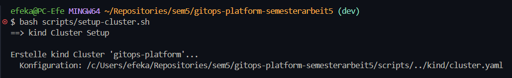
<small><em>Abbildung 14: Starten des Clusters lokal</em></small>

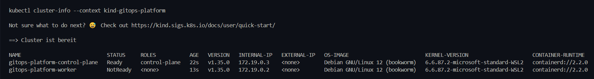
<small><em>Abbildung 15: Status Cluster</em></small>

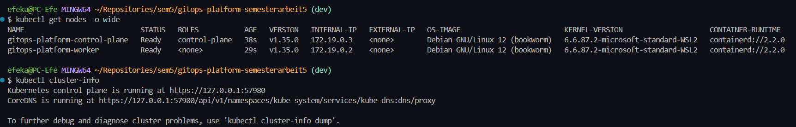
<small><em>Abbildung 16: Cluster Info nach Start</em></small>

#### Verifikation nach Setup

Nach erfolgreichem Setup zeigt `kubectl get nodes` beide Nodes im Status `Ready`:

```
$ kubectl get nodes
NAME                              STATUS   ROLES           AGE   VERSION
gitops-platform-control-plane     Ready    control-plane   1m    v1.35.0
gitops-platform-worker            Ready    <none>          1m    v1.35.0
```

Sind beide Nodes `Ready`, ist das Messkriterium aus Ziel 1 (Kapitel Zielsetzung und Messkriterien) erfüllt.

### Backend Anwendung (FastAPI)

Das Backend wird als FastAPI Anwendung implementiert. Die Wahl von FastAPI gegenüber Flask ist in [ADR-001](#adr-001-fastapi-statt-flask-fur-das-backend) dokumentiert.

In Sprint 1 (US04) wurde das Backend als minimales Skelett aufgebaut, das die Plattform Integration ermöglicht (Health Probes, OpenAPI Schema). In Sprint 2 wurde die Anwendungslogik mit Pydantic Modellen, SQLite Persistenz und der Preisquelle erweitert (US06, US07).

#### Projektstruktur

Der Backend Code liegt unter `app/backend/`:

| Pfad | Inhalt |
| --- | --- |
| [`app/backend/main.py`](https://github.com/Cancani/gitops-platform-semesterarbeit5/blob/main/app/backend/main.py) | FastAPI Anwendung, Endpoints und Lifespan |
| [`app/backend/models.py`](https://github.com/Cancani/gitops-platform-semesterarbeit5/blob/main/app/backend/models.py) | Pydantic Modelle für Preisdaten und API Responses |
| [`app/backend/database.py`](https://github.com/Cancani/gitops-platform-semesterarbeit5/blob/main/app/backend/database.py) | SQLite Datenzugriff, Init, Insert, Queries |
| [`app/backend/pricesource.py`](https://github.com/Cancani/gitops-platform-semesterarbeit5/blob/main/app/backend/pricesource.py) | Steam Market API Anbindung mit Mock-Fallback |
| [`app/backend/requirements.txt`](https://github.com/Cancani/gitops-platform-semesterarbeit5/blob/main/app/backend/requirements.txt) | Python Abhängigkeiten mit Versionsranges |
| [`app/backend/pyproject.toml`](https://github.com/Cancani/gitops-platform-semesterarbeit5/blob/main/app/backend/pyproject.toml) | Konfiguration für ruff und pytest |
| [`app/backend/Dockerfile`](https://github.com/Cancani/gitops-platform-semesterarbeit5/blob/main/app/backend/Dockerfile) | Multi-Stage Build, Non-Root UID 1001 |
| [`app/backend/static/index.html`](https://github.com/Cancani/gitops-platform-semesterarbeit5/blob/main/app/backend/static/index.html) | Frontend, ausgeliefert über StaticFiles |
| [`app/backend/tests/test_api.py`](https://github.com/Cancani/gitops-platform-semesterarbeit5/blob/main/app/backend/tests/test_api.py) | Testsuite (14 Tests) für die CI Pipeline |

Die Trennung in `app/backend/` reflektiert die Monorepo Struktur (siehe [ADR-004](#adr-004-monorepo-statt-multi-repo)) und macht die Helm Chart Konfiguration eindeutig adressierbar.

#### Endpoints

| Pfad | Methode | Beschreibung |
| --- | --- | --- |
| `/docs` | GET | Interaktive OpenAPI Doku (Swagger UI) |
| `/healthz` | GET | Liveness Probe für Kubernetes |
| `/ready` | GET | Readiness Probe für Kubernetes, prüft SQLite Verbindung |
| `/api/prices` | GET | Aktuellster Preis pro beobachtetem Objekt |
| `/api/prices/history` | GET | Preishistorie, optional gefiltert per `?item=` |
| `/api/prices/refresh` | POST | Preisabruf auslösen, wird vom CronJob aufgerufen |
| `/` | GET | Frontend (`index.html` über StaticFiles) |

OpenAPI Schema und Swagger UI sind durch FastAPI automatisch verfügbar und müssen nicht separat konfiguriert werden. Das wird für manuelle Tests und für die Demo in den Zwischenpräsentationen genutzt.

#### Lokale Ausführung

Die Anwendung läuft lokal ohne Kubernetes Cluster, was den Entwicklungs-Loop in Sprint 1 und 2 kurz hält:

```bash
cd app/backend
python -m venv .venv
source .venv/bin/activate   # PowerShell: .venv\Scripts\Activate.ps1
pip install -r requirements.txt
uvicorn main:app --reload --host 0.0.0.0 --port 8000
```

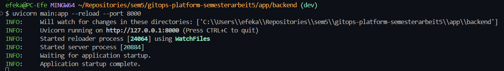
<small><em>Abbildung 17: Ausführung der App lokal</em></small>

Der Server reagiert auf Code-Änderungen mit Auto-Reload, was die Iteration beim Skelett Aufbau und beim späteren Anbinden der Datenbank in Sprint 2 beschleunigt.

#### Health Probes

Die beiden Health Endpoints werden in Sprint 2 als Kubernetes Liveness und Readiness Probes im Helm Chart konfiguriert:

- `/healthz` antwortet, solange der FastAPI Prozess lebt. Wird von Kubernetes verwendet, um abgestürzte Pods neu zu starten (Liveness Probe).
- `/ready` antwortet, sobald der Service Anfragen annehmen kann. Die Readiness Probe prüft zusätzlich die SQLite Datenbankverbindung (siehe [ADR-003](#adr-003-sqlite-statt-postgresql-als-datenbank)). Diese Probe entscheidet, ob ein Pod Traffic vom Service erhält.

Die Trennung in zwei Probes folgt der Kubernetes Best Practice und vermeidet, dass langsame Initialisierungen (zum Beispiel ein Schema-Load in Sprint 2) zu falschen Pod Restarts führen.

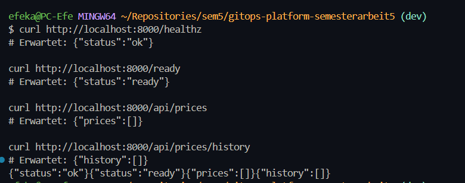
<small><em>Abbildung 18: Health Probes der App</em></small>

### Containerisierung (Dockerfile)

Das FastAPI Backend wird als Container Image paketiert und über die CI Pipeline gebaut und in die GitHub Container Registry (GHCR) gepusht (Sprint 2, US08). Das Dockerfile liegt unter [`app/backend/Dockerfile`](https://github.com/Cancani/gitops-platform-semesterarbeit5/blob/main/app/backend/Dockerfile).

#### Multi-Stage Build

Das Dockerfile verwendet ein Two-Stage Build Pattern:

| Stage | Zweck | Output |
| --- | --- | --- |
| `builder` | Installiert Python Abhängigkeiten in eine isolierte virtuelle Umgebung | `/opt/venv` mit allen Paketen |
| `runtime` | Schlankes Laufzeit-Image mit nur dem Nötigsten | Finales Image, kopiert `/opt/venv` aus dem Builder |

Vorteil: Build-Werkzeuge (zum Beispiel `gcc` für eventuelle native Abhängigkeiten in Sprint 2) bleiben im Builder Stage und landen nicht im Final Image. Damit ist das Final Image deutlich schlanker und die Angriffsfläche kleiner.

#### Sicherheitsmerkmale

Folgende Cloud Native Härtungsmassnahmen sind im Dockerfile umgesetzt:

| Massnahme | Umsetzung |
| --- | --- |
| Non-Root User | User `app` (UID 1001) wird angelegt und im `USER` Statement aktiviert. Der Container läuft nicht als root. |
| Spezifisches Base Image | `python:3.12-slim` statt `:latest`. Reproduzierbarkeit und kleinere Angriffsfläche. |
| Minimale Layer | Build Dependencies bleiben im Builder Stage, nur die fertige venv landet im Runtime Image. |
| Pinning Vorbereitung | Image kann später für die Abgabe auf einen Digest gepinnt werden (`python:3.12-slim@sha256:...`). |
| HEALTHCHECK | Container-interner Health Check gegen `/healthz`, unabhängig von Kubernetes Probes. |
| OCI Labels | Metadata für Title, Description, Source und Lizenz nach OCI Image Spec. |

Die UID 1001 ist bewusst fest gewählt, damit das Helm Chart in Sprint 2 mit `runAsUser: 1001` und `runAsNonRoot: true` konsistent zum Image konfiguriert werden kann.

#### .dockerignore

Die Datei `app/backend/.dockerignore` schliesst Build-irrelevante Inhalte aus dem Build Context aus:

- Virtuelle Umgebungen (`.venv/`, `venv/`)
- Python Cache (`__pycache__/`, `*.pyc`)
- Test- und Coverage-Artefakte
- IDE Konfiguration (`.vscode/`, `.idea/`)
- Git Metadaten (`.git/`)

Damit ist der Build Context schlank, was den Upload zum Docker Daemon beschleunigt und verhindert, dass lokale Entwicklungs-Artefakte ins Image gelangen.

#### Lokales Build und Test

```bash
# Image bauen (Tag :dev für lokale Iterationen)
docker build -t price-watch-backend:dev app/backend

# Image als Container starten
docker run --rm -p 8000:8000 price-watch-backend:dev

# Smoke Test in einem zweiten Terminal
curl http://localhost:8000/healthz
# Erwartet: {"status":"ok"}

curl http://localhost:8000/api/prices
# Erwartet: {"prices":[]}
```

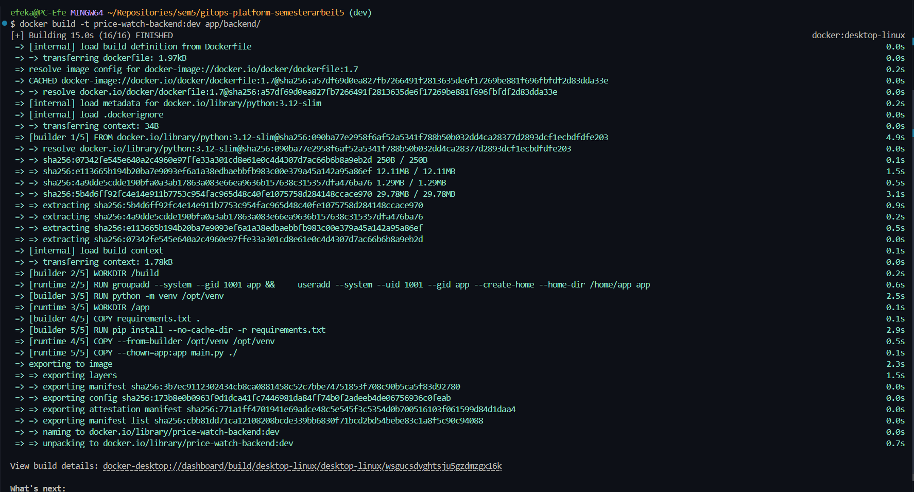
<small><em>Abbildung 19: Docker Build Ausführung</em></small>

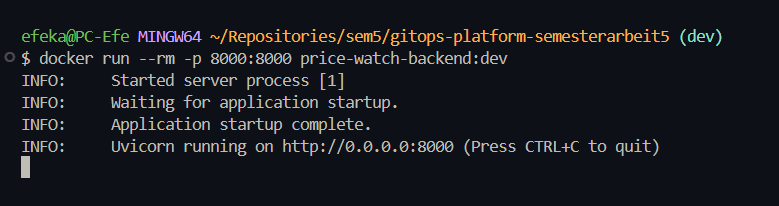
<small><em>Abbildung 20: Docker Run Ausführung</em></small>

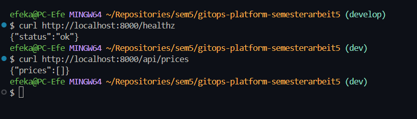
<small><em>Abbildung 21: Endpoint Checks im Container</em></small>

Der HEALTHCHECK wird vom Docker Daemon automatisch ausgeführt. Status prüfen mit:

```bash
docker ps
```
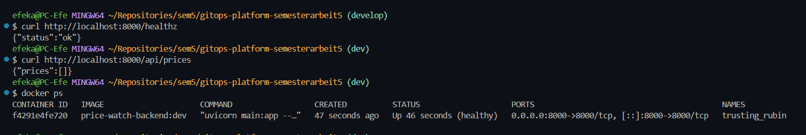
<small><em>Abbildung 22: Docker Container Status</em></small>

Image Grösse prüfen:

```bash
docker images price-watch-backend
```

#### Image in kind Cluster laden

Für lokale Tests vor der CI Pipeline kann das lokal gebaute Image direkt in den kind Cluster geladen werden (siehe [ADR-002](#adr-002-lokaler-cluster-mit-kind-statt-minikube)):

```bash
kind load docker-image price-watch-backend:dev --name gitops-platform
```

Damit ist das Image im Cluster verfügbar, ohne über eine Registry gehen zu müssen. Ab Sprint 2 wird dieser Schritt durch die CI Pipeline (Build und Push nach GHCR) und Argo CD Sync ersetzt.

---


### Helm Chart

Das Backend wird über ein Helm Chart in den Kubernetes Cluster deployed. Das Chart liegt unter [`helm/price-watch/`](https://github.com/Cancani/gitops-platform-semesterarbeit5/tree/main/helm/price-watch). In Sprint 2 (US09) wurde das Chart mit Deployment, Service und Security Context aufgebaut. ConfigMap, PVC und CronJob wurden in Sprint 3 als Abschluss von US09 ergänzt.

#### Chart Struktur

| Pfad | Zweck |
| --- | --- |
| [`helm/price-watch/Chart.yaml`](https://github.com/Cancani/gitops-platform-semesterarbeit5/blob/main/helm/price-watch/Chart.yaml) | Chart Metadaten (Name, Version, App Version) |
| [`helm/price-watch/values.yaml`](https://github.com/Cancani/gitops-platform-semesterarbeit5/blob/main/helm/price-watch/values.yaml) | Konfigurierbare Standardwerte |
| [`helm/price-watch/.helmignore`](https://github.com/Cancani/gitops-platform-semesterarbeit5/blob/main/helm/price-watch/.helmignore) | Files, die nicht ins Chart Paket gehören |
| [`helm/price-watch/templates/_helpers.tpl`](https://github.com/Cancani/gitops-platform-semesterarbeit5/blob/main/helm/price-watch/templates/_helpers.tpl) | Helm Template Helpers für Namen und Labels |
| [`helm/price-watch/templates/deployment.yaml`](https://github.com/Cancani/gitops-platform-semesterarbeit5/blob/main/helm/price-watch/templates/deployment.yaml) | Backend Deployment mit Probes und Security Context |
| [`helm/price-watch/templates/service.yaml`](https://github.com/Cancani/gitops-platform-semesterarbeit5/blob/main/helm/price-watch/templates/service.yaml) | NodePort Service |
| [`helm/price-watch/templates/configmap.yaml`](https://github.com/Cancani/gitops-platform-semesterarbeit5/blob/main/helm/price-watch/templates/configmap.yaml) | ConfigMap mit `DATABASE_PATH` (Sprint 3) |
| [`helm/price-watch/templates/pvc.yaml`](https://github.com/Cancani/gitops-platform-semesterarbeit5/blob/main/helm/price-watch/templates/pvc.yaml) | PersistentVolumeClaim für die SQLite Datei (Sprint 3) |
| [`helm/price-watch/templates/cronjob.yaml`](https://github.com/Cancani/gitops-platform-semesterarbeit5/blob/main/helm/price-watch/templates/cronjob.yaml) | CronJob für den regelmässigen Preisabruf (Sprint 3) |

Chart Version und App Version sind getrennte Metadaten: `version` beschreibt den Stand des Charts selbst, `appVersion` die zugehörige Anwendungsversion. Die tatsächlich ausgelieferte Applikationsversion wird in diesem Projekt jedoch über `image.tag` in `values.yaml` gesteuert: Die CI Pipeline baut ein Image mit commitbasiertem Tag und schreibt diesen nach erfolgreichem Push zurück in `values.yaml`, worauf Argo CD synchronisiert. `appVersion` wird bewusst nicht als automatischer Release Mechanismus verwendet und nur bei manuellen Versionssprüngen der Anwendung nachgeführt.

#### Konfigurierbarkeit über values.yaml

Die `values.yaml` Datei enthält alle Parameter, die per `--values` Datei, `--set` Flag oder Overlay overridden werden können. Die wichtigsten Gruppen:

| Gruppe | Inhalt |
| --- | --- |
| `image` | Repository, Tag, PullPolicy |
| `service` | Type, Port, NodePort |
| `resources` | Requests und Limits für CPU und Memory |
| `livenessProbe`, `readinessProbe` | Health Probe Konfiguration |
| `podSecurityContext`, `securityContext` | Sicherheitsmerkmale auf Pod und Container Ebene |

Bewusste Voreinstellungen:

- `replicaCount: 1`: Single Replica wegen SQLite Single Writer (siehe [ADR-003](#adr-003-sqlite-statt-postgresql-als-datenbank)). Skalierung würde eine Multi-Pod taugliche DB voraussetzen.
- `image.pullPolicy: Always`: Die CI Pipeline setzt pullPolicy automatisch auf Always, da das Image von GHCR gezogen wird (seit US08).
- `service.nodePort: 30080`: Matched die `extraPortMappings` in `kind/cluster.yaml`, damit das Backend ohne Ingress Controller vom Host erreichbar ist.

#### Health Probes Konfiguration

Beide FastAPI Endpoints aus US04 werden im Chart als Kubernetes Probes verdrahtet:

| Probe | Pfad | initialDelay | period | failureThreshold |
| --- | --- | --- | --- | --- |
| Liveness | `/healthz` | 10 s | 10 s | 3 |
| Readiness | `/ready` | 5 s | 5 s | 3 |

Die Liveness Probe sorgt für automatischen Pod Restart bei Hänger. Die Readiness Probe entscheidet, ob ein Pod Traffic vom Service erhält. Beide Probes nutzen den `http` Port (Name statt Nummer), damit Container Port und Probe Port automatisch konsistent bleiben, wenn der Port via values angepasst wird.

#### Security Context und Härtung

Das Chart setzt folgende Härtungsmassnahmen, konsistent zum Dockerfile aus US05:

| Massnahme | Wirkung |
| --- | --- |
| `runAsNonRoot: true` | Container darf nicht als root laufen |
| `runAsUser: 1001`, `runAsGroup: 1001` | Matched den `app` User im Dockerfile |
| `fsGroup: 1001` | Gemountete Volumes gehören der `app` Gruppe |
| `allowPrivilegeEscalation: false` | Kein `setuid` Escalation möglich |
| `readOnlyRootFilesystem: true` | Container kann keine Files ausserhalb gemounteter Volumes schreiben |
| `capabilities.drop: [ALL]` | Alle Linux Capabilities werden entzogen |

Damit `readOnlyRootFilesystem: true` mit uvicorn funktioniert, wird `/tmp` als `emptyDir` Volume gemountet. uvicorn nutzt `/tmp` für interne Worker Kommunikation.

#### Service Exposition via NodePort

Bewusst NodePort statt Ingress. Ein Ingress Controller (zum Beispiel ingress-nginx) wäre eine zusätzliche Plattformkomponente, die im Scope der Semesterarbeit keinen Mehrwert bringt, sondern nur Wartungsaufwand erzeugt. NodePort matched ausserdem die kind Cluster Konfiguration aus US03 (siehe Kapitel Lokaler Cluster mit kind), die Port 30080 vom Cluster auf den Host mappt.

Damit ist das Backend unter `http://localhost:30080/` erreichbar, sobald der Pod im Status `Running` und `Ready` ist.

#### Lokales Deployment und Verifikation

```bash
# Voraussetzung: Cluster läuft, Image ist lokal gebaut und in kind geladen
docker build -t price-watch-backend:dev app/backend
kind load docker-image price-watch-backend:dev --name gitops-platform

# Chart linten (statische Prüfung)
helm lint helm/price-watch

# Chart rendern ohne zu deployen (Dry Run)
helm template price-watch helm/price-watch

# Chart installieren
helm install price-watch helm/price-watch
```
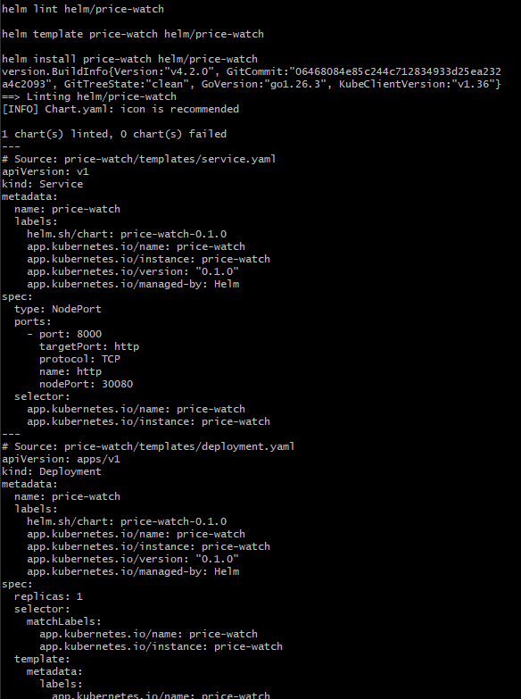

<small><em>Abbildung 23: Helm Lint und Helm Template lokal</em></small>

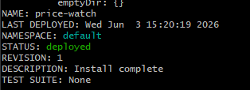

<small><em>Abbildung 24: Helm Chart Installation</em></small>

```bash
# Status prüfen
kubectl get pods,svc
kubectl get pod -l app.kubernetes.io/name=price-watch
```

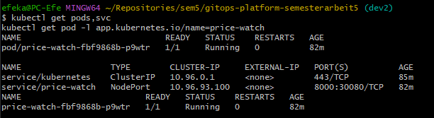

<small><em>Abbildung 25: kubectl get pods und svc nach Helm Install</em></small>

```bash
# Smoke Tests gegen NodePort
curl http://localhost:30080/healthz
# Erwartet: {"status":"ok"}

curl http://localhost:30080/api/prices
# Erwartet: {"prices":[]}
```

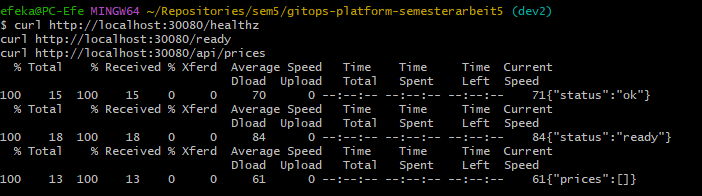

<small><em>Abbildung 26: Smoke Test gegen NodePort 30080</em></small>

```bash
# Logs
kubectl logs -l app.kubernetes.io/name=price-watch
```
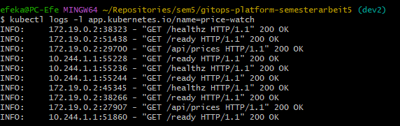

<small><em>Abbildung 27: Pod Logs nach Helm Install</em></small>

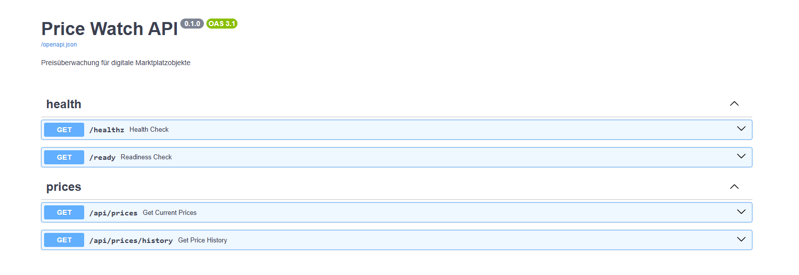

<small><em>Abbildung 28: Swagger UI über NodePort erreichbar</em></small>

```bash
# Deinstallieren
helm uninstall price-watch
```
---


### CI Pipeline (GitHub Actions)

Die CI Pipeline automatisiert den Build und Push des Container Images nach GHCR. Sie ist das erste Glied im GitOps Loop: ein Commit auf `main` mit Code-Änderungen triggert die Pipeline, die das Image baut, pushed und die `helm/price-watch/values.yaml` mit dem neuen Image Tag aktualisiert. Argo CD erkennt die Änderung und synct den Cluster (siehe Kapitel Argo CD Application und GitOps Loop).

#### Workflow Überblick

Der Workflow liegt unter [`.github/workflows/ci.yaml`](https://github.com/Cancani/gitops-platform-semesterarbeit5/blob/main/.github/workflows/ci.yaml) und besteht aus zwei Jobs. Der zweite Job läuft nur, wenn der erste erfolgreich durchläuft.

**Job 1, `lint-and-test`:**

| Schritt | Aktion |
| --- | --- |
| 1. Checkout | Repository auschecken |
| 2. Python einrichten | Python 3.12 bereitstellen |
| 3. Abhängigkeiten installieren | `requirements.txt` sowie `pytest`, `httpx`, `ruff` installieren |
| 4. ruff | `ruff check .` gegen den Backend Code |
| 5. pytest | Testsuite aus `tests/test_api.py` ausführen |
| 6. Helm einrichten | `azure/setup-helm` Action |
| 7. helm lint | `helm lint helm/price-watch` |
| 8. helm template | `helm template price-watch helm/price-watch` rendert die Manifeste ohne Cluster-Verbindung |

**Job 2, `build-and-push`:** läuft nur bei `push` auf `main`, blockiert über `needs: lint-and-test`.

| Schritt | Aktion |
| --- | --- |
| 1. Checkout | Repository auschecken, `PAT_TOKEN` als Credentials für den späteren Commit |
| 2. Buildx | Docker Buildx für effiziente Multi-Layer Builds einrichten |
| 3. GHCR Login | Authentifizierung gegen `ghcr.io` via `GITHUB_TOKEN` |
| 4. Metadaten | Image Tags und OCI Labels aus dem Commit Kontext ableiten |
| 5. Build und Push | Multi-Stage Image bauen und nach GHCR pushen |
| 6. Values Update | `helm/price-watch/values.yaml` mit Repository URL, SHA Tag und `pullPolicy: Always` aktualisieren, Commit mit `[skip ci]` zurück auf `main` |

Ein `kubectl apply --dry-run` gegen einen echten Cluster ist in der CI bewusst nicht eingebaut, der GitHub Actions Runner hat keinen Kubernetes Cluster zur Verfügung. `helm template` prüft stattdessen, ob die Manifeste aus dem Chart überhaupt fehlerfrei rendern, das reicht für eine reine Syntax- und Template-Prüfung ohne Cluster.

#### Trigger und Path Filter

Der Workflow feuert bei Pushes auf `main` und bei Pull Requests gegen `main`, jeweils wenn sich einer der beiden Pfade `app/backend/**` oder `helm/**` ändert:

```yaml
on:
  push:
    branches:
      - main
    paths:
      - 'app/backend/**'
      - 'helm/**'
  pull_request:
    branches:
      - main
    paths:
      - 'app/backend/**'
      - 'helm/**'
```

Der `pull_request`-Trigger sorgt dafür, dass `lint-and-test` bereits auf offenen Pull Requests läuft, bevor überhaupt gemerged wird. Der Job `build-and-push` läuft dagegen ausschliesslich bei einem tatsächlichen Push auf `main`, ein Pull Request baut kein neues Image. Helm Chart Änderungen lösen die Pipeline also ebenfalls aus und durchlaufen mindestens `lint-and-test`, auch wenn der Anwendungscode selbst unverändert bleibt.

#### Image Tag Strategie

Das Image wird mit zwei Tags in GHCR gespeichert:

| Tag | Format | Zweck |
| --- | --- | --- |
| SHA Tag | `sha-abc1234` (7 Zeichen) | Eindeutige Identifikation jedes Builds, ermöglicht Rollback |
| Latest Tag | `latest` | Zeigt immer auf den neusten Build |

`helm/price-watch/values.yaml` wird vom CI mit dem SHA Tag aktualisiert. Damit ist in der Git History jederzeit nachvollziehbar, welcher Commit zu welchem Image Tag führte.

#### Values Update für den GitOps Loop

Nach erfolgreichem Build und Push updatet der CI Workflow `helm/price-watch/values.yaml` direkt auf `main`:

```yaml
image:
  repository: ghcr.io/cancani/price-watch-backend   # gesetzt durch CI
  tag: sha-abc1234                                    # gesetzt durch CI
  pullPolicy: Always                                  # gesetzt durch CI
```

Der Commit (Autorname `github-actions[bot]`, authentisiert über `PAT_TOKEN`) trägt `[skip ci]` in der Message, damit kein weiterer Workflow Loop ausgelöst wird. Argo CD erkennt die Änderung in `values.yaml` und synct den Cluster auf das neue Image (siehe Kapitel Argo CD Application und GitOps Loop).

#### Layer Caching

Der Workflow nutzt den GitHub Actions Cache (`cache-from: type=gha`) für Docker Layer Caching. Bei reinen App-Code Änderungen (zum Beispiel `main.py`) bleibt der `pip install` Layer im Cache, was die Build Zeit von rund 30 Sekunden auf unter 10 Sekunden reduziert.

#### Einmalige Setup-Schritte

Zwei Konfigurationen sind einmalig in GitHub notwendig:

**Schreibrechte für den Values Update Commit:**
Der Push auf `main` wird nicht über den Standard `GITHUB_TOKEN` authentisiert, sondern über einen Personal Access Token (`PAT_TOKEN`), der als Repository Secret hinterlegt und im Checkout Schritt gesetzt wird. Der Token gehört dem Repository Owner und ist in der Branch Protection als Bypass Actor zugelassen; `github-actions[bot]` erscheint dabei lediglich als konfigurierter Autorname des Commits. Ohne diesen Token schlägt der `git push` im Values Update Schritt an der Branch Protection fehl. Das ist ein bewusster Tradeoff: Er ermöglicht den vollständigen GitOps Loop, müsste in einer produktiven Umgebung aber restriktiver abgesichert werden (z.B. Fine-grained Token mit minimalem Scope und regelmässiger Rotation).

**GHCR Paket Sichtbarkeit:**
Nach dem ersten CI Run ist das `price-watch-backend` Paket unter `ghcr.io/cancani/price-watch-backend` initial als private gespeichert. Unter dem eigenen GitHub Profil unter `Packages → price-watch-backend → Package settings → Change visibility → Public` auf Public setzen, damit Kubernetes im kind Cluster das Image ohne `imagePullSecret` ziehen kann.

#### Verifikation nach erstem CI Run

Nach einem Push auf `main` mit Änderung in `app/backend/`:

```bash
# Laufende und abgeschlossene Workflow Runs anzeigen
gh run list --workflow=ci.yaml

# Logs eines Runs anschauen
gh run view <run-id> --log

# GHCR Image verifizieren
docker pull ghcr.io/cancani/price-watch-backend:latest
docker pull ghcr.io/cancani/price-watch-backend:sha-<abc1234>

# values.yaml prüfen ob CI den Tag gesetzt hat
grep "tag:" helm/price-watch/values.yaml
grep "repository:" helm/price-watch/values.yaml
```

Der CI Run erscheint auch direkt im GitHub Repository unter dem Tab **Actions**.

---

### Argo CD Installation

Argo CD ist der GitOps Controller, der Änderungen im Git Repository erkennt und den Cluster auf den deklarierten Soll-Zustand synchronisiert. Die Installation erfolgt im Namespace `argocd` via offiziellem Manifest.

#### Installation

Argo CD wird über das idempotente Script [`scripts/setup-argocd.sh`](https://github.com/Cancani/gitops-platform-semesterarbeit5/blob/main/scripts/setup-argocd.sh) installiert:

```bash
bash scripts/setup-argocd.sh
```

Das Script führt folgende Schritte aus:

| Schritt | Aktion |
| --- | --- |
| 1. Checks | kubectl verfügbar, Cluster erreichbar |
| 2. Namespace | `argocd` Namespace erstellen (idempotent) |
| 3. Install | Offizielles Argo CD Manifest via `kubectl apply` |
| 4. Warten | Alle Deployments im Status `Available` |
| 5. Ausgabe | Admin Passwort und Port Forward Befehl |

#### Komponenten im Cluster

Nach der Installation laufen folgende Pods im Namespace `argocd`:

```bash
kubectl get pods -n argocd
```

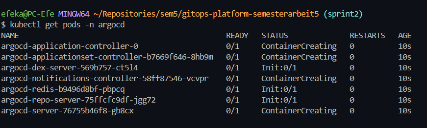

<small><em>Abbildung 29: Argo CD Installation im Cluster</em></small>

| Deployment | Zweck |
| --- | --- |
| `argocd-server` | API Server und Web UI |
| `argocd-repo-server` | Git Repository Zugriff und Helm Rendering |
| `argocd-application-controller` | Reconciliation Loop, vergleicht Soll- und Ist-Zustand |
| `argocd-dex-server` | SSO und Authentication |
| `argocd-redis` | Interner Cache |

#### UI Zugang

Argo CD ist über Port Forward erreichbar:

```bash
kubectl port-forward svc/argocd-server -n argocd 8080:443
```

Browser öffnen: `https://localhost:8080`

Die Zertifikatswarnung des selbst signierten Zertifikats im Browser akzeptieren. Login mit:

- **Benutzername**: `admin`
- **Passwort**: Ausgabe von `scripts/setup-argocd.sh`, oder manuell:

```bash
# Git Bash / Linux / macOS
kubectl -n argocd get secret argocd-initial-admin-secret \
  -o jsonpath="{.data.password}" | base64 -d; echo

# PowerShell
$pw = kubectl -n argocd get secret argocd-initial-admin-secret -o jsonpath="{.data.password}"
[System.Text.Encoding]::UTF8.GetString([System.Convert]::FromBase64String($pw))
```

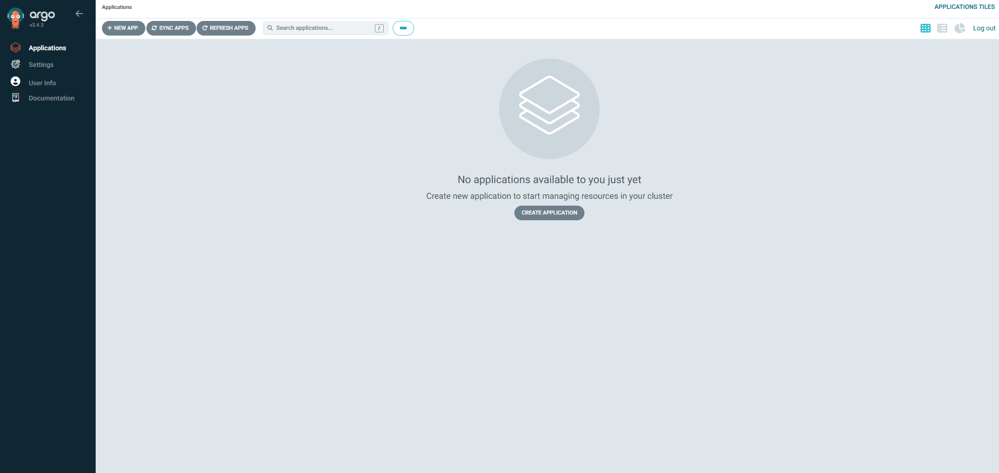

<small><em>Abbildung 30: Argo CD UI mit Application price-watch</em></small>

#### Warum kubectl apply statt Helm Chart

Argo CD muss initial manuell gebootstrapped werden, bevor es andere Anwendungen verwalten kann (Chicken-and-Egg beim ersten Setup). Das offizielle Manifest via `kubectl apply` ist dafür der empfohlene Weg; danach wäre Self Management über ein App-of-Apps Pattern möglich, wurde aber bewusst ausgeschlossen und wird in der offiziellen Argo CD Dokumentation so beschrieben. Für Production wäre ein eigener Argo CD Helm Chart mit App-of-Apps Pattern denkbar, sprengt aber den Scope dieser Semesterarbeit.

### Argo CD Application und GitOps Loop

Die Argo CD Application verbindet das Git Repository mit dem Cluster und schliesst damit den GitOps Loop. Argo CD beobachtet den Pfad `helm/price-watch` auf dem Branch `main` und synchronisiert Änderungen automatisch in den Cluster.

#### Application Definition

Die Application ist in [`app/argocd/price-watch.app.yaml`](https://github.com/Cancani/gitops-platform-semesterarbeit5/blob/main/app/argocd/price-watch.app.yaml) deklariert:

| Feld | Wert | Bedeutung |
| --- | --- | --- |
| `source.repoURL` | Repository URL | Beobachtetes Git Repository |
| `source.targetRevision` | `main` | Beobachteter Branch |
| `source.path` | `helm/price-watch` | Pfad zum Helm Chart im Monorepo (siehe [ADR-004](#adr-004-monorepo-statt-multi-repo)) |
| `destination.server` | `https://kubernetes.default.svc` | Ziel-Cluster (lokaler Cluster) |
| `destination.namespace` | `default` | Ziel-Namespace für die Anwendung |

Argo CD rendert das Helm Chart selbst (über den `argocd-repo-server`) und vergleicht das Ergebnis mit dem Ist-Zustand im Cluster.

#### Sync Policy

Die Application nutzt eine automatisierte Sync Policy:

| Option | Wert | Wirkung |
| --- | --- | --- |
| `automated.prune` | `true` | Ressourcen, die aus Git entfernt werden, werden auch im Cluster gelöscht |
| `automated.selfHeal` | `true` | Manuelle Änderungen am Cluster werden auf den Git Stand zurückgesetzt |

`selfHeal` macht Git zur einzigen Wahrheit: Wer `kubectl edit` am laufenden Deployment macht, dessen Änderung wird von Argo CD automatisch rückgängig gemacht. Das ist das Kernprinzip von GitOps.

#### Deployment der Application

```bash
# Bestehenden manuellen Helm Release entfernen, Argo CD übernimmt
helm uninstall price-watch

# Application registrieren
kubectl apply -f app/argocd/price-watch.app.yaml

# Sync Status beobachten
kubectl get application -n argocd price-watch -w
```

Erwartetes Ergebnis nach 1 bis 2 Minuten: `SYNC STATUS: Synced`, `HEALTH STATUS: Healthy`.

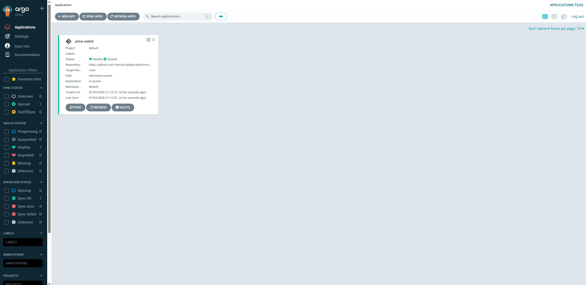

<small><em>Abbildung 31: Argo CD Applications Übersicht mit registrierter Application price-watch (Healthy, Synced)</em></small>

Die Kachelansicht bestätigt die zentralen Parameter der Application: Repository, Target Revision `main`, Pfad `helm/price-watch` und Ziel-Namespace `default`. Status ist `Healthy` und `Synced` wenige Sekunden nach der Registrierung.


#### Der vollständige GitOps Loop

Mit der Application ist der Loop geschlossen. Eine Code-Änderung durchläuft folgende Stationen vollautomatisch:

| Schritt | Akteur | Aktion |
| --- | --- | --- |
| 1 | Entwickler | Commit auf Feature Branch, Pull Request, Squash Merge auf `main` |
| 2 | GitHub Actions | CI baut Container Image, pushed nach GHCR (siehe Kapitel CI Pipeline) |
| 3 | GitHub Actions | `helm/price-watch/values.yaml` wird mit neuem Image Tag aktualisiert, Commit zurück auf `main` |
| 4 | Argo CD | Erkennt die Änderung in `values.yaml` (Polling alle 3 Minuten oder via Webhook) |
| 5 | Argo CD | Rendert das Helm Chart neu und synchronisiert den Cluster |
| 6 | Kubernetes | Rollt das neue Image als Deployment aus |

Kein manuelles `kubectl` oder `helm` ist nach dem Merge mehr nötig. Der Soll-Zustand im Git Repository wird automatisch zum Ist-Zustand im Cluster.

#### Verifikation

```bash
# Application Status
kubectl get application -n argocd price-watch

# Pod läuft mit GHCR Image
kubectl get pods
kubectl describe pod -l app.kubernetes.io/name=price-watch | grep Image:

# Smoke Test
curl http://localhost:30080/healthz
# Erwartet: {"status":"ok"}
```

In der Argo CD UI (siehe Kapitel Argo CD Installation, Abschnitt UI Zugang) wird die Application `price-watch` mit allen Ressourcen (Deployment, Service, Pod, ReplicaSet) als Baum dargestellt, jeweils mit Health- und Sync-Status.

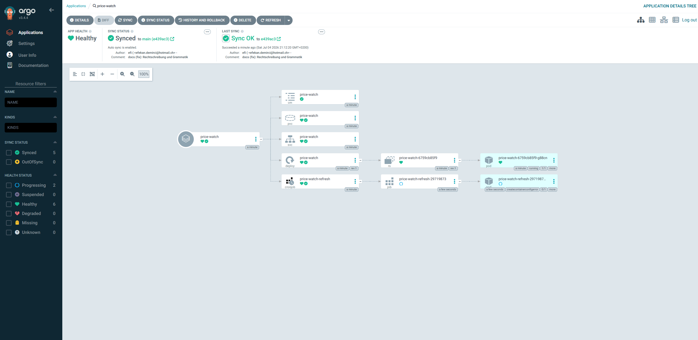

<small><em>Abbildung 32: Argo CD Ressourcenbaum der Application price-watch mit ConfigMap, PVC, Service, Deployment und CronJob</em></small>

Der Baum zeigt alle vom Helm Chart erzeugten Ressourcen inklusive der Sprint 3 Erweiterungen (ConfigMap, PVC, CronJob). Der CronJob hat bereits einen Job mit zugehörigem Pod für den Preisabruf gestartet. Sync Status ist `Sync OK` auf den Commit `e439ac3`, App Health `Healthy`.

Hinweis zu Image Pull: Da `values.yaml` durch die CI auf das GHCR Image zeigt, muss das GHCR Paket auf Public gesetzt sein. Andernfalls zeigt der Pod `ImagePullBackOff`.


### Anwendungslogik und Datenmodelle

In US06 erhält das Backend echte Funktionalität: Preisdaten werden über eine Quelle abgerufen, in SQLite gespeichert und über die API als aktuelle Werte und Historie ausgeliefert. Die Wahl von SQLite ist im ADR zur Datenbank begründet.

#### Datenmodelle (Pydantic)

Die Datenstruktur ist in [`app/backend/models.py`](https://github.com/Cancani/gitops-platform-semesterarbeit5/blob/main/app/backend/models.py) als Pydantic Modelle definiert. Pydantic erzwingt die Konsistenz zwischen API Schicht und Persistenz (siehe ADR zu FastAPI).

| Modell | Felder | Zweck |
| --- | --- | --- |
| `PriceEntry` | item_name, price, currency, source, image_url, timestamp | Ein Preisdatenpunkt |
| `PricesResponse` | prices (Liste) | Antwort der aktuellen Preise |
| `HistoryResponse` | history (Liste) | Antwort der Historie |
| `RefreshResponse` | fetched (Anzahl) | Antwort nach Preisabruf |

Das Feld `price` ist mit `Field(gt=0)` validiert, sodass ungültige negative Preise abgelehnt werden. Die Response Modelle werden als `response_model` an den Endpoints deklariert und erscheinen automatisch im OpenAPI Schema.

#### Persistenz (SQLite)

Der Datenzugriff liegt in [`app/backend/database.py`](https://github.com/Cancani/gitops-platform-semesterarbeit5/blob/main/app/backend/database.py). Die Datenbankdatei wird über die Umgebungsvariable `DATABASE_PATH` konfiguriert:

| Umgebung | DATABASE_PATH | Begründung |
| --- | --- | --- |
| Lokal | `./prices.db` (manuell gesetzt) | Einfaches Testen ohne Cluster |
| Container (Standard) | `/tmp/prices.db` | Einziger beschreibbarer Pfad bei `readOnlyRootFilesystem: true` |
| Cluster mit PVC | `/data/prices.db` | Persistentes Volume, übersteht Pod Neustarts |

Die Tabelle `prices` wird beim Anwendungsstart über den FastAPI Lifespan Hook idempotent angelegt (`CREATE TABLE IF NOT EXISTS`). Ein Index auf `(item_name, timestamp)` beschleunigt die Abfragen für aktuelle Preise und Historie.

Die Single Writer Beschränkung von SQLite ist im Lab Setup akzeptabel, weil nur eine Backend Replica betrieben wird und alle Schreibzugriffe über den Refresh Pfad laufen. Dieser wird durch den CronJob sowie bei Bedarf manuell über UI oder API ausgelöst. `concurrencyPolicy: Forbid` verhindert parallele CronJob Läufe, aber keine gleichzeitig manuell ausgelösten Refreshs. Für ein produktives Multi Pod Setup wäre PostgreSQL notwendig.

#### Preisquelle

Die Preisquelle in [`app/backend/pricesource.py`](https://github.com/Cancani/gitops-platform-semesterarbeit5/blob/main/app/backend/pricesource.py) ruft primär die Steam Market API ab (Details siehe Abschnitt Steam Market API als Preisquelle weiter unten in diesem Kapitel). Schlägt der Aufruf fehl, etwa durch Timeout oder Rate Limit, greift automatisch ein Mock-Fallback mit plausibler Schwankung um einen hinterlegten Basispreis. Über die Funktion `fetch_prices()` als einheitliche Schnittstelle bleibt diese Umschaltung für den Rest der Anwendung unsichtbar. Die Kombination macht die Demo unabhängig von der Erreichbarkeit der externen API und adressiert damit das Risiko einer instabilen Preisquelle (R2), ohne auf echte Marktdaten zu verzichten, wenn Steam erreichbar ist.

#### API Endpoints

| Pfad | Methode | Beschreibung |
| --- | --- | --- |
| `/healthz` | GET | Liveness Probe |
| `/ready` | GET | Readiness Probe, prüft zusätzlich die Datenbankverbindung |
| `/api/prices` | GET | Neuster Preis pro Objekt |
| `/api/prices/history` | GET | Historie, optional gefiltert via `?item=...` |
| `/api/prices/refresh` | POST | Ruft Preise ab und speichert sie |

Der POST Endpoint `/api/prices/refresh` ist der Hook, der später vom Kubernetes CronJob regelmässig aufgerufen wird. Manuell dient er für Tests und die Demo.

Die Readiness Probe prüft nun die Datenbankverbindung. Schlägt diese fehl, antwortet der Endpoint mit HTTP 503, und Kubernetes nimmt den Pod aus dem Service, bis die Datenbank wieder erreichbar ist.

#### Lokale Verifikation

```bash
cd app/backend
export DATABASE_PATH=./prices.db
uvicorn main:app --reload --port 8000
```

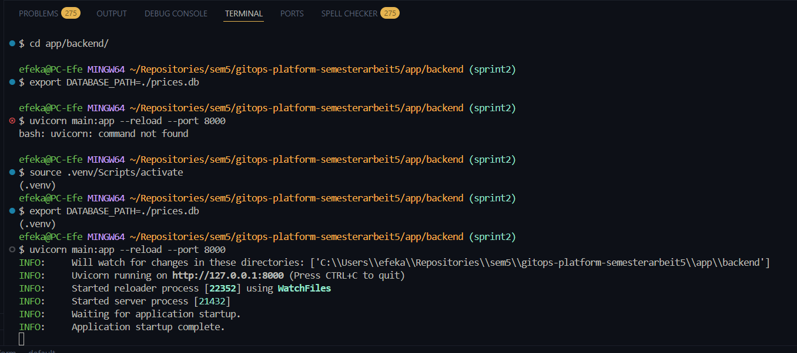

<small><em>Abbildung 33: Lokaler Start der App mit gesetztem DATABASE_PATH</em></small>

```bash
# Preise abrufen und speichern
curl -X POST http://localhost:8000/api/prices/refresh
# Erwartet: {"fetched":4}

# Aktuelle Preise
curl http://localhost:8000/api/prices
# Erwartet: 4 Objekte mit Preisen

# Nochmal abrufen, damit Historie mehrere Punkte hat
curl -X POST http://localhost:8000/api/prices/refresh

# Historie eines Objekts
curl "http://localhost:8000/api/prices/history?item=AWP%20Asiimov"
```

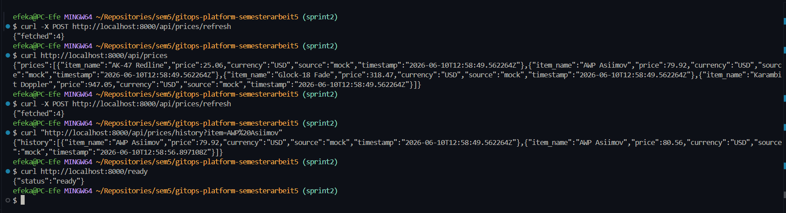

<small><em>Abbildung 34: curl Aufrufe gegen die API lokal</em></small>

Die interaktive OpenAPI Doku unter `http://localhost:8000/docs` zeigt den neuen POST Endpoint und die Pydantic Response Schemas.

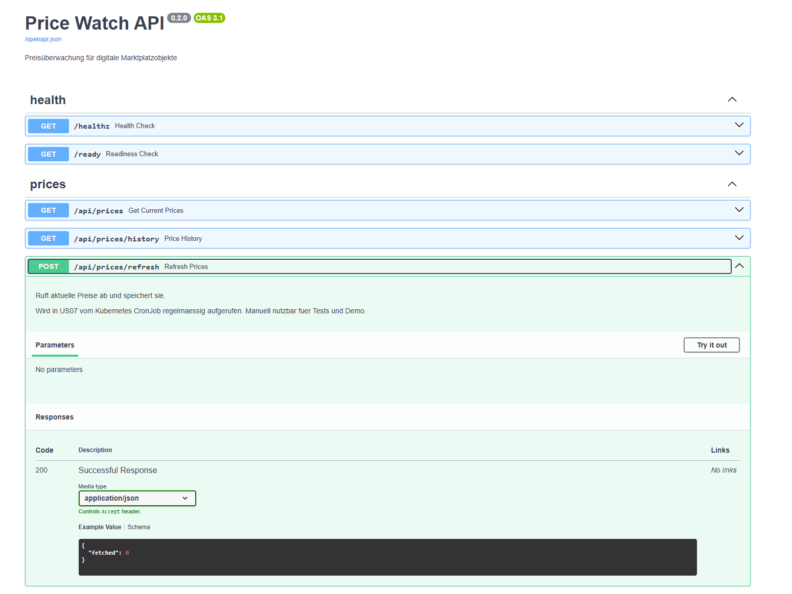

<small><em>Abbildung 35: POST /api/prices/refresh in der Swagger UI lokal</em></small>


### Frontend (Preisübersicht und Verlauf)

Das Frontend stellt die Preisdaten als durchsuchbare Übersicht dar und zeigt pro Objekt den Preisverlauf als Diagramm. Es ist bewusst als einzelne `index.html` ohne Build-Schritt umgesetzt und wird vom FastAPI Backend als statische Datei ausgeliefert.

#### Aufbau und Auslieferung

Das Frontend liegt unter [`app/backend/static/index.html`](https://github.com/Cancani/gitops-platform-semesterarbeit5/blob/main/app/backend/static/index.html). FastAPI bindet das Verzeichnis in [`main.py`](https://github.com/Cancani/gitops-platform-semesterarbeit5/blob/main/app/backend/main.py) über einen StaticFiles Mount ein:

```python
app.mount("/", StaticFiles(directory="static", html=True), name="static")
```

Wichtig ist die Reihenfolge: Der Mount wird nach allen API Routen registriert. Sonst würde er die Pfade `/api/...`, `/healthz` und `/ready` abfangen. So liefert das Backend unter `/` das Frontend und unter `/api/...` die Daten, beides aus demselben Container.

#### Technische Wahl: kein Frontend Framework

Die Oberfläche kommt mit reinem HTML, CSS und Vanilla JavaScript aus. Auf React, Vue oder einen Build-Schritt wurde bewusst verzichtet, weil:

- kein zweiter Container und kein npm Build im CI nötig ist,
- die Auslieferung über StaticFiles trivial bleibt,
- der Fokus der Arbeit auf der Plattform liegt, nicht auf dem Frontend Stack.

Für die Diagramme wird Chart.js über ein CDN eingebunden, ebenfalls ohne Build.

#### Funktionen

| Funktion | Umsetzung |
| --- | --- |
| Übersicht | Grid aus Karten, eine pro beobachtetes Objekt |
| Suche | Eingabefeld filtert die Karten clientseitig live nach Name |
| Aktueller Preis | Karte zeigt neusten Preis und prozentuale Änderung zum Vorwert |
| Bilder | Echte Skin Bilder vom Steam CDN (siehe unten) |
| Verlauf | Klick auf eine Karte öffnet ein Diagramm mit der Preishistorie |
| Aktualisieren | Button löst `POST /api/prices/refresh` aus und lädt neu |

Die prozentuale Änderung und der Verlauf werden aus `GET /api/prices/history` berechnet. Steigt der Preis, wird die Änderung grün dargestellt, fällt er, rot.

#### Echte Skin Bilder

Die Item Bilder stammen vom offiziellen Steam CDN. Jeder Skin hat einen `icon_url` Hash, der aus der Steam Market API gewonnen und in der Preisquelle hinterlegt ist. Die Bild URL wird daraus gebaut:

```
https://community.cloudflare.steamstatic.com/economy/image/<icon_url>/360fx360f
```

Das Bild lädt der Browser direkt vom Steam CDN. Die Preise stammen von der echten Steam Market API, mit automatischem Mock-Fallback bei Nichtverfügbarkeit (siehe Abschnitt zur Preisquelle weiter unten). Das Bild kommt in jedem Fall vom echten Steam CDN, unabhängig davon, ob der angezeigte Preis von der API oder vom Fallback stammt.

#### Farbcodierung nach Seltenheit

Die Akzentfarbe pro Karte entspricht der Seltenheitsfarbe des Skins aus der Steam Market API (`name_color`). Damit greift das Frontend die im CS2 Umfeld etablierte Farbsemantik auf, statt einer generischen Akzentfarbe.

#### Lokale Verifikation

```bash
cd app/backend
export DATABASE_PATH=./prices.db
uvicorn main:app --reload --port 8000
```
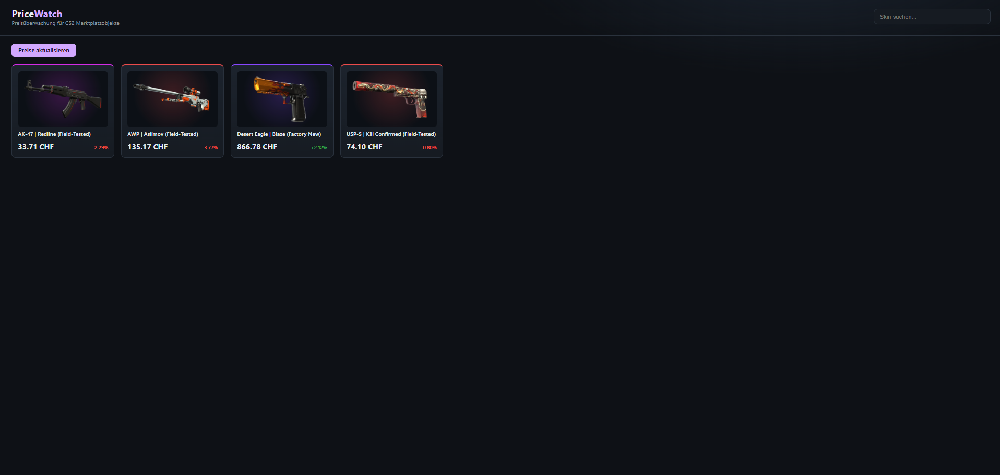

<small><em>Abbildung 36: Frontend lokal, leere Übersicht vor erstem Preisabruf</em></small>

Browser auf `http://localhost:8000/` öffnen. Beim ersten Start ist die Übersicht leer. Ein Klick auf "Preise aktualisieren" ruft die Preisquelle ab und füllt das Grid. Mehrmaliges Aktualisieren erzeugt einen Verlauf, der im Detaildiagramm sichtbar wird.

Die API bleibt unter `http://localhost:8000/api/prices` und die OpenAPI Doku unter `http://localhost:8000/docs` erreichbar.

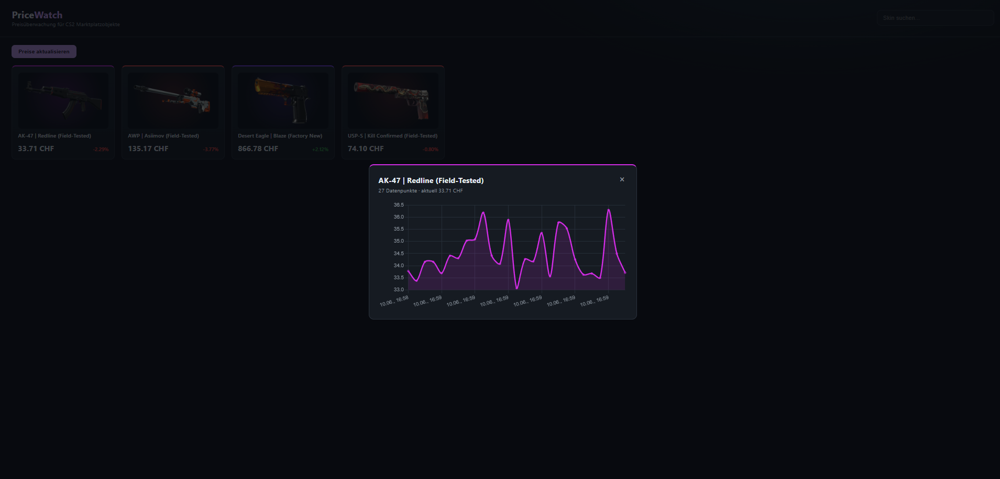

<small><em>Abbildung 37: Frontend lokal mit befüllter Preisübersicht</em></small>

### Helm Chart Erweiterung: PVC, ConfigMap und CronJob (Sprint 3)

Das Helm Chart wird um drei weitere Templates ergänzt, die für den produktiven Betrieb
der Applikation notwendig sind.

Die **ConfigMap** stellt den Datenbankpfad `/data/prices.db` als Umgebungsvariable
`DATABASE_PATH` bereit. Das Deployment liest diesen Wert und gibt ihn an den
FastAPI-Prozess weiter.

Der **PersistentVolumeClaim** reserviert 100Mi Speicher mit `ReadWriteOnce` Zugriff.
Das Volume wird im Deployment unter `/data` gemountet, sodass SQLite die Datenbankdatei
persistent speichern kann. Ohne PVC gehen alle Preisdaten beim Pod-Neustart verloren.

Der **CronJob** ruft jede Minute `POST /api/prices/refresh` auf und löst damit
den automatischen Preisabruf aus. `concurrencyPolicy: Forbid` verhindert gleichzeitige
Ausführungen, da SQLite keinen parallelen Schreibzugriff verträgt.

Die Preisquelle wurde auf die Steam Market API umgestellt. Bei Nichtverfügbarkeit
greift ein Mock-Fallback mit plausiblen Basispreisen. `httpx` wurde als HTTP-Client
in `requirements.txt` ergänzt.

### Steam Market API als Preisquelle (Sprint 3)

Die Preisquelle wird von Mock-Daten auf die Steam Market API umgestellt. Der Endpoint
`priceoverview` liefert den aktuellen Marktpreis eines CS2 Skins direkt in CHF:

`https://steamcommunity.com/market/priceoverview/?currency=4&appid=730&market_hash_name=<name>`

Die Funktion `_fetch_steam_price()` in [`pricesource.py`](https://github.com/Cancani/gitops-platform-semesterarbeit5/blob/main/app/backend/pricesource.py) ruft diesen Endpoint via `httpx`
auf und parst den `lowest_price` Wert. Schlägt der Aufruf fehl -- etwa weil Steam nicht
erreichbar ist oder ein Rate Limit greift -- greift der Mock-Fallback mit einer zufälligen
Schwankung um den hinterlegten Basispreis. Damit bleibt die App auch ohne Netzwerkzugriff
demonstrierbar (Massnahme zu Risiko R2).

Der CronJob-Schedule wurde von `*/5 * * * *` auf `*/1 * * * *` geändert, sodass Preise
jede Minute automatisch abgerufen und in SQLite persistiert werden. Der Preisverlauf im
Frontend baut sich dadurch im Demo-Betrieb schnell auf.

Jede Karte im Frontend enthält einen direkten Link auf die Steam Market Seite des Skins:

`https://steamcommunity.com/market/listings/730/<item_name>`

#### Verifikation im Cluster

Nach dem Argo CD Sync ist das Frontend über den NodePort `http://localhost:30080` erreichbar. Direkt nach einem frischen Deployment ist die Übersicht noch leer, bis der CronJob den ersten Preisabruf ausgelöst hat oder manuell auf "Preise aktualisieren" geklickt wird:

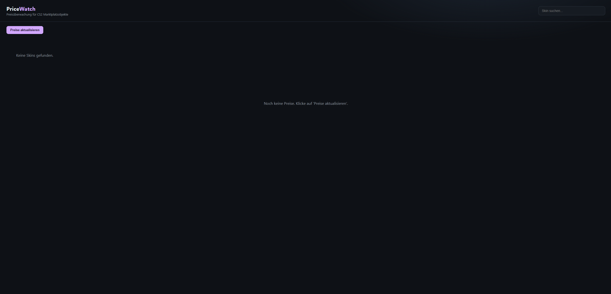

<small><em>Abbildung 38: Frontend im Cluster über NodePort, leere Übersicht vor dem ersten Preisabruf</em></small>

Nach dem Preisabruf zeigt die Übersicht die vier beobachteten Skins mit echten Preisen der Steam Market API in CHF, den echten Skin Bildern vom Steam CDN und der Farbcodierung nach Seltenheit:

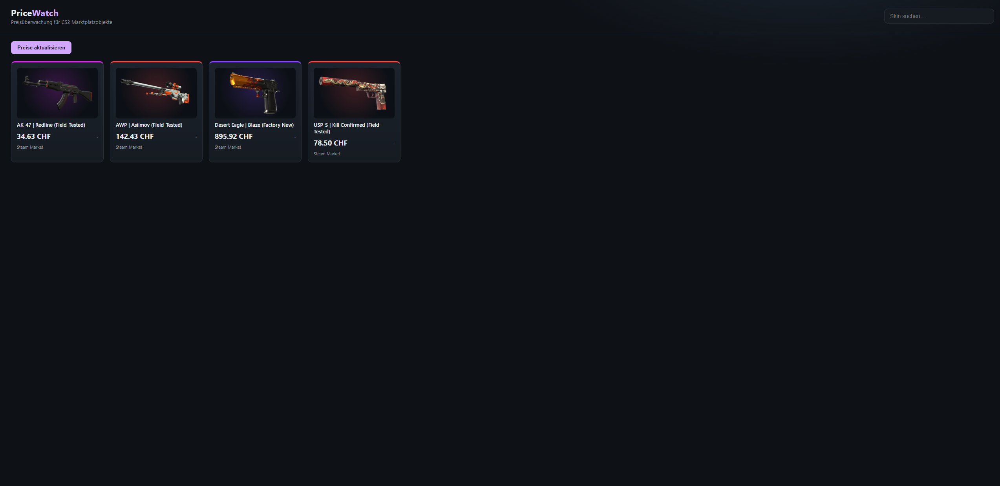

<small><em>Abbildung 39: Frontend im Cluster mit echten Preisen der Steam Market API in CHF</em></small>

---

## Tests und Lint in der CI-Pipeline

Die CI-Pipeline wird um eine Qualitätssicherungsstufe erweitert, die vor jedem Image-Build vier Prüfschritte ausführt.

**ruff** prüft den Python-Code statisch auf Stil- und Logikfehler.
**pytest** führt 14 Tests gegen Backend und Preisquelle aus: die FastAPI Endpunkte `/healthz`, `/ready` (Positiv- und Negativfall mit gemockter, defekter Datenbankverbindung), `POST /api/prices/refresh` und `GET /api/prices` sowie den Steam Preisparser mit verschiedenen CHF Formaten, den Mock Fallback bei nicht erreichbarer Steam API und das Wachstum der Preishistorie über mehrere Refreshs. Die Tests verwenden `TestClient` aus dem FastAPI-Testpaket, mocken alle Netzwerkzugriffe und laufen in-process ohne laufenden Server.
**helm lint** validiert das Helm Chart statisch auf syntaktische Korrektheit.
**helm template** rendert die Kubernetes-Manifeste aus dem Chart und prüft damit, ob das Template fehlerfrei durchläuft, ganz ohne Cluster-Verbindung.

Die vier Schritte laufen im Job `lint-and-test`. Der Job `build-and-push` ist über `needs: lint-and-test` blockiert -- schlägt ein Schritt fehl, wird kein Image gebaut und kein Deployment ausgelöst. Damit ist sichergestellt, dass nur geprüfter Code den GitOps-Loop erreicht.

Der Path-Filter ist auf `app/backend/**` und `helm/**` erweitert, sodass Helm-Änderungen ebenfalls eine Prüfung auslösen.

Beim Aufbau der Tests traten zwei Probleme auf. Erstens öffnet `database.py` die SQLite-Verbindung auf einen konfigurierten Pfad, der im Test-Kontext nicht existiert. Gelöst wird das mit einem temporären Verzeichnis via `tempfile.mkdtemp()`, dessen Pfad vor dem Import von `main` als Umgebungsvariable `DATABASE_PATH` gesetzt wird. Zweitens muss `init_db()` explizit aufgerufen werden, bevor die Tests laufen, da die Tabelle sonst fehlt. Beide Massnahmen sind in [`tests/test_api.py`](https://github.com/Cancani/gitops-platform-semesterarbeit5/blob/main/app/backend/tests/test_api.py) umgesetzt.

---

## Rollback Szenario per Git Revert

Der GitOps Rollback wird durch einen `git revert` auf dem fehlerhaften Commit ausgelöst.
Kein manueller Eingriff im Cluster ist nötig -- Git ist die einzige Source of Truth.

**Ablauf**

Ein bewusst fehlerhafter Image Tag (`sha-000000`) wird via Pull Request auf main gemergt.
Argo CD erkennt die Änderung in `values.yaml` und synchronisiert das Deployment; das
Image selbst wird anschliessend nicht von Argo CD, sondern vom kubelet auf dem Node
aus GHCR gezogen. Da der Tag nicht in GHCR existiert, wechselt der neue Pod in
`ImagePullBackOff`. Weil das Deployment bewusst die Strategie `Recreate` verwendet
(siehe ADR-003 und Deployment Template), wird der bestehende Pod vor dem Start des
neuen Pods beendet. Die Anwendung ist während des fehlerhaften Rollouts deshalb
temporär nicht verfügbar. Das Rollback Szenario demonstriert damit nicht Zero
Downtime, sondern die nachvollziehbare Wiederherstellung des Soll Zustands über
Git Revert und Argo CD Synchronisation.

Der Revert wird auf einem neuen Branch durchgeführt:

```bash
git revert 4563f45 --no-edit
```

Nach dem Merge des Revert-PRs auf main steht in `values.yaml` wieder der
vorherige Tag `sha-c68ccb0` (der Revert-Commit stellt den alten Stand her).
Argo CD erkennt die Änderung und synchronisiert den Cluster: Der fehlerhafte
Pod wird terminiert, der Pod läuft wieder mit Status `Running`.

**Nachweise**

- Bad Commit SHA: `4563f45`
- Pod in `ErrImagePull` und `ImagePullBackOff` (siehe Runbook 03)
- Pod wieder `Running` nach Revert (siehe Runbook 03)

## Runbooks

Drei Runbooks dokumentieren den Betrieb der Plattform von Grund auf bis zum Rollback.
Jedes Runbook enthält Zweck, Voraussetzungen, Schritt-für-Schritt Anleitung,
Erfolgskriterium und Nachweis.

| Runbook | Titel |
| --- | --- |
| RB-01 | [Plattform Initial Setup](https://github.com/Cancani/gitops-platform-semesterarbeit5/blob/main/docs/runbooks/RB01_plattform_initial_setup.md) |
| RB-02 | [Neue Version deployen](https://github.com/Cancani/gitops-platform-semesterarbeit5/blob/main/docs/runbooks/RB02_neue_version_deployen.md) |
| RB-03 | [Rollback eines fehlerhaften Releases](https://github.com/Cancani/gitops-platform-semesterarbeit5/blob/main/docs/runbooks/RB03_rollback_release.md) |

Die Runbooks sind unter `docs/runbooks/` abgelegt und in der MkDocs Navigation verlinkt.
RB-03 basiert auf dem durchgeführten Rollback Szenario aus US12.

---

## Glossar

| Begriff | Erklärung |
| --- | --- |
| ADR | Architectural Decision Record. Kurzform zur Dokumentation einer technischen Entscheidung mit Kontext, Optionen, Entscheid und Konsequenzen. |
| Argo CD | GitOps Operator für Kubernetes. Vergleicht laufend den im Git Repository beschriebenen Soll-Zustand mit dem Ist-Zustand im Cluster und synchronisiert Abweichungen automatisch. |
| CI/CD | Continuous Integration / Continuous Delivery. Automatisiertes Bauen, Prüfen und Ausliefern von Software bei jeder Code-Änderung. |
| ConfigMap | Kubernetes Ressource für nicht-geheime Konfigurationsdaten, die als Umgebungsvariable oder Datei in einen Pod eingebunden werden kann. |
| ConcurrencyPolicy | Feld im Kubernetes CronJob, das regelt, ob überlappende Jobs erlaubt sind. `Forbid` verhindert, dass ein neuer Job startet, während der vorherige noch läuft. |
| CronJob | Kubernetes Ressource, die einen Job nach einem Cron-Zeitplan wiederholt startet. In dieser Arbeit für den regelmässigen Preisabruf verwendet. |
| Deployment | Kubernetes Ressource, die eine gewünschte Anzahl Pod Replicas deklarativ verwaltet, inklusive Rolling Updates. |
| Dry Run | Ausführung eines Befehls, ohne die eigentliche Änderung vorzunehmen, meist zur Validierung. `helm template` ist ein Dry Run auf Chart-Ebene, `kubectl apply --dry-run` einer auf Cluster-Ebene. |
| FastAPI | Python Web Framework für APIs, das auf Type Hints und Pydantic aufbaut und automatisch eine OpenAPI Spezifikation erzeugt. |
| GHCR | GitHub Container Registry. Container Registry von GitHub, in dieser Arbeit Ablageort für die gebauten Backend Images. |
| GitOps | Betriebsmodell, bei dem der gewünschte Zustand einer Infrastruktur oder Anwendung deklarativ in einem Git Repository liegt und automatisiert in die Zielumgebung synchronisiert wird. Git ist damit die einzige Source of Truth. |
| Helm | Paketmanager für Kubernetes. Bündelt Kubernetes Manifeste als parametrisierbares Chart, das sich mit einem Befehl installieren, aktualisieren und deinstallieren lässt. |
| Helm Chart | Ein Paket aus Templates, Default-Werten (`values.yaml`) und Metadaten (`Chart.yaml`), aus dem Helm konkrete Kubernetes Manifeste rendert. |
| Idempotenz | Eigenschaft eines Vorgangs, bei mehrfacher Ausführung stets dasselbe Ergebnis zu liefern. Die Setup-Skripte dieser Arbeit sind bewusst idempotent gehalten. |
| kind | Kubernetes IN Docker. Werkzeug, um einen lokalen, mehrknotigen Kubernetes Cluster als Docker Container laufen zu lassen. |
| Liveness Probe | Kubernetes Health Check, der prüft, ob ein Container noch lebt. Schlägt er wiederholt fehl, startet Kubernetes den Container neu. |
| MADR | Markdown Architectural Decision Records. Leichtgewichtiges Markdown-Format für ADRs, das dieser Arbeit als Vorlage dient. |
| Monorepo | Repository-Strategie, bei der Anwendungscode, Infrastrukturcode und Dokumentation in einem einzigen Git Repository liegen, statt auf mehrere Repositories verteilt zu sein. |
| NodePort | Kubernetes Service-Typ, der einen Port auf jedem Cluster-Node öffnet und so Traffic von ausserhalb des Clusters auf einen internen Service weiterleitet. |
| OCI | Open Container Initiative. Industriestandard für Container-Image-Formate und Registries, auf dem Docker und GHCR aufbauen. |
| Pod | Kleinste deploybare Einheit in Kubernetes, ein oder mehrere Container, die sich Netzwerk und Storage teilen. |
| PVC | PersistentVolumeClaim. Kubernetes Ressource, mit der ein Pod dauerhaften Speicher anfordert, der einen Pod-Neustart übersteht. |
| Pydantic | Python Bibliothek für Datenvalidierung über Type Hints. FastAPI nutzt Pydantic Modelle für Request- und Response-Validierung. |
| Readiness Probe | Kubernetes Health Check, der prüft, ob ein Container bereit ist, Traffic zu empfangen. Schlägt er fehl, nimmt Kubernetes den Pod aus dem Service, startet ihn aber nicht neu. |
| Reconciliation Loop | Kontrollschleife, die laufend Soll- und Ist-Zustand vergleicht und bei Abweichung korrigierend eingreift. Kernprinzip von Kubernetes Controllern und von Argo CD. |
| SelfHeal | Argo CD Funktion, die manuelle, undokumentierte Änderungen im Cluster automatisch auf den im Git Repository definierten Soll-Zustand zurücksetzt. |
| Source of Truth | Die eine massgebliche Quelle für den gewünschten Zustand eines Systems. In GitOps ist das Git Repository die Source of Truth, nicht der Cluster selbst. |
| Squash Merge | Merge-Strategie, bei der alle Commits eines Feature Branch beim Merge zu einem einzigen Commit auf dem Zielbranch zusammengefasst werden. |
| SQLite | Dateibasierte, eingebettete Datenbank ohne separaten Serverprozess. In dieser Arbeit die Persistenzschicht für Preisdaten. |
| StaticFiles | FastAPI/Starlette Mechanismus, um ein Verzeichnis mit statischen Dateien (HTML, CSS, JS) direkt über eine Route auszuliefern. |
| Story Points | Relatives Mass für Aufwand, Komplexität und Risiko einer User Story, bewusst keine Zeitangabe. |
| Sync Policy | Argo CD Konfiguration, die festlegt, ob und wie automatisch synchronisiert wird, unter anderem mit den Feldern `automated`, `prune` und `selfHeal`. |
| values.yaml | Zentrale Konfigurationsdatei eines Helm Charts mit den Default-Werten für alle Templates, etwa Image Tag, Replica Count oder Ressourcenlimits. |
| WIP Limit | Work in Progress Limit. Projektmanagement-Regel, die die Anzahl gleichzeitig aktiver Tickets begrenzt, um Fokus zu erzwingen. |

---

## Quellenverzeichnis

Alle Quellen wurden im Verlauf der drei Sprints zur Recherche, Entscheidungsfindung oder als Referenz für Implementierungsdetails verwendet. Abrufdaten sind auf den Monat genau angegeben, orientiert an dem Sprint, in dem die Quelle jeweils primär genutzt wurde.

| Quelle | URL | Verwendung | Abruf |
| --- | --- | --- | --- |
| FastAPI Dokumentation | https://fastapi.tiangolo.com/ | Backend Framework, Routing, Dependency Injection, OpenAPI | Mai 2026 |
| Pydantic v2 Dokumentation | https://docs.pydantic.dev/latest/ | Datenmodelle, Validierung, Field Constraints | Mai 2026 |
| Starlette Dokumentation | https://www.starlette.io/staticfiles/ | StaticFiles Mount für das Frontend | Juni 2026 |
| kind Dokumentation | https://kind.sigs.k8s.io/ | Lokaler Multi-Node Kubernetes Cluster, Konfiguration und `extraPortMappings` | Mai 2026 |
| Kubernetes Dokumentation | https://kubernetes.io/docs/home/ | Deployment, Service, ConfigMap, PVC, CronJob, Probes | Mai bis Juni 2026 |
| Helm Dokumentation | https://helm.sh/docs/ | Chart-Aufbau, Templating, `helm lint`, `helm template` | Mai 2026 |
| Argo CD Dokumentation | https://argo-cd.readthedocs.io/ | Installation, Application Ressource, Sync Policy, SelfHeal | Mai bis Juni 2026 |
| GitHub Actions Dokumentation | https://docs.github.com/actions | Workflow Syntax, Trigger, Path Filter, Permissions | Mai bis Juni 2026 |
| Docker Dokumentation | https://docs.docker.com/build/building/multi-stage/ | Multi-Stage Build, `HEALTHCHECK`, Non-Root User | Mai 2026 |
| OCI Image Format Spezifikation | https://specs.opencontainers.org/image-spec/ | Image Labels, Registry-Kompatibilität von GHCR | Mai 2026 |
| ruff Dokumentation | https://docs.astral.sh/ruff/ | Lint-Konfiguration in `pyproject.toml`, Regelauswahl | Juni 2026 |
| pytest Dokumentation | https://docs.pytest.org/ | Testaufbau, `TestClient` Integrationstests | Juni 2026 |
| MkDocs Material Dokumentation | https://squidfunk.github.io/mkdocs-material/ | Doku-Site, Navigation, Mermaid-Einbindung über `pymdownx.superfences` | Mai 2026 |
| Mermaid Dokumentation | https://mermaid.js.org/ | Syntax für Flowchart- und Sequenzdiagramme | Juni 2026 |
| Steam Community Market | https://steamcommunity.com/market/ | Inoffizieller `priceoverview` Endpoint als Preisquelle, keine offizielle API-Dokumentation vorhanden | Juni 2026 |
| Uvicorn Dokumentation | https://www.uvicorn.org/ | ASGI Server, Startparameter für Container und lokale Entwicklung | Mai 2026 |
| httpx Dokumentation | https://www.python-httpx.org/ | HTTP Client für den Steam API Abruf, Timeout Handling | Juni 2026 |
| Python sqlite3 Dokumentation | https://docs.python.org/3/library/sqlite3.html | Datenbankzugriff, Row Factory, Context Manager Pattern | Mai 2026 |
| SQLite Dokumentation | https://www.sqlite.org/docs.html | Single Writer Verhalten, Eignung als eingebettete Datenbank (ADR-003) | Mai 2026 |
| Chart.js Dokumentation | https://www.chartjs.org/docs/latest/ | Preisverlauf Diagramm im Frontend | Juni 2026 |
| GitHub Packages, Container Registry | https://docs.github.com/packages/working-with-a-github-packages-registry/working-with-the-container-registry | GHCR Login, Berechtigungen, Lowercase Anforderung an Image Namen | Mai 2026 |
| OpenGitOps, GitOps Prinzipien | https://opengitops.dev/ | Definition der vier GitOps Prinzipien als konzeptionelle Grundlage | Mai 2026 |
| Conventional Commits Spezifikation | https://www.conventionalcommits.org/ | Einheitliches Commit Format über alle Sprints | Mai 2026 |
| Sem 4 Referenzprojekt, Geräteausleihe | https://cancani.com/geraeteausleihe-sem4/dokumentation/ | Vergleich Dokumentationsstil, Lerntransfer für Reflexion | Mai und Juli 2026 |

Die Steam Community Market API ist nicht offiziell dokumentiert. Feldnamen und Verhalten des `priceoverview` Endpoints wurden über eigene Testaufrufe und öffentlich bekannte, von der Community zusammengetragene Beispiele ermittelt, nicht über eine autoritative Herstellerdokumentation. Das ist einer der Gründe für den Mock-Fallback in `pricesource.py`: Ohne offizielle Garantie auf Verfügbarkeit oder Format-Stabilität ist ein Fallback für eine Referenzanwendung angemessen.

---

## Abbildungsverzeichnis

Alle Abbildungen und Diagramme dieses Dokuments in der Reihenfolge ihres Auftretens. Screenshots sind direkt auf die Bilddatei verlinkt, Mermaid Diagramme werden im jeweiligen Kapitel gerendert.

| Nr. | Abbildung | Kapitel |
| --- | --- | --- |
| 1 | [Milestone Sprint 1 Ende](img/sprint1ende.png) | Projektmanagement |
| 2 | [Projectboard Sprint 1 Ende](img/sprint1ende2.png) | Projektmanagement |
| 3 | [Sprint 1 Starfish Retrospektive](img/starfishretrosprint1.png) | Projektmanagement |
| 4 | [Sprint 2 Milestone und Issues](img/image-2.png) | Projektmanagement |
| 5 | [Starfish Retrospektive Sprint 2](img/retro-sprint2-starfish.png) | Projektmanagement |
| 6 | [Sprint 3 Milestones und Issues](img/image-3.png) | Projektmanagement |
| 7 | [Starfish Retrospektive Sprint 3](img/Starfish_Retro_Sprint_3.png) | Projektmanagement |
| 8 | Use Case Diagramm aus Plattform Sicht (Mermaid) | Projektmanagement |
| 9 | [Risikomatrix mit allen zehn Risiken](img/Risikomatrix.png) | Projektmanagement |
| 10 | Systemkontext der Plattform (Mermaid) | Architektur im Überblick |
| 11 | WebApp Architektur (Mermaid) | Architektur im Überblick |
| 12 | Plattform Architektur auf Kubernetes Ebene (Mermaid) | Architektur im Überblick |
| 13 | GitOps Sequenz vom Commit bis zum synchronisierten Cluster (Mermaid) | Architektur im Überblick |
| 14 | [Starten des Clusters lokal](img/setup_cluster1.png) | Plattformaufbau |
| 15 | [Status Cluster](img/setup_cluster2.png) | Plattformaufbau |
| 16 | [Cluster Info nach Start](img/setup_cluster3.png) | Plattformaufbau |
| 17 | [Ausführung der App lokal](img/backendapp1.png) | Plattformaufbau |
| 18 | [Health Probes der App](img/backend2.png) | Plattformaufbau |
| 19 | [Docker Build Ausführung](img/docker1.png) | Plattformaufbau |
| 20 | [Docker Run Ausführung](img/docker2.png) | Plattformaufbau |
| 21 | [Endpoint Checks im Container](img/docker3.png) | Plattformaufbau |
| 22 | [Docker Container Status](img/docker4.png) | Plattformaufbau |
| 23 | [Helm Lint und Helm Template lokal](img/helminstall_1.png) | Plattformaufbau |
| 24 | [Helm Chart Installation](img/helminstall_2.png) | Plattformaufbau |
| 25 | [kubectl get pods und svc nach Helm Install](img/helminstall_3.png) | Plattformaufbau |
| 26 | [Smoke Test gegen NodePort 30080](img/helminstall_4.png) | Plattformaufbau |
| 27 | [Pod Logs nach Helm Install](img/helminstall_5.png) | Plattformaufbau |
| 28 | [Swagger UI über NodePort erreichbar](img/Helminstall_6.png) | Plattformaufbau |
| 29 | [Argo CD Installation im Cluster](img/setupargocd.png) | Plattformaufbau |
| 30 | [Argo CD UI mit Application price-watch](img/argocdui.png) | Plattformaufbau |
| 31 | [Argo CD Applications Übersicht mit registrierter Application price-watch](img/argocdappoverview.png) | Plattformaufbau |
| 32 | [Argo CD Ressourcenbaum der Application price-watch](img/argocdapptree.png) | Plattformaufbau |
| 33 | [Lokaler Start der App mit gesetztem DATABASE_PATH](img/appbackend1sq.png) | Plattformaufbau |
| 34 | [curl Aufrufe gegen die API lokal](img/appbackend2sq.png) | Plattformaufbau |
| 35 | [POST /api/prices/refresh in der Swagger UI lokal](img/appbackend3sq.png) | Plattformaufbau |
| 36 | [Frontend lokal, leere Übersicht vor erstem Preisabruf](img/lokalpreis1.png) | Plattformaufbau |
| 37 | [Frontend lokal mit befüllter Preisübersicht](img/lokalpreis2.png) | Plattformaufbau |
| 38 | [Frontend im Cluster, leere Übersicht vor dem ersten Preisabruf](img/clusterpreis1.png) | Plattformaufbau |
| 39 | [Frontend im Cluster mit echten Preisen der Steam Market API](img/clusterpreis2.png) | Plattformaufbau |


---

## Reflexion

### Fachliche Reflexion

Der grösste fachliche Sprung gegenüber Sem 4 war nicht der Wechsel von manuell zu automatisiert, automatisiertes Deployment gab es in Sem 4 bereits über GitHub Actions. Der eigentliche Sprung war der Wechsel von Push-CD zu echtem Pull-GitOps. In der Geräteausleihe (Sem 4) hat die Pipeline selbst aktiv mit `kubectl apply` und `kubectl set image` auf den Cluster eingewirkt, die Pipeline war der Akteur. In dieser Arbeit ist das umgekehrt: Argo CD beobachtet laufend den Zustand im Repository und gleicht den Cluster kontinuierlich daran an, die Pipeline liefert nur noch ein neues Image und einen neuen Commit, den eigentlichen Abgleich übernimmt der Operator. Der SelfHeal-Mechanismus, der eine manuelle `kubectl scale` aktiv zurücksetzt, macht diesen Unterschied sehr plastisch: Es gibt in Sem 5 keinen Moment, in dem der Cluster länger von der Git-Wahrheit abweicht als einen Reconcile-Zyklus.

Konkret neu waren:

- **Multi-Node Kubernetes und Helm.** Kubernetes selbst war nicht komplett neu, K3s lief schon in Sem 4 auf einer einzelnen EC2. Neu war der Multi-Node-Aufbau mit kind, und vor allem, dass die Ressourcen nicht mehr als rohe YAML-Manifeste direkt appliziert werden, sondern über ein parametrisiertes Helm Chart mit `values.yaml` entstehen. Der Übergang hat mir gezeigt, wie schnell reine Manifest-Verwaltung unübersichtlich wird, sobald mehr als ein, zwei Ressourcen dazukommen, genau das war in Sem 4 mit wachsender Ressourcenzahl bereits spürbar.
- **Argo CD und der GitOps-Gedanke selbst.** Die Umstellung im Kopf war grösser als die technische: nicht mehr die Pipeline als Werkzeug zu denken, das aktiv auf den Cluster einwirkt, sondern Git als einzige Wahrheit und den Cluster nur noch als sich selbst korrigierenden Spiegel davon zu behandeln.
- **FastAPI statt Flask.** Der Wechsel war bewusst gewählt (ADR-001), um Lerntransfer zu zeigen, nicht weil Flask ungeeignet gewesen wäre. Pydantic-Modelle als durchgängige Validierungsschicht zwischen API und Datenbank sind ein Muster, das ich in Sem 4 noch nicht hatte und das den Code merklich robuster macht.
- **Sicherheitsgrundlagen im Container.** Non-Root UID, `readOnlyRootFilesystem`, Multi-Stage Builds für kleinere Images, das war in Sem 4 nicht im gleichen Umfang mitgedacht und ist hier von Anfang an Teil des Dockerfiles statt ein späterer Ausbauschritt.

Am meisten Zeit hat der CI/CD-Teil gekostet, konkret das Zusammenspiel aus Image Tag, `values.yaml` Update per Bot-Commit und dem `[skip ci]` Mechanismus, um keine Endlosschleife auszulösen. Das war kein grosses Konzept, aber ein Detail, das ohne Testen im echten Repository nicht offensichtlich war.

### Methodische Reflexion

Die Sprint-Struktur mit Planung, Review und Retrospektive pro Sprint ist aus Sem 4 übernommen und in dieser Arbeit konsequenter angewendet worden, insbesondere die Retrospektive nach dem Starfish-Modell und die durchgängige Story-Point-Schätzung. Was in Sem 4 eher informell lief, ist hier über das GitHub Project Board mit festen Feldern (Status, Priority, Sprint) und die Story-Point-Tabellen in den Sprint Plannings strukturiert nachvollziehbar.

Zwei methodische Learnings stechen heraus:

- **Doku parallel statt am Schluss.** Der grösste Doku-Rückstand in dieser Arbeit ist nicht bei der laufenden Umsetzung entstanden, sondern bei Abschnitten, die sich durch spätere Änderungen (etwa die CI-Erweiterung in US14) technisch überholt haben, ohne dass ich sie sofort nachgezogen habe. Die Regel "Doku im selben PR wie der Code" hat für neue Inhalte gut funktioniert, aber nicht automatisch dafür gesorgt, dass ältere Kapitel bei einer Änderung an anderer Stelle mit aktualisiert werden. Für eine Folgearbeit würde ich eine explizite Prüfliste führen, welche Doku-Kapitel von welcher Komponente abhängen.
- **Scope-Disziplin als Sprint-2-Rettung.** Die Kürzung von vier auf drei Sprints nach der Kickoff-Präsentation hätte den GitOps-Durchstich leicht gefährden können. Dass er trotzdem mit voller Punktzahl geschafft wurde, lag am konsequenten Streichen von Zusatztools (Monitoring, Image Updater, mehrere Values-Profile) zugunsten des Kernpfads. Das ist dieselbe Lektion wie in Sem 4, nur unter engerem Zeitrahmen erneut bestätigt.

Als Einzelperson ohne Code Review von Aussen fehlte ein Korrektiv, das in einem Team-Setting automatisch da wäre. Die Selbstkorrektur über Definition of Done und die eigene Nachprüfung mit `kubectl describe`, `helm lint` und den automatisierten Tests hat das teilweise kompensiert, ersetzt aber keine zweite Perspektive.

### Persönliche Reflexion

Der Umstieg von einer mir aus Sem 4 vertrauten Push-CD-Welt auf eine mir bis dahin nur oberflächlich bekannte GitOps-Welt war der Hauptgrund, warum ich mich für dieses Thema entschieden habe, nicht das sichere, sondern das Thema mit dem grösseren Lernfeld. Das hat sich ausgezahlt, brachte aber auch die grösste Unsicherheit der Arbeit mit sich, insbesondere zu Beginn von Sprint 2, als CI Pipeline, Helm Chart und Argo CD gleichzeitig entstehen mussten und noch nichts davon zusammenspielte.

Zwei Dinge nehme ich für künftige Projekte mit: Erstens, kleine, verifizierbare Zwischenschritte (Cluster läuft, dann Image baut lokal, dann Chart installiert lokal, dann CI baut, dann Argo CD synct) haben die Komplexität handhabbar gemacht, ein direkter Sprung auf den vollständigen GitOps-Loop hätte vermutlich zu Debugging ohne klaren Ausgangspunkt geführt. Zweitens, das bewusste Streichen von Umfang ist keine Schwäche, sondern eine Voraussetzung dafür, den Kernpfad überhaupt sauber abzuschliessen, gerade als Einzelperson in neun statt der ursprünglich geplanten zwölf Wochen.

---

## Demo Skript

**Ablauf:** Das Kolloquium folgt der vorbereiteten Präsentation: zuerst der Foliendurchgang (Projekt, Sprintverlauf, Architektur), anschliessend die Live-Demo des GitOps Loops entlang der Folien, danach Fragen.

**Annahme zur Slotdauer:** Die Zeitplanung geht von 20 Minuten aus (Präsentation, Live-Demo, Fragen). Falls das tatsächliche Zeitfenster für das Kolloquium am 08.07.2026 davon abweicht, werden die Blöcke proportional angepasst, die Reihenfolge und die Kernpunkte bleiben gleich.

### Vorbereitung, am Vortag

- kind Cluster frisch aufsetzen (`bash scripts/setup-cluster.sh`), Argo CD installieren (`bash scripts/setup-argocd.sh`), Application deployen
- Prüfen, dass Argo CD Application Status `Synced, Healthy` zeigt
- CronJob mindestens einmal durchlaufen lassen, damit die Preishistorie beim Start nicht leer ist
- Zwei Terminal-Fenster vorbereiten: eines für `kubectl`/`git`, eines für `kubectl port-forward` auf die Argo CD UI
- Browser-Tabs vorbereiten: Frontend (`http://localhost:30080`), Argo CD UI (`https://localhost:8080`), GitHub Repository, GitHub Actions
- Akku, WLAN und Beamer-Auflösung vorab testen (Risiko R8)


### Backup Plan

Falls die Live-Demo aus technischen Gründen nicht funktioniert (Netzwerk, Cluster, Beamer, siehe Risiko R8):

1. Ein kurzes, vorher aufgezeichnetes Video des vollständigen GitOps Loops (Commit bis Sync) als Ersatz einspielen.
2. Falls kein Video verfügbar ist, die Screenshots aus den Kapiteln Plattformaufbau und Rollback Szenario per Git Revert in derselben Reihenfolge wie die Live-Demo durchgehen und den Ablauf anhand der Bilder erklären.
3. Die Architektur-Diagramme und die Doku-Site bleiben in jedem Fall offline verfügbar (lokaler Klon der Pages oder PDF-Export), unabhängig von Cluster oder Internetverbindung.
4. Bei WLAN-Ausfall: GitHub Actions Run und Argo CD Sync nicht live, sondern anhand der bereits während der Vorbereitung gesammelten Screenshots zeigen, restlicher Ablauf unverändert.

Die Priorität im Ernstfall ist, den GitOps-Gedanken nachvollziehbar zu erklären, auch wenn kein einziger Klick live funktioniert. Das Video beziehungsweise die Screenshots sind dafür ausreichend.

---

## Fazit

### Zielerreichung im Detail

Die sechs Ziele aus dem Kapitel Zielsetzung und Messkriterien sind der Massstab für dieses Fazit.

**Ziel 1, Kubernetes Umgebung aufbauen.** Erreicht. Der kind Cluster mit zwei Nodes (`gitops-platform-control-plane`, `gitops-platform-worker`) läuft reproduzierbar über das idempotente Setup-Skript, `kubectl get nodes` zeigt beide Nodes im Status `Ready`. Das Messkriterium ist seit Sprint 1 erfüllt und blieb über alle drei Sprints stabil.

**Ziel 2, Preisüberwachungs WebApp erstellen.** Erreicht. Die WebApp zeigt aktuelle Preise und Preisverlauf für vier CS2 Skins, gespeist von der echten Steam Market API mit Mock-Fallback. Das Messkriterium (aktuelle und gespeicherte Preisdaten im Browser sichtbar) ist seit Sprint 2 erfüllt, die Umstellung auf die echte Steam-Quelle kam in Sprint 3 dazu.

**Ziel 3, Anwendung mit Helm paketieren.** Erreicht. Das Helm Chart `helm/price-watch` installiert Deployment, Service, ConfigMap, PVC und CronJob reproduzierbar, `helm lint` und `helm template` laufen fehlerfrei und sind seit US14 fester Bestandteil der CI Pipeline.

**Ziel 4, GitOps mit Argo CD umsetzen.** Erreicht. Die Argo CD Application beobachtet den Pfad `helm/price-watch` auf Branch `main`; das Application Manifest unter `app/argocd/` wird initial einmalig per `kubectl apply` gebootstrapped und nicht durch die Application selbst verwaltet. `syncPolicy` ist `automated` mit `prune: true` und `selfHeal: true`. Ein Commit auf `main`, der das Helm Chart oder `values.yaml` verändert, führt innerhalb weniger Minuten zu einem automatischen Sync, verifiziert unter anderem im dokumentierten Rollback-Szenario aus US12.

**Ziel 5, Build und Image Veröffentlichung automatisieren.** Erreicht. Die CI Pipeline baut bei jedem Push auf `main` ein neues Image, taggt es mit Kurz-SHA und `latest`, pusht nach GHCR und aktualisiert `values.yaml` automatisch. Seit US14 laufen zusätzlich ruff, pytest, `helm lint` und `helm template` vor dem Image-Build, ein roter Schritt verhindert den Build.

**Ziel 6, Dokumentation und Runbooks erstellen.** Erreicht. Die Dokumentation umfasst Architektur (ADRs und die vier Diagramme aus Kapitel Architektur im Überblick), Aufbau, Deployment-Ablauf und drei getestete Runbooks (Initial Setup, neue Version deployen, Rollback), alle unter `docs/runbooks/` abgelegt und in der MkDocs Navigation verlinkt.

Alle sechs Ziele sind damit im Sinne der jeweiligen Messkriterien erreicht.

### Gesamtfazit

Der Kern der Arbeit, ein vollständiger GitOps Loop von einem Git Commit bis zu einem synchronisierten, selbstheilenden Kubernetes Cluster, funktioniert durchgängig und ist mehrfach live nachgewiesen, unter anderem im Rollback-Szenario aus US12. Die bewusste Entscheidung, die WebApp fachlich einfach zu halten, hat sich ausgezahlt: Der Aufwand floss in die Plattform statt in Anwendungslogik, und der dichte GitOps-Durchstich in Sprint 2 wurde trotz verkürztem Zeitrahmen (9 statt ursprünglich 12 Wochen) mit voller Punktzahl abgeschlossen.

Die grösste Schwäche der Arbeit liegt nicht in der Technik, sondern in der Pflege der Dokumentation: Mehrere Kapitel liefen der Umsetzung zeitweise hinterher, insbesondere nach der CI-Erweiterung in Sprint 3, und mussten vor Abgabe gezielt nachgezogen werden (Risiko R10, siehe Risikomatrix). Als Einzelperson ohne Code Review von Aussen war die eigene Nachprüfung über Definition of Done, automatisierte Tests und Lint die einzige Qualitätssicherung, das hat funktioniert, ersetzt aber keine zweite Perspektive.

### Ausblick

Für eine mögliche Folgearbeit oder Weiterentwicklung wären naheliegende nächste Schritte: ein Argo CD Image Updater statt manuellem Tag-Bump in `values.yaml`, ein Ingress Controller statt NodePort für einen produktionsnäheren Zugriffsweg, PostgreSQL statt SQLite sobald mehr als ein schreibender Zugriff nötig wird, sowie ein einfacher Observability-Stack (Prometheus, Grafana) für Laufzeitmetriken. Alle vier waren im Rahmen dieser Arbeit bewusst ausserhalb des Scopes (siehe Kapitel Abgrenzung und SWOT-Chancen), bauen aber direkt auf der jetzt vorhandenen GitOps-Grundlage auf und liessen sich ohne strukturellen Umbau ergänzen.

---

## Abnahmematrix

Die folgende Matrix ordnet jedes Projektziel dem konkreten Artefakt und einem überprüfbaren Nachweis zu.

| Ziel | Artefakt | Nachweis | Status |
| --- | --- | --- | --- |
| Lokaler Kubernetes Cluster | [`kind/cluster.yaml`](https://github.com/Cancani/gitops-platform-semesterarbeit5/blob/main/kind/cluster.yaml), [`scripts/setup-cluster.sh`](https://github.com/Cancani/gitops-platform-semesterarbeit5/blob/main/scripts/setup-cluster.sh) | `kubectl get nodes`, beide Nodes `Ready` (Abbildung 15) | Erfüllt |
| Preisüberwachungs WebApp | [`app/backend/`](https://github.com/Cancani/gitops-platform-semesterarbeit5/tree/main/app/backend) | WebApp zeigt aktuelle und historische Preise über NodePort 30080 (Abbildungen 38, 39) | Erfüllt |
| Helm Chart | [`helm/price-watch/`](https://github.com/Cancani/gitops-platform-semesterarbeit5/tree/main/helm/price-watch) | `helm lint` und `helm template` fehlerfrei in jeder CI Pipeline, installierte Ressourcen (Abbildungen 23 bis 28) | Erfüllt |
| GitOps mit Argo CD | [`app/argocd/price-watch.app.yaml`](https://github.com/Cancani/gitops-platform-semesterarbeit5/blob/main/app/argocd/price-watch.app.yaml) | Application `Synced, Healthy`, Commit auf `main` führt zu automatischem Sync (Abbildungen 30, 31) | Erfüllt |
| CI Build und Image Publishing | [`.github/workflows/ci.yaml`](https://github.com/Cancani/gitops-platform-semesterarbeit5/blob/main/.github/workflows/ci.yaml) | Grüne Workflow Runs, SHA getaggte Images in GHCR | Erfüllt |
| Persistenz | [PVC Template](https://github.com/Cancani/gitops-platform-semesterarbeit5/blob/main/helm/price-watch/templates/pvc.yaml), SQLite | Preishistorie bleibt über Pod Neustart erhalten (Rollback Szenario) | Erfüllt |
| Dokumentation und Runbooks | [`docs/`](https://github.com/Cancani/gitops-platform-semesterarbeit5/tree/main/docs), [`docs/runbooks/`](https://github.com/Cancani/gitops-platform-semesterarbeit5/tree/main/docs/runbooks) | MkDocs Site auf GitHub Pages, drei getestete Runbooks | Erfüllt |

---

## Kontakt

Für Rückfragen oder weiterführende Informationen zu diesem Projekt:

**Efekan Demirci**  
efekan@demirci.ch

Die Projektdokumentation ist **öffentlich zugänglich**.
