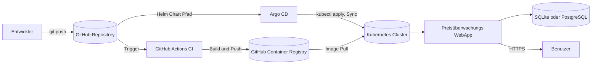
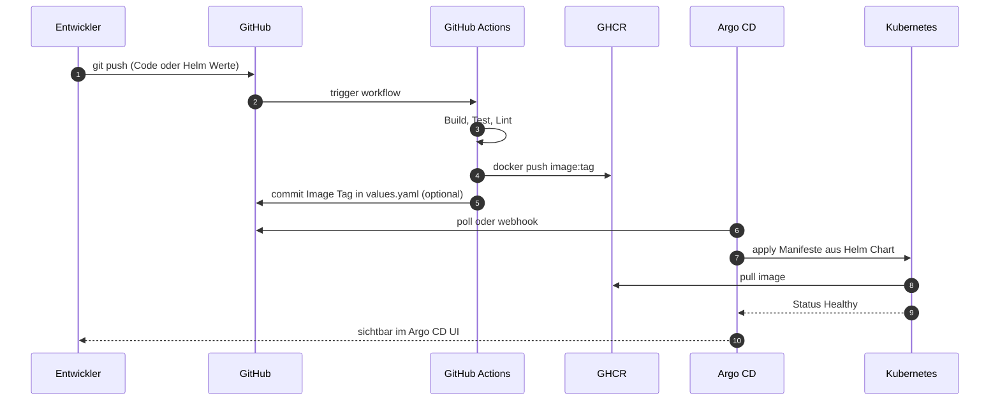

# GitOps Plattform mit Preisüberwachungs WebApp

Semesterarbeit 5, ITCNE24, Dipl. Informatiker HF, Cloud Native Engineer, Technische Berufsschule Zürich TBZ.

> Aufbau einer kleinen, reproduzierbaren Cloud Native Plattform auf Kubernetes. Eine einfache Preisüberwachungs WebApp dient als realistischer Workload, um den GitOps Lifecycle (Build, Push, Sync, Deploy, Rollback) end to end zu zeigen.


## Inhaltsverzeichnis

- [GitOps Plattform mit Preisüberwachungs WebApp](#gitops-plattform-mit-preisüberwachungs-webapp)
  - [Inhaltsverzeichnis](#inhaltsverzeichnis)
  - [Kurzbeschreibung](#kurzbeschreibung)
  - [Architektur auf einen Blick](#architektur-auf-einen-blick)
  - [Tech Stack](#tech-stack)
  - [Repository Struktur](#repository-struktur)
  - [Quick Start, lokales Setup](#quick-start-lokales-setup)
  - [GitOps Workflow](#gitops-workflow)
  - [Dokumentation](#dokumentation)
  - [Referenzprojekt aus früherer Semesterarbeit](#referenzprojekt-aus-früherer-semesterarbeit)
  - [Autor und Rahmen](#autor-und-rahmen)

## Kurzbeschreibung

Containerisierte Anwendungen werden in vielen Umgebungen noch manuell oder nur teilweise automatisiert bereitgestellt. Deployments sind dadurch schwer nachvollziehbar, Rollbacks nicht sauber definiert und der Soll Zustand der Anwendung ist nicht zentral versioniert.

Diese Semesterarbeit baut eine kleine, aber realistische Cloud Native Plattform auf Kubernetes auf. Der Soll Zustand wird im Git Repository gepflegt. Argo CD synchronisiert ihn automatisch in den Cluster. Eine Preisüberwachungs WebApp dient als realistischer Workload und ist bewusst einfach gehalten. Der Fokus der Arbeit liegt auf Plattform, GitOps, Helm und CI Pipeline.

## Architektur auf einen Blick




## Tech Stack

| Bereich | Technologie |
|---------|-------------|
| Cluster | kind oder k3s (lokale Variante), optional kleine Cloud VM |
| Orchestrierung | Kubernetes |
| Paketierung | Helm |
| GitOps | Argo CD |
| CI Pipeline | GitHub Actions |
| Container Build | Docker |
| Registry | GitHub Container Registry (ghcr.io) |
| Backend | Python (Flask oder FastAPI) |
| Frontend | minimales HTML, optional kleines JS Framework |
| Datenbank | SQLite (Default) oder PostgreSQL |
| Job Scheduling | Kubernetes CronJob für regelmässigen Preisabruf |
| Quelle Preisdaten | öffentliche Preis API oder Testdaten als Fallback |

## Repository Struktur

```
.
├── README.md                       # Dieses Dokument
├── docs/                           # Projektdokumentation, Diagramme, Screenshots
│   ├── SEMESTERARBEIT.md           # Hauptdokument der Semesterarbeit
│   ├── runbooks/                   # Betriebsanleitungen
│   ├── architektur/                # Diagramme
│   └── screenshots/                # Nachweise und Belege
├── app/
│   ├── backend/                    # Python Service: API, Preisabruf, DB Zugriff
│   └── frontend/                   # einfache Weboberfläche
├── docker/
│   ├── Dockerfile                  # Image Definition WebApp
│   └── docker-compose.yml          # lokale Entwicklung ohne Kubernetes
├── helm/
│   └── price-watch/                # Helm Chart der WebApp
│       ├── Chart.yaml
│       ├── values.yaml
│       └── templates/
├── k8s/                            # ergänzende Manifeste, falls nicht in Helm
├── argocd/
│   ├── app-of-apps.yaml            # optional
│   └── price-watch-app.yaml        # Argo CD Application Definition
├── .github/
│   └── workflows/
│       ├── ci.yaml                 # Build und Push in Registry
│       └── lint.yaml               # Helm Lint, Manifest Validierung
├── tests/
│   └── ...                         # Unit Tests, Smoke Tests, Testdaten
└── scripts/
    ├── setup-cluster.sh            # kind oder k3s aufsetzen
    └── bootstrap-argocd.sh         # Argo CD installieren und initiale App anlegen
```

## Quick Start, lokales Setup

Voraussetzungen: Docker, kubectl, Helm, Argo CD CLI optional, Git, Visual Studio Code.

```bash
# 1. Repository klonen
git clone https://github.com/<user>/gitops-platform-semesterarbeit.git
cd gitops-platform-semesterarbeit

# 2. lokalen Cluster bauen
./scripts/setup-cluster.sh           # erstellt kind oder k3s Cluster
kubectl cluster-info

# 3. Argo CD installieren und initiale Application erstellen
./scripts/bootstrap-argocd.sh
kubectl -n argocd get pods
kubectl -n argocd port-forward svc/argocd-server 8080:443

# 4. Status prüfen
kubectl get applications -n argocd
kubectl get pods -n price-watch
```

Eine vollständige Schritt für Schritt Anleitung mit Screenshots befindet sich im Runbook [docs/runbooks/01_plattform_initial_setup.md](docs/runbooks/01_plattform_initial_setup.md).

## GitOps Workflow

Änderungen am Deployment erfolgen ausschliesslich über Commits im Git Repository. Es wird nicht direkt im Cluster konfiguriert.



## Dokumentation


| Dokument | Inhalt |
|----------|--------|
| [dokumentation.md](docs/dokumentation.md) | Hauptdokument, alle Kapitel von Management Summary bis Reflexion |
| [runbooks/01_plattform_initial_setup.md](docs/runbooks/01_plattform_initial_setup.md) | Cluster und Argo CD initial aufbauen |
| [runbooks/02_neue_version_deployen.md](docs/runbooks/02_neue_version_deployen.md) | Standard GitOps Release Workflow |
| [runbooks/03_rollback_release.md](docs/runbooks/03_rollback_release.md) | Rollback eines fehlerhaften Releases |

## Referenzprojekt aus früherer Semesterarbeit

Die 4. Semesterarbeit ist als Referenzprojekt verlinkt und dient als Nachweis für vorhandene Erfahrung mit strukturierter Projektdokumentation, CI/CD, Docker und Microservice Architektur.

- Dokumentation: https://cancani.com/geraeteausleihe-sem4/dokumentation/
- Projektseite: https://cancani.com/geraeteausleihe-sem4

Die neue Semesterarbeit ist keine Wiederholung, sondern eine fachliche Erweiterung in Richtung Kubernetes, GitOps, Helm, Argo CD und Cloud Native Plattform Engineering. Details und Lerntransfer siehe [docs/SEMESTERARBEIT.md, Kapitel 12](docs/SEMESTERARBEIT.md#12-lerntransfer-aus-früherer-semesterarbeit).

## Autor und Rahmen

| Feld | Wert |
|------|------|
| Autor | Efekan Demirci |
| Klasse | ITCNE24 |
| Schule | Technische Berufsschule Zürich TBZ, Höhere Fachschule |
| Semester | 5 |
| Fachexperte IaCA, CNC, CNA | Marcel Bernet |
| Fachexperte PRJ | Thanam Pangri |
| Module | Projektmanagement, IaCA, CNC und CNA, optional DevOps |
